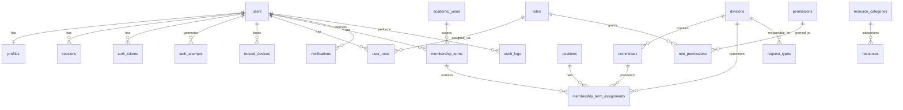

# Database Schema

This document defines **what information the UP Circuit Member Portal stores**, how tables relate, and the rules governing time, privacy, and retention.

**Prerequisites:** Read [`03-supabase-architecture.md`](03-supabase-architecture.md) first (schema location, roles, migrations).

**Phase 0 reference:** §0.10 (conceptual data model), FR-MEMBER-001, FR-MEMBERSHIP-001, FR-MEMBERSHIP-007

---

## What is a database schema?

A **schema** (in the database-design sense) is the blueprint for stored data: which **tables** exist, what **columns** each table has, how rows **relate** to each other, and what **rules** the database enforces (e.g. "email must be unique").

Phase 0 §0.10 named the major entities. This document makes them concrete for PostgreSQL in the `app` schema (see Section 3).

---

## Design principles

| Principle | Meaning |
|---|---|
| **Represent real Circuit entities** | Tables map to members, terms, resources — not generic "data blobs" (Phase 0 §0.10.1) |
| **Store facts once** | No duplicate sources of truth (resolves C9) |
| **Temporal where history matters** | Membership status and org placement are per academic year (resolves C6) |
| **Minimize personal data** | Store only fields the portal actually uses (N2, N5) |
| **Enforce invariants in the database** | CHECK constraints, foreign keys — last line of defense if application code has a bug |
| **Tiered delivery** | Design all tiers now; migrate Tier 1 first for MVP |

---

## Schema tiers

Not every table is created on day one. Tiers match Phase 0 priorities (§0.7.19, §0.7.22).

| Tier | When migrated | Table count |
|---|---|---|
| **Tier 1 — MVP** | Initial migrations | 21 |
| **Tier 2 — P1** | When feature ships | 7 |
| **Tier 3 — P2** | Future | 3 |

---

## Entity relationship overview



---

## Resolved design decisions (Section 4)

### C6 — Temporal division, committee, position

**Problem:** Phase 0 §0.10.4 put `division_id`, `committee_id`, and `position` on `profiles`, but §0.10.5 correctly made membership temporal. Org placement changes every academic year; storing it only on `profiles` loses history.

**Decision:**

- **`profiles`** — stable identity and contact info only
- **`membership_terms`** — one row per member per academic year (status, renewal dates)
- **`membership_term_assignments`** — division, committee, position per term (supports **multiple divisions**)

**Naming:** Phase 0 called this entity `memberships`. We use **`membership_terms`** because the row represents one member's term in one academic year, including org placement.

**Double division (approved):** Option B — assignments table with `is_primary` for directory grouping. Circuit's Double Division request type (§0.7.9) requires more than one division per member per year.

**Current status rule:**

> If a member has **no** `membership_terms` row for the current academic year, they are effectively **`NOT_RENEWED`** for access checks.

---

### C9 — Single authority for resource scope

**Problem:** Phase 0 gave `resources.scope`, `resource_categories.scope`, and `resources.category_id` — three ways to answer "is this academic?"

**Decision:** **`resource_categories.scope` is the only authority.** `resources` has `category_id NOT NULL` and **no `scope` column.**

Scope values: `ACADEMIC`, `ORGANIZATIONAL`.

**Flagship resources:** Not mixed into `resources`. Separate `flagship_resources` table (Tier 3) — different lifecycle, categories, and ownership.

---

### N5 — Emergency contact omitted

**Problem:** Phase 0 FR-MEMBER-001 lists `emergency_contact`, but no requirement reads it.

**Decision:** **`emergency_contact` is not stored** in the portal schema.

**Reason:** Highest privacy sensitivity (third-party PII with no consent), zero consumers in MVP or planned features. Membership Division systems retain this if needed.

**Phase 0 note:** This is a deliberate Phase 1 minimization. FR-MEMBER-001 field list is superseded for this field only. Documented here and in `open-items.md`.

---

### N2 — Data privacy minimization

| Field | Stored? | Visibility |
|---|---|---|
| Full name | Yes | Directory |
| UP email | Yes | Own account; admin |
| Student number | Yes | **Admin only** — never directory |
| Degree program, year level | Yes | Directory |
| Contact number | Yes | **Own account + admin** — not directory |
| Emergency contact | **No** | — |
| Batch | Yes | Directory |
| Profile photo | **No** (deferred) | — |

**Organizational action still required:** Circuit leadership sign-off before production import (N2).

---

## Tier 1 tables (MVP)

All tables: schema `app`, primary key `id UUID DEFAULT gen_random_uuid()`, timestamps `created_at` / `updated_at TIMESTAMPTZ NOT NULL DEFAULT now()` unless noted.

---

### Identity and authentication

#### `users`

**Purpose:** Authentication identity — "who can log in." Separated from profile (Phase 0 §0.10.2).

| Column | Type | Constraints | Notes |
|---|---|---|---|
| `id` | UUID | PK | |
| `email` | TEXT | NOT NULL | Normalized lowercase in application |
| `password_hash` | TEXT | NULL | **NULL = not activated** (C4 hook) |
| `activated_at` | TIMESTAMPTZ | NULL | Set when member claims account |
| `is_active` | BOOLEAN | NOT NULL DEFAULT true | Admin disable |
| `locked_until` | TIMESTAMPTZ | NULL | After excessive failed attempts |
| `deleted_at` | TIMESTAMPTZ | NULL | Soft delete / anonymization |
| `last_login_at` | TIMESTAMPTZ | NULL | |

**Indexes:** `UNIQUE (lower(email))`

**Activation model:** Import creates `users` + `profiles` with `password_hash IS NULL`. Section 7 designs the activation flow.

---

#### `profiles`

**Purpose:** Stable member information — "what Circuit knows about you" long-term.

| Column | Type | Constraints | Notes |
|---|---|---|---|
| `id` | UUID | PK | |
| `user_id` | UUID | NOT NULL, UNIQUE, FK → users | 1:1 |
| `full_name` | TEXT | NOT NULL | |
| `student_number` | TEXT | NULL, UNIQUE | Nullable for pre-import edge cases |
| `degree_program` | TEXT | NULL | |
| `year_level` | TEXT | NULL | Current value; see temporal note in C6 |
| `contact_number` | TEXT | NULL | Member-editable (§0.6.5) |
| `batch` | TEXT | NULL | **Immutable** after set — join cohort |
| `updated_by` | UUID | NULL, FK → users | Last admin editor |

**Not on profiles:** division, committee, position, membership status, emergency contact.

**Member-editable via API:** `contact_number`, `year_level` (per §0.6.5 — enforced via `edit_own_profile` permission; see Section 5).

---

#### `sessions`

**Purpose:** Active login sessions (opaque token model — Section 2).

| Column | Type | Constraints |
|---|---|---|
| `id` | UUID | PK |
| `user_id` | UUID | NOT NULL, FK → users ON DELETE CASCADE |
| `token_hash` | TEXT | NOT NULL, UNIQUE |
| `expires_at` | TIMESTAMPTZ | NOT NULL |
| `last_used_at` | TIMESTAMPTZ | NOT NULL DEFAULT now() | Sliding idle expiry (Section 7) |
| `ip_address` | INET | NULL |
| `user_agent` | TEXT | NULL |

**Indexes:** `(user_id)`, `(expires_at)` for cleanup

**Rule:** Store hash only — never plaintext token.

**Session lifetime (Section 7):** Sliding **7-day idle** expiry, **30-day absolute** cap from `created_at`. On authenticated requests, extend `expires_at` (throttled: at most once per **15 minutes**):

```
new_expires_at = min(now() + 7 days, created_at + 30 days)
```

Only update when `now() - last_used_at > 15 minutes` to avoid a DB write per API call.

---

#### `auth_tokens`

**Purpose:** Single-use secrets for OTP, activation, password reset.

| Column | Type | Constraints |
|---|---|---|
| `id` | UUID | PK |
| `user_id` | UUID | NOT NULL, FK → users ON DELETE CASCADE |
| `purpose` | TEXT | NOT NULL, CHECK IN ('LOGIN_OTP','ACTIVATION','PASSWORD_RESET') |
| `token_hash` | TEXT | NOT NULL, UNIQUE |
| `expires_at` | TIMESTAMPTZ | NOT NULL |
| `used_at` | TIMESTAMPTZ | NULL |
| `attempt_count` | SMALLINT | NOT NULL DEFAULT 0 |

**Indexes:** `(user_id, purpose, expires_at)` where `used_at IS NULL`

---

#### `auth_attempts`

**Purpose:** Rate limiting and security monitoring (Section 2 — no Redis).

| Column | Type | Constraints |
|---|---|---|
| `id` | UUID | PK |
| `email` | TEXT | NOT NULL |
| `ip_address` | INET | NULL |
| `attempt_type` | TEXT | NOT NULL, CHECK IN ('LOGIN','OTP','ACTIVATION') |
| `success` | BOOLEAN | NOT NULL |
| `created_at` | TIMESTAMPTZ | NOT NULL DEFAULT now() |

**Indexes:** `(email, created_at DESC)`, `(ip_address, created_at DESC)`

**Retention:** 90 days (see Retention section).

---

#### `trusted_devices`

**Purpose:** "Remember this device for 30 days" — reduces OTP volume (Section 2).

| Column | Type | Constraints |
|---|---|---|
| `id` | UUID | PK |
| `user_id` | UUID | NOT NULL, FK → users ON DELETE CASCADE |
| `token_hash` | TEXT | NOT NULL, UNIQUE |
| `device_label` | TEXT | NULL |
| `expires_at` | TIMESTAMPTZ | NOT NULL |
| `last_used_at` | TIMESTAMPTZ | NULL |
| `revoked_at` | TIMESTAMPTZ | NULL |

**Indexes:** `(user_id)` where `revoked_at IS NULL`

---

### Organization structure

#### `academic_years`

**Purpose:** Defines academic years and which is "current" — drives membership gates.

| Column | Type | Constraints |
|---|---|---|
| `id` | UUID | PK |
| `start_year` | SMALLINT | NOT NULL, UNIQUE |
| `label` | TEXT | NOT NULL | e.g. `2026-2027` |
| `is_current` | BOOLEAN | NOT NULL DEFAULT false |
| `renewal_opens_at` | TIMESTAMPTZ | NULL |
| `renewal_closes_at` | TIMESTAMPTZ | NULL |

**Constraint:** Partial unique index — only one row with `is_current = true`.

---

#### `divisions`

**Purpose:** Circuit divisions (Executive Board, Internal Affairs, …).

| Column | Type | Constraints |
|---|---|---|
| `id` | UUID | PK |
| `name` | TEXT | NOT NULL, UNIQUE |
| `description` | TEXT | NULL |
| `display_order` | INTEGER | NOT NULL DEFAULT 0 |
| `is_active` | BOOLEAN | NOT NULL DEFAULT true |

**Seed data:** Official Circuit division names required before production (open item N6).

---

#### `committees`

**Purpose:** Committees within divisions.

| Column | Type | Constraints |
|---|---|---|
| `id` | UUID | PK |
| `division_id` | UUID | NOT NULL, FK → divisions |
| `name` | TEXT | NOT NULL |
| `description` | TEXT | NULL |
| `display_order` | INTEGER | NOT NULL DEFAULT 0 |
| `is_active` | BOOLEAN | NOT NULL DEFAULT true |

**Constraint:** `UNIQUE (division_id, name)`

---

#### `positions`

**Purpose:** Named positions (President, Vice President, Member, …) — Phase 0 §0.10.8.

| Column | Type | Constraints |
|---|---|---|
| `id` | UUID | PK |
| `name` | TEXT | NOT NULL, UNIQUE |
| `description` | TEXT | NULL |
| `hierarchy_level` | INTEGER | NULL | Lower = more senior in directory sort |
| `is_active` | BOOLEAN | NOT NULL DEFAULT true |

---

### Membership (temporal)

#### `membership_terms`

**Purpose:** One member's membership record for one academic year.

| Column | Type | Constraints |
|---|---|---|
| `id` | UUID | PK |
| `user_id` | UUID | NOT NULL, FK → users |
| `academic_year_id` | UUID | NOT NULL, FK → academic_years |
| `status` | TEXT | NOT NULL, CHECK IN ('PENDING','RENEWED','NOT_RENEWED') |
| `renewed_at` | TIMESTAMPTZ | NULL |

**Constraint:** `UNIQUE (user_id, academic_year_id)`

**Indexes:** `(academic_year_id, status)`, `(user_id)`

**History:** Never deleted — organizational record.

---

#### `membership_term_assignments`

**Purpose:** Where a member served during a term — supports double division.

| Column | Type | Constraints |
|---|---|---|
| `id` | UUID | PK |
| `membership_term_id` | UUID | NOT NULL, FK → membership_terms ON DELETE CASCADE |
| `division_id` | UUID | NOT NULL, FK → divisions |
| `committee_id` | UUID | NULL, FK → committees |
| `position_id` | UUID | NULL, FK → positions |
| `is_primary` | BOOLEAN | NOT NULL DEFAULT false | Directory grouping division |

**Constraint:** `UNIQUE (membership_term_id, division_id, committee_id, position_id)` — prevent duplicate rows

**Indexes:** `(division_id, committee_id)`, `(membership_term_id)`

**Directory rule:** Group by assignment where `is_primary = true`; if none marked, use first assignment.

---

### Authorization (RBAC)

#### `roles`

| Column | Type | Constraints |
|---|---|---|
| `id` | UUID | PK |
| `name` | TEXT | NOT NULL, UNIQUE | e.g. `ACADEMIC_ADMIN` |
| `description` | TEXT | NULL |
| `is_active` | BOOLEAN | NOT NULL DEFAULT true |

**Seed:** MEMBER, SUPER_ADMIN, RENEWALS_ADMIN, ACADEMIC_ADMIN, FINANCE_ADMIN, PUBLICITY_ADMIN (no WEBDEV — C8).

---

#### `permissions`

| Column | Type | Constraints | Notes |
|---|---|---|---|
| `id` | UUID | PK | |
| `name` | TEXT | NOT NULL, UNIQUE | e.g. `manage_academic_resources` |
| `description` | TEXT | NULL | |
| `kind` | TEXT | NOT NULL | `member_access` or `admin_capability` (C3) |
| `required_membership` | TEXT | NULL | `ANY`, `RENEWED`, or NULL — see cross-field rule below |

**Constraints:**

```sql
CHECK (kind IN ('member_access', 'admin_capability'))
CHECK (required_membership IS NULL OR required_membership IN ('ANY', 'RENEWED'))
CHECK (
  (kind = 'member_access' AND required_membership IN ('ANY', 'RENEWED'))
  OR
  (kind = 'admin_capability' AND required_membership IS NULL)
)
```

**Enforcement model (Section 5):**

- `member_access` — membership gate applies via `required_membership`
- `admin_capability` — role check only; `required_membership` must be NULL

**MVP seed catalogue:** See [`05-authorization-architecture.md`](05-authorization-architecture.md) for the full permission list and role → permission matrix. Seed migration inserts all permission rows and `role_permissions` links.

**Request-type gating:** No `request_types.required_membership` column in MVP (N10). All request types visible to anyone with `view_request_directory`.

---

#### `role_permissions`

| Column | Type | Constraints |
|---|---|---|
| `role_id` | UUID | FK → roles |
| `permission_id` | UUID | FK → permissions |

**PK:** `(role_id, permission_id)`

---

#### `user_roles`

| Column | Type | Constraints |
|---|---|---|
| `user_id` | UUID | FK → users |
| `role_id` | UUID | FK → roles |
| `assigned_by` | UUID | NULL, FK → users |
| `assigned_at` | TIMESTAMPTZ | NOT NULL DEFAULT now() |

**PK:** `(user_id, role_id)`

---

### Content

#### `resource_categories`

**Purpose:** Group resources; **`scope` lives here only** (C9).

| Column | Type | Constraints |
|---|---|---|
| `id` | UUID | PK |
| `scope` | TEXT | NOT NULL, CHECK IN ('ACADEMIC','ORGANIZATIONAL') |
| `name` | TEXT | NOT NULL |
| `description` | TEXT | NULL |
| `display_order` | INTEGER | NOT NULL DEFAULT 0 |
| `is_active` | BOOLEAN | NOT NULL DEFAULT true |

**Constraint:** `UNIQUE (scope, name)`

**Seed:** At least one category per scope (e.g. "General", "Other") so resources always have a valid FK.

---

#### `resources`

**Purpose:** Academic Drive and Resources links (Phase 0 §0.10.12).

| Column | Type | Constraints |
|---|---|---|
| `id` | UUID | PK |
| `category_id` | UUID | NOT NULL, FK → resource_categories |
| `title` | TEXT | NOT NULL |
| `description` | TEXT | NULL |
| `url` | TEXT | NOT NULL |
| `resource_type` | TEXT | NOT NULL, CHECK IN ('GOOGLE_FORM','GOOGLE_SHEET','GOOGLE_DRIVE','GOOGLE_DOC','EXTERNAL_LINK') |
| `display_order` | INTEGER | NOT NULL DEFAULT 0 |
| `is_active` | BOOLEAN | NOT NULL DEFAULT true |
| `created_by` | UUID | NULL, FK → users |
| `updated_by` | UUID | NULL, FK → users |

**URL security:** Application validates `http`/`https` only. Database CHECK: `url ~* '^https?://'`

**No `scope` column.**

**Indexes:** `(category_id, is_active, display_order)`

**Academic Drive query:** Join categories WHERE `scope = 'ACADEMIC'`.

---

#### `request_types`

**Purpose:** Request directory entries (Phase 0 §0.10.14 — type only in MVP).

| Column | Type | Constraints |
|---|---|---|
| `id` | UUID | PK |
| `name` | TEXT | NOT NULL, UNIQUE |
| `description` | TEXT | NULL |
| `responsible_division_id` | UUID | NULL, FK → divisions |
| `destination_url` | TEXT | NOT NULL |
| `destination_type` | TEXT | NOT NULL DEFAULT 'GOOGLE_FORM' |
| `display_order` | INTEGER | NOT NULL DEFAULT 0 |
| `is_active` | BOOLEAN | NOT NULL DEFAULT true |
| `created_by` | UUID | NULL, FK → users |
| `updated_by` | UUID | NULL, FK → users |

**URL security:** Same http/https rule as resources.

**MVP seed:** Double Division, Transfer Request, Headships Form, Pub Request, Finance Request, Venue Request (§0.7.9).

---

### Cross-cutting

#### `notifications`

**Purpose:** In-app notifications (FR-NOTIF-001).

| Column | Type | Constraints |
|---|---|---|
| `id` | UUID | PK |
| `user_id` | UUID | NOT NULL, FK → users ON DELETE CASCADE |
| `title` | TEXT | NOT NULL |
| `message` | TEXT | NOT NULL |
| `type` | TEXT | NOT NULL | e.g. `MEMBERSHIP_STATUS`, `ANNOUNCEMENT` |
| `is_read` | BOOLEAN | NOT NULL DEFAULT false |
| `read_at` | TIMESTAMPTZ | NULL |

**Indexes:** `(user_id, is_read, created_at DESC)`

**Retention:** 12 months.

---

#### `audit_logs`

**Purpose:** Record sensitive admin actions (§0.6.16).

| Column | Type | Constraints |
|---|---|---|
| `id` | UUID | PK |
| `actor_user_id` | UUID | NULL, FK → users ON DELETE SET NULL |
| `action` | TEXT | NOT NULL | e.g. `UPDATE_MEMBERSHIP_STATUS` |
| `entity_type` | TEXT | NOT NULL | e.g. `membership_term` |
| `entity_id` | UUID | NOT NULL |
| `old_value` | JSONB | NULL | See privacy rules below |
| `new_value` | JSONB | NULL | See privacy rules below |
| `ip_address` | INET | NULL |
| `created_at` | TIMESTAMPTZ | NOT NULL DEFAULT now() |

**Indexes:** `(entity_type, entity_id, created_at DESC)`, `(created_at)` for retention job

**Privacy rules for `old_value` / `new_value`:**

| Field category | Log content |
|---|---|
| Non-sensitive (status, URL, order, boolean) | Full before/after values |
| Sensitive (contact_number, student_number, name) | `{"changed": ["contact_number"]}` only — no values |

**Retention:** 24 months.

---

## Tier 2 tables (P1 — designed, not MVP migration)

### `requests`

Native request instances when Google Form redirects are replaced (C5 deferred).

| Column | Type | Notes |
|---|---|---|
| `id` | UUID | PK |
| `request_type_id` | UUID | FK → request_types |
| `submitted_by` | UUID | FK → users |
| `status` | TEXT | CHECK: SUBMITTED, UNDER_REVIEW, APPROVED, REJECTED, CANCELLED |
| `payload` | JSONB | Form data — schema varies by type |

---

### `announcements`

| Column | Type | Notes |
|---|---|---|
| `id` | UUID | PK |
| `title`, `content` | TEXT | |
| `author_id` | UUID | FK → users |
| `status` | TEXT | DRAFT, PUBLISHED, ARCHIVED |
| `published_at`, `expires_at` | TIMESTAMPTZ | |

---

### `notification_deliveries`

Email delivery tracking (§0.10.22).

| Column | Type | Notes |
|---|---|---|
| `notification_id` | UUID | FK → notifications |
| `channel` | TEXT | IN_APP, EMAIL |
| `status` | TEXT | PENDING, SENT, FAILED |
| `sent_at` | TIMESTAMPTZ | |
| `failure_reason` | TEXT | |

---

### `navigation_items`

Database-configurable sidebar (§0.7.14 — P2 in Phase 0 priority, implemented P1).

| Column | Type | Notes |
|---|---|---|
| `label` | TEXT | |
| `route_key` | TEXT | References React route registry — not free-text path |
| `icon` | TEXT | |
| `parent_id` | UUID | Self-FK for nesting |
| `display_order` | INTEGER | |
| `is_visible` | BOOLEAN | |
| `required_permission` | TEXT | NULL = all authenticated |

**MVP:** Navigation is **code-defined** with route keys. This table is not migrated until P1.

---

### Flagship (P1)

#### `flagship_projects`

Seed: The E-Waste Project, InteraCKT, SquEEEze (§0.10.16).

| Column | Type | Notes |
|---|---|---|
| `name`, `slug`, `description` | TEXT | |
| `display_order`, `is_active` | | |

#### `flagship_iterations`

| Column | Type | Notes |
|---|---|---|
| `flagship_project_id` | UUID | FK |
| `year` | SMALLINT | |
| `name`, `description` | TEXT | |
| `status` | TEXT | DRAFT, ACTIVE, COMPLETED, ARCHIVED |
| `start_date`, `end_date` | DATE | |

#### `flagship_activities`

For E-Waste sub-activities (TEP Talks, ESCON, …).

| Column | Type | Notes |
|---|---|---|
| `flagship_iteration_id` | UUID | FK |
| `name`, `description` | TEXT | |
| `date`, `location` | | |
| `status`, `display_order` | | |

---

## Tier 3 tables (P2 — shape only)

### `flagship_resources`

Separate from `resources` (see C9 flagship note). Belongs to an iteration, not global scope.

| Column | Type | Notes |
|---|---|---|
| `flagship_iteration_id` | UUID | FK |
| `category` | TEXT | Manpower, Forms, Sheets, Communication, … |
| `title`, `description`, `url` | TEXT | |
| `resource_type` | TEXT | Same enum as resources |
| `display_order`, `is_active` | | |

### `activity_resources`

Links activities to flagship resources.

| Column | Type |
|---|---|
| `activity_id` | UUID FK |
| `flagship_resource_id` | UUID FK |
| `display_order` | INTEGER |

### `portal_settings`

Key-value portal configuration (§0.10.23). Structured tables preferred for navigation; settings for simple flags only.

| Column | Type |
|---|---|
| `key` | TEXT UNIQUE |
| `value` | JSONB |
| `updated_by` | UUID FK |

---

## Data retention

| Table | Retention | Method |
|---|---|---|
| `audit_logs` | 24 months | Scheduled delete job |
| `auth_attempts` | 90 days | Scheduled delete job |
| `sessions` | Until expiry | Delete on logout + cleanup job |
| `auth_tokens` | Until used/expired | Cleanup job |
| `notifications` | 12 months | Scheduled delete job |
| `membership_terms` | **Permanent** | Organizational history |
| `membership_term_assignments` | **Permanent** | Organizational history |

---

## Member erasure (privacy)

When a member requests deletion:

1. Set `users.deleted_at`
2. Blank PII on `profiles` (name → "Deleted User", clear contact, student number)
3. Keep `membership_terms` rows for aggregate history but anonymize linkage if required by policy
4. `audit_logs.actor_user_id` → SET NULL on user delete (already configured)

Hard delete cascades would destroy audit integrity — **anonymize, don't delete.**

---

## What we deliberately do not store

| Data | Reason |
|---|---|
| Emergency contact | N5 — no consumer; third-party PII |
| Profile photos | Storage deferred (§0.10.27) |
| Google OAuth tokens | No Google API integration in MVP |
| Plaintext passwords, OTPs, session tokens | Security |
| Full PII in audit log values | N2 minimization |

---

## Seed data requirements (before production)

| Seed | Source | Status |
|---|---|---|
| Divisions | Official Circuit names (§0.10.6) | **Open — N6** |
| Committees per division | Official Circuit structure | **Open — N6** |
| Positions | Executive Board + Member | Partial — confirm with org |
| Roles + permissions | Phase 0 §0.10.9–0.10.11 | Defined in [`05-authorization-architecture.md`](05-authorization-architecture.md) |
| Academic year | Current AY row | Set at launch |
| Resource categories | At least one per scope | WebDev + Academic Admin |
| Request types | §0.7.9 list | WebDev seed |
| Flagship projects | §0.10.16 | P1 |

---

## Index summary

| Table | Index | Purpose |
|---|---|---|
| `users` | `UNIQUE (lower(email))` | Login |
| `sessions` | `UNIQUE (token_hash)` | Session lookup |
| `membership_terms` | `UNIQUE (user_id, academic_year_id)` | One term per year |
| `membership_term_assignments` | `(division_id, committee_id)` | Directory filters |
| `resource_categories` | `UNIQUE (scope, name)` | Category management |
| `resources` | `(category_id, is_active, display_order)` | Listings |
| `notifications` | `(user_id, is_read, created_at DESC)` | Notification centre |
| `audit_logs` | `(created_at)` | Retention purge |

**Not yet:** `pg_trgm` fuzzy search — unnecessary at ~1,200 members; plain `ILIKE` suffices.

---

## Migration order (Tier 1)

Migrations should respect foreign key dependencies:

```
1. academic_years, divisions, positions
2. committees
3. roles, permissions, role_permissions
4. users, profiles
5. sessions, auth_tokens, auth_attempts, trusted_devices
6. membership_terms, membership_term_assignments
7. user_roles
8. resource_categories, resources, request_types
9. notifications, audit_logs
```

---

## Consistency with earlier Phase 1 sections

| Earlier doc | Section 4 alignment |
|---|---|
| §1 — profiles separate from users | Unchanged |
| §1 — navigation route keys | MVP: code registry only; `navigation_items` is P1 |
| §2 — auth in PostgreSQL | sessions, auth_tokens, auth_attempts, trusted_devices |
| §3 — app schema, no RLS | All tables in `app` |
| §3 — circuit_app / circuit_migrator | Unchanged |

---

## What future WebDev members should know

**Safe to change:** Seed category names, display orders, request type URLs via admin UI or seed migrations.

**Change with care:** Adding columns — use Alembic expand-then-contract. Adding permissions requires code + seed.

**Do not change without ADR:** Temporal membership model, scope authority (C9), assignments table (C6), audit PII rules.

**Common questions:**

| Question | Answer |
|---|---|
| Where is membership status? | `membership_terms.status` for a given `academic_year_id` |
| Where is division? | `membership_term_assignments` — not `profiles` |
| Why no emergency contact? | N5 — documented deviation from FR-MEMBER-001 |
| Why two resource systems? | Global `resources` vs iteration-scoped `flagship_resources` |
| How is "current year" known? | `academic_years.is_current = true` (one row) |

---

*Section 4 — complete. Authorization in [`05-authorization-architecture.md`](05-authorization-architecture.md). Authentication in [`07-authentication-architecture.md`](07-authentication-architecture.md).*
