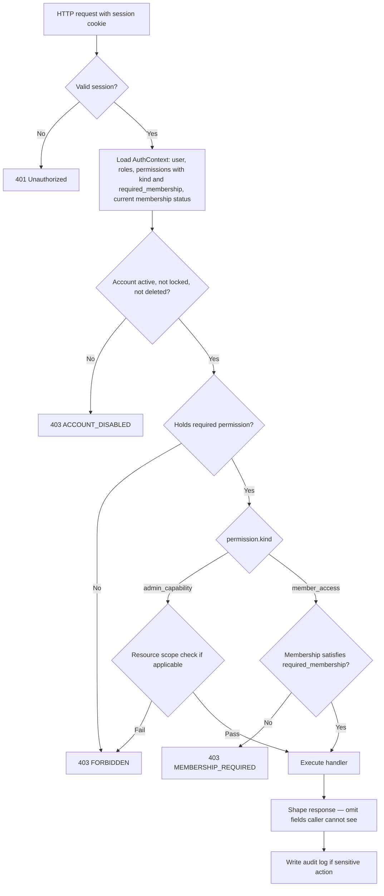

# Authorization Architecture

This document defines **who may do what** in the UP Circuit Member Portal after they have logged in.

**Prerequisites:** Read [`01-system-architecture.md`](01-system-architecture.md) (trust boundaries, C3 rule) and [`04-database-schema.md`](04-database-schema.md) (RBAC tables, `membership_terms`).

**Phase 0 reference:** §0.6 (permission matrix), §0.6.13 (roles vs permissions), §0.6.14 (resource-level scoping), §0.6.17 (UI hiding is not security), §0.7.15 (member directory)

---

## What is authorization?

**Authentication** answers: *Who are you?*

**Authorization** answers: *What may you do?*

A member who has logged in successfully is **authenticated**. Whether they may open the Academic Drive, edit a resource, or change another member's status is **authorization**.

| | Authentication | Authorization |
|---|---|---|
| Question | Who are you? | What may you do? |
| When | Once at login | **Every request** |
| Failure | `401 Unauthorized` | `403 Forbidden` or `403 MEMBERSHIP_REQUIRED` |
| Enforced by | Session validation | Permission + membership gate |
| Documented in | Section 7 | **This document (Section 5)** |

The browser is untrusted. React may hide buttons for convenience, but **FastAPI re-derives authorization on every API call** from the session. Editing permissions in browser memory changes nothing.

**Phase 0 ref:** §0.6.17 — hiding UI is not security.

---

## The three primitives

Before any enforcement rule, understand the three concepts the system combines.

### Permission — one atomic capability

A **permission** is a single thing a user may do, identified by a stable string name:

- `view_academic_resources` — browse Academic Drive as a member
- `manage_academic_resources` — create, edit, delete academic resources as an admin
- `manage_membership_status` — change a member's renewal status

Permissions are **defined in code and seeded in the database**. Backend endpoints reference permission names literally. An officer cannot invent a new permission name in an admin UI and have it grant access — the endpoint must already check for that name.

Each permission row carries a **`kind`** (see below) that determines whether membership status applies.

### Role — a named bundle of permissions

A **role** groups permissions for an organizational job:

- `MEMBER` — every account
- `ACADEMIC_ADMIN` — manages academic resources
- `RENEWALS_ADMIN` — manages member records and membership status
- `SUPER_ADMIN` — all administrative capabilities

A user may hold **multiple roles** simultaneously (Phase 0 §0.6.2). An Academic Admin is both `MEMBER` and `ACADEMIC_ADMIN`.

Roles exist so Circuit can add "External Affairs Admin" later by inserting database rows, not by scattering `if user.role == "finance_admin"` through Python (Phase 0 §0.6.13).

### Membership status — a temporal fact, not a role

**Membership status** is whether a member has renewed for the **current academic year**. It is stored on `membership_terms.status`, not on `profiles` and not as a role.

| Status | Meaning |
|---|---|
| `PENDING` | Imported or registered; renewal not yet confirmed |
| `RENEWED` | Active member for the current academic year |
| `NOT_RENEWED` | Did not renew (or no row exists for the current year) |

**No `membership_terms` row for the current academic year** is treated as `NOT_RENEWED` for access checks.

Membership status controls **member-facing consumption** — browsing Academic Drive, viewing flagship internal resources. It does **not** grant administrative capabilities. Admin capabilities come from roles.

---

## Why permissions need a `kind`

### The problem with a flat permission set

Suppose all permissions were equal. `ACADEMIC_ADMIN` must manage academic resources, so it is granted `view_academic_resources` (to preview what members see). Consider a non-renewed Academic Admin:

```
User: Maria
Roles: MEMBER, ACADEMIC_ADMIN
Membership status: NOT_RENEWED
ACADEMIC_ADMIN grants: view_academic_resources, manage_academic_resources

Maria opens GET /api/v1/resources?scope=academic
→ Permission check: view_academic_resources ✓
→ Maria browses Academic Drive
→ Violates Phase 0: non-renewed members cannot view Academic Drive (§0.6.3)
```

The admin role silently satisfied a membership gate. Phase 0 Rule 2 and the approved C3 rule forbid exactly this: **a role may never satisfy a membership gate.**

Patching with `if resource.is_academic and not user.is_renewed: deny` would work once and be forgotten the next time someone adds a renewal-gated feature. The fix must be structural.

### The decision: `kind` + `required_membership`

Every permission in `app.permissions` carries:

| Column | Values | Meaning |
|---|---|---|
| `kind` | `member_access` \| `admin_capability` | What sort of capability this is |
| `required_membership` | `ANY` \| `RENEWED` \| NULL | Membership requirement; NULL only for `admin_capability` |

**Database constraint:**

```sql
CHECK (
  (kind = 'member_access' AND required_membership IN ('ANY', 'RENEWED'))
  OR
  (kind = 'admin_capability' AND required_membership IS NULL)
)
```

### The four-step allow rule

Every protected endpoint uses the same logic:

```
allow(user, permission_name):

  1. User is authenticated (valid session)
     AND is_active AND NOT locked AND deleted_at IS NULL
     → else 401 Unauthorized

  2. permission_name ∈ union of permissions from all user's roles
     → else 403 Forbidden

  3. IF permission.kind == 'member_access':
       current membership status must satisfy permission.required_membership
       (RENEWED gate: only RENEWED passes; PENDING and NOT_RENEWED fail)
     → else 403 MEMBERSHIP_REQUIRED

  4. Allow — execute handler
```

Step 3 runs **regardless of which role granted the permission**. A non-renewed Academic Admin holding `view_academic_resources` through `ACADEMIC_ADMIN` is denied at step 3 — C3 enforced structurally, not by developer memory.

**`admin_capability` permissions skip step 3 entirely.** `manage_academic_resources` has `required_membership = NULL`; membership status is irrelevant to admin work.

### Super Admin does not bypass membership gates

`SUPER_ADMIN` is seeded with every `admin_capability` permission. It does **not** bypass `member_access` membership gates. A non-renewed Super Admin receives `403 MEMBERSHIP_REQUIRED` on Academic Drive.

This looks like a bug to newcomers. It is intentional: the rule has no exceptions, and the remedy is to renew. A Super Admin can still **manage** academic resources through admin endpoints without browsing the member-facing Academic Drive page.

---

## How authorization works: request → decision



### AuthContext — loaded once per request

On each authenticated request, FastAPI loads an **AuthContext** in a single database query (or minimal queries):

- `user_id`, account flags (`is_active`, `locked_until`, `deleted_at`)
- All role names
- All permission names **with** `kind` and `required_membership`
- Current membership status (from `membership_terms` where `academic_years.is_current = true`; absent row → `NOT_RENEWED`)

This context is passed to the permission guard and to handlers for response shaping.

**Permissions are never cached in the session.** If a role is revoked or membership lapses, the next request reflects it immediately. One indexed join at ~1,200 users is negligible; stale authorization is not.

### FastAPI enforcement pattern (pseudocode)

Authorization is declarative — declared on each endpoint, not buried in handler bodies:

```python
@router.get("/resources")
def list_resources(
    scope: str,
    ctx: AuthContext = Depends(require_permission("view_resources")),
):
    ...


@router.post("/resources")
def create_resource(
    body: ResourceCreate,
    ctx: AuthContext = Depends(require_permission("manage_academic_resources")),
):
    # Scope-after-load: verify category.scope matches permission domain
    ...
```

`require_permission(name)` is a FastAPI dependency that runs steps 1–4 before the handler executes. It is unit-testable in isolation.

**Phase 0 ref:** §0.6.13 — permissions as data, not role string checks.

### Three denial responses

| HTTP status | Code detail | Meaning | Frontend behaviour |
|---|---|---|---|
| `401` | — | No valid session | Redirect to login |
| `403` | `FORBIDDEN` | Authenticated but lacks permission | Generic "not available" |
| `403` | `MEMBERSHIP_REQUIRED` | Has permission; membership gate failed | **Renewal prompt** with link to Renew Membership page |

The third code is deliberate: it turns a dead end into the renewal call-to-action Phase 0 §0.8.6 wants. It leaks nothing — the member already knows their own status.

### Response shaping is authorization

Returning JSON the caller is not entitled to see is an authorization failure, not a UI concern.

| Caller | Member directory response |
|---|---|
| Ordinary member | Name, program, year level, batch, division — **not** student number, contact |
| Admin with `view_members_admin` | Full profile fields including student number, contact |
| Member viewing own profile | Own full profile |

Restricted fields are **omitted from the JSON**, not merely hidden in CSS.

---

## Resolving C2 — non-renewed member access

### Correction: C2 was not a contradiction

An earlier draft of `open-items.md` claimed §0.6.3 and §0.6.12 contradicted each other on non-renewed access. **That was a misreading.**

Both tables mark Member Directory, Requests, own request history, and flagship projects as **⚠️ (restricted / dependent on specific rule)**. §0.6.3 explicitly states:

> *"The ⚠️ items need a precise rule later. My initial recommendation: If something is specifically intended for active/renewed Circuit members, it should be restricted."*

C2 is therefore a **deliberately deferred decision** that Phase 1 Section 5 resolves — not a conflict between two Phase 0 statements.

### Resolution per ⚠️ item

| ⚠️ item | Phase 0 trace | Decision | Permission |
|---|---|---|---|
| **Member directory** | §0.7.15: *"Both renewed and non-renewed members retain access to the Member Directory."* | **`ANY`** — field-level restrictions apply to all members (FR-MEMBER-005), not status-based blocking | `view_member_directory` |
| **Submit / view requests (directory)** | §0.6.3 ⚠️; Phase 1 brief: non-renewed may access Requests; §0.7.9 FR-REQUEST-001 draws no status distinction | **`ANY`** for request directory (MVP: external redirects) | `view_request_directory` |
| **Own request history** | §0.6.3 ⚠️; C5: no history in MVP | **Moot for MVP.** When built (P1): **`ANY`** | `view_own_requests` (P1) |
| **Flagship projects** | §0.6.3 ⚠️; no explicit resolution in Phase 0 | **Split** (approved): project info `ANY`; internal resources `RENEWED` | `view_flagship_projects` (P1 info), `view_flagship_resources` (P1 internal) |
| **Academic Drive** | §0.6.3 ❌ for non-renewed | **`RENEWED`** | `view_academic_resources` |

### PENDING status (approved)

Phase 0 defines `PENDING` but gives it no row in any permission table. §0.9.2 implies full access begins at `RENEWED`.

**Decision:** `PENDING` **fails the `RENEWED` gate** — treated like `NOT_RENEWED` for member-facing consumption. The gate stays binary: only `RENEWED` passes `required_membership = 'RENEWED'`.

### Per-request-type gating (deferred)

Should a non-renewed member open the Headships Form? MVP request types are external Google Form redirects; portal-side gating provides false assurance while human review is the actual control.

**Decision:** No per-request-type membership gating in MVP. Revisit in P1 if Circuit requires it (`request_types.required_membership` column — see N10).

---

## Worked examples

### Example 1: "Can this member access the Academic Drive?"

**Answered by:** `view_academic_resources` (`member_access`, `required_membership = RENEWED`) + current membership status.

| Actor | Roles | Status | Step 2 (permission?) | Step 3 (gate?) | Result |
|---|---|---|---|---|---|
| Renewed ordinary member | MEMBER | RENEWED | ✓ via MEMBER | RENEWED satisfies RENEWED | **Allow** |
| Non-renewed ordinary member | MEMBER | NOT_RENEWED | ✓ via MEMBER | NOT_RENEWED fails | **403 MEMBERSHIP_REQUIRED** |
| Non-renewed Academic Admin | MEMBER, ACADEMIC_ADMIN | NOT_RENEWED | ✓ (either role) | NOT_RENEWED fails | **403 MEMBERSHIP_REQUIRED** |
| Non-renewed Super Admin | MEMBER, SUPER_ADMIN | NOT_RENEWED | ✓ | NOT_RENEWED fails | **403 MEMBERSHIP_REQUIRED** |

The Academic Admin **can** still call `POST /api/v1/resources` using `manage_academic_resources` — that is admin work, not member consumption.

### Example 2: "Can this officer edit resources?"

**Answered by:** `manage_academic_resources` or `manage_organizational_resources` (`admin_capability`) + resource scope check.

| Actor | Permission | Scope check | Result |
|---|---|---|---|
| Academic Admin | `manage_academic_resources` | Category `scope = ACADEMIC` | **Allow** |
| Finance Admin | `manage_finance_request_types` only | Academic resource | **403 FORBIDDEN** — wrong permission |
| Academic Admin | `manage_academic_resources` | Category `scope = ORGANIZATIONAL` | **403 FORBIDDEN** — scope mismatch |
| Renewals Admin | No resource permissions | Any resource | **403 FORBIDDEN** |

Membership status is **not consulted** for `admin_capability` permissions.

**Scope authority:** `resource_categories.scope` (C9). The handler loads the target resource's category and verifies scope matches the permission domain. Phase 0 §0.6.14's intent — Finance Admin cannot edit academic resources — without a separate scope-resolution mechanism.

### Example 3: "Can this admin manage members?"

**Answered by:** `manage_members` and `manage_membership_status` (`admin_capability`).

| Actor | `manage_members` | `manage_membership_status` |
|---|---|---|
| Renewals Admin | ✓ | ✓ |
| Super Admin | ✓ | ✓ |
| Academic / Finance / Publicity Admin | ✗ | ✗ |
| Ordinary member | ✗ | ✗ |

Phase 0 §0.6.6 requires a confirmation step for status changes. **The backend enforces this**, not only the UI: the request body must include `confirm_full_name` matching the target member's `profiles.full_name`, or the request is rejected with `422`. This is a deliberate-action safeguard against accidental or automated calls — the security boundary remains the permission check.

---

## Permission catalogue

### `member_access` permissions (MVP)

| Permission | `required_membership` | Phase 0 trace |
|---|---|---|
| `view_dashboard` | `ANY` | §0.6.3 ✅ Dashboard |
| `view_own_profile` | `ANY` | §0.6.3 ✅ Own profile |
| `edit_own_profile` | `ANY` | §0.6.3 ✅ Edit profile; §0.6.5 |
| `view_resources` | `ANY` | §0.6.3 ✅ Resources (organizational scope) |
| `view_academic_resources` | `RENEWED` | §0.6.3 ❌ Academic Drive for non-renewed |
| `view_member_directory` | `ANY` | §0.7.15 explicit |
| `view_request_directory` | `ANY` | §0.6.3 ⚠️ → resolved C2 |
| `view_own_notifications` | `ANY` | §0.6.3 ✅ Notifications |
| `view_renewal_info` | `ANY` | §0.6.3 ✅ Renewal portal link |

### `member_access` permissions (P1+)

| Permission | `required_membership` | Notes |
|---|---|---|
| `view_own_requests` | `ANY` | C5 — when request history ships |
| `view_flagship_projects` | `ANY` | Flagship overview/info (C2 split) |
| `view_flagship_resources` | `RENEWED` | Internal flagship workspace content (C2 split) |

### `admin_capability` permissions (MVP)

| Permission | Held by (roles) | Phase 0 trace |
|---|---|---|
| `view_admin_dashboard` | All admin roles | §0.6.12 admin columns |
| `view_members_admin` | RENEWALS_ADMIN, SUPER_ADMIN | §0.6.12 Membership Data ✏️ |
| `manage_members` | RENEWALS_ADMIN, SUPER_ADMIN | §0.6.12 Manage Users |
| `manage_membership_status` | RENEWALS_ADMIN, SUPER_ADMIN | §0.6.12 Membership Status ✏️ |
| `import_member_data` | RENEWALS_ADMIN, SUPER_ADMIN | FR-MEMBERSHIP-007 |
| `manage_academic_resources` | ACADEMIC_ADMIN, SUPER_ADMIN | §0.6.12 Manage Academic Resources |
| `manage_organizational_resources` | SUPER_ADMIN | §0.6.12 Resources ✏️ (organizational) |
| `manage_resource_categories` | ACADEMIC_ADMIN (academic scope), SUPER_ADMIN | Category CRUD |
| `manage_finance_request_types` | FINANCE_ADMIN, SUPER_ADMIN | §0.6.12 Manage Finance Requests |
| `manage_publicity_request_types` | PUBLICITY_ADMIN, SUPER_ADMIN | §0.6.12 Manage Pub Requests |
| `manage_all_request_types` | SUPER_ADMIN | §0.6.12 Manage Request Types ✏️ |
| `view_audit_logs` | SUPER_ADMIN | §0.6.12 View Audit Logs ✅ |
| `manage_roles` | SUPER_ADMIN | §0.6.12 Manage Admin Roles |

### `admin_capability` permissions (P1+)

| Permission | Notes |
|---|---|
| `manage_flagship_projects` | §0.6.12; per-project assignment in N12 |
| `manage_events` | §0.6.12 |
| `manage_announcements` | §0.6.12 |
| `manage_navigation` | §0.6.12; `navigation_items` table |
| `manage_portal_branding` | §0.6.12 |
| `view_audit_logs_scoped` | Division-scoped audit views (§0.6.12 "scoped") |

### Not portal permissions

| Capability | Where it lives |
|---|---|
| Source code access | GitHub (C8 — no WEBDEV role) |
| Production infrastructure | Render, Vercel, Supabase dashboards (C8) |

---

## Role → permission seed matrix (MVP)

Every user receives `MEMBER`. Admin roles add capabilities on top.

| Permission | MEMBER | RENEWALS | ACADEMIC | FINANCE | PUBLICITY | SUPER |
|---|:---:|:---:|:---:|:---:|:---:|:---:|
| **Member access (MVP)** |
| `view_dashboard` | ✓ | ✓ | ✓ | ✓ | ✓ | ✓ |
| `view_own_profile` | ✓ | ✓ | ✓ | ✓ | ✓ | ✓ |
| `edit_own_profile` | ✓ | ✓ | ✓ | ✓ | ✓ | ✓ |
| `view_resources` | ✓ | ✓ | ✓ | ✓ | ✓ | ✓ |
| `view_academic_resources` | ✓ | ✓ | ✓ | ✓ | ✓ | ✓ |
| `view_member_directory` | ✓ | ✓ | ✓ | ✓ | ✓ | ✓ |
| `view_request_directory` | ✓ | ✓ | ✓ | ✓ | ✓ | ✓ |
| `view_own_notifications` | ✓ | ✓ | ✓ | ✓ | ✓ | ✓ |
| `view_renewal_info` | ✓ | ✓ | ✓ | ✓ | ✓ | ✓ |
| **Admin capabilities (MVP)** |
| `view_admin_dashboard` | | ✓ | ✓ | ✓ | ✓ | ✓ |
| `view_members_admin` | | ✓ | | | | ✓ |
| `manage_members` | | ✓ | | | | ✓ |
| `manage_membership_status` | | ✓ | | | | ✓ |
| `import_member_data` | | ✓ | | | | ✓ |
| `manage_academic_resources` | | | ✓ | | | ✓ |
| `manage_organizational_resources` | | | | | | ✓ |
| `manage_resource_categories` | | | ✓ | | | ✓ |
| `manage_finance_request_types` | | | | ✓ | | ✓ |
| `manage_publicity_request_types` | | | | | ✓ | ✓ |
| `manage_all_request_types` | | | | | | ✓ |
| `view_audit_logs` | | | | | | ✓ |
| `manage_roles` | | | | | | ✓ |

**Note on `view_academic_resources` for all roles:** Every role includes `MEMBER`, which grants all `member_access` permissions. The **membership gate** (`required_membership = RENEWED`) still applies at enforcement time — holding the permission is necessary but not sufficient.

**Note on §0.6.12 "👁️" for admin roles on Academic Drive / Resources:** Admins browse member-facing content through the same `member_access` permissions as ordinary members. If renewed, they see Academic Drive. If not renewed, they manage through admin endpoints instead. Admin roles do not grant a separate "admin view" of member pages in MVP.

---

## Mapping §0.6.12 matrix to permissions

| §0.6.12 capability | Permission(s) | Gate |
|---|---|---|
| Login | *(authentication — Section 7)* | — |
| Dashboard | `view_dashboard` | ANY |
| Own Account | `view_own_profile`, `edit_own_profile` | ANY |
| Academic Drive | `view_academic_resources` | RENEWED |
| Resources | `view_resources` | ANY |
| Requests | `view_request_directory` | ANY |
| Own Request History | `view_own_requests` (P1) | ANY |
| Member Directory | `view_member_directory` | ANY |
| Membership Data (own) | `view_own_profile` | ANY |
| Membership Data (admin) | `view_members_admin` | admin_capability |
| Membership Status (admin) | `manage_membership_status` | admin_capability |
| Renewal Portal Link | `view_renewal_info` | ANY |
| Manage Academic Resources | `manage_academic_resources` | admin_capability |
| Manage Finance Requests | `manage_finance_request_types` | admin_capability |
| Manage Pub Requests | `manage_publicity_request_types` | admin_capability |
| Manage Request Types | scoped types + `manage_all_request_types` | admin_capability |
| Manage Users | `manage_members` | admin_capability |
| Manage Admin Roles | `manage_roles` | admin_capability |
| View Audit Logs | `view_audit_logs` | admin_capability |
| Source Code / Infrastructure | *(not portal — C8)* | — |

P1 capabilities (Flagship, Events, Announcements, Navigation, Branding) map to P1 permissions listed above.

---

## Design decisions and reasoning

### Scoped permissions: explicit names, not a scope column

Phase 0 §0.6.14 suggests permissions like `manage_request_type: finance`. **Decision:** use separate permission names (`manage_finance_request_types`, `manage_publicity_request_types`) instead of a `(permission, scope)` pair.

**Why:** Uses only the existing role → permission mechanism. No additional resolution logic. Trivially auditable and testable.

**Cost:** Name proliferation as Circuit adds divisions.

**Revisit trigger (N11):** If Circuit adds several more division admins, migrate to a scoped permission model. Recorded, not pre-built.

### Super Admin: data, not a code special case

`SUPER_ADMIN` is seeded with **every** `admin_capability` permission via migration — not `if is_super_admin: allow` in Python. This honours Phase 0 §0.6.13.

**Risk:** A newly added permission might be forgotten in the seed.

**Mitigation:** A test asserting `SUPER_ADMIN` holds every `admin_capability` permission ([`13-testing-strategy.md`](13-testing-strategy.md)).

### Permissions never cached in the session

Storing the permission list on the `sessions` row would save one join but create stale authorization after role revocation or membership lapse. Same reasoning as rejecting JWTs for sessions (Section 2): **revocation must take effect on the next request.**

### Frontend receives permissions for UI only

`GET /api/v1/auth/me` returns:

- User identity and profile summary
- Current membership status
- Effective permission names (for UI gating)
- Navigation route keys the user may see

React uses this to hide unavailable controls. **This is presentation.** Every endpoint re-derives authorization server-side. Section 1 Rule A restated for the permission list.

### Member-editable profile fields

Per §0.6.5, members may edit `contact_number` and `year_level` via `edit_own_profile`. Other profile fields require admin action. The `edit_own_profile` handler validates which fields are writable — the permission grants edit access to the allowed subset only.

---

## What frontend routes require which permissions (MVP)

MVP navigation is code-defined (C7). Each route declares required permissions:

| Route key | Permission | Notes |
|---|---|---|
| `dashboard` | `view_dashboard` | |
| `account` | `view_own_profile` | |
| `resources` | `view_resources` | Organizational scope |
| `academic_drive` | `view_academic_resources` | Membership gate applies |
| `requests` | `view_request_directory` | |
| `member_directory` | `view_member_directory` | |
| `renew_membership` | `view_renewal_info` | |
| `notifications` | `view_own_notifications` | |
| `admin` | `view_admin_dashboard` | Any admin role |

If a user lacks the permission, the route is omitted from navigation. Direct URL access still hits the API, which enforces authorization independently.

---

## Related documents

| Topic | Document |
|---|---|
| C3 membership/role rule | `01-system-architecture.md` |
| RBAC tables | `04-database-schema.md` |
| Session authentication | [`07-authentication-architecture.md`](07-authentication-architecture.md) |
| API endpoint permissions | [`06-api-architecture.md`](06-api-architecture.md) |
| Security (CSRF, etc.) | [`08-security-architecture.md`](08-security-architecture.md) |
| Open items (C2, N9–N12) | `open-items.md` |
| ADRs | `decisions/README.md` — ADR-012, ADR-020, ADR-021, ADR-022 |

---

## Do not change without ADR

- The four-step allow rule and `kind` / `required_membership` model
- C3: roles never satisfy membership gates — including Super Admin
- Permissions resolved per request, not cached in session
- Backend enforcement on every endpoint (no frontend-only authorization)
- Super Admin seeded as data, not hardcoded bypass

