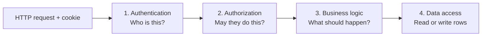
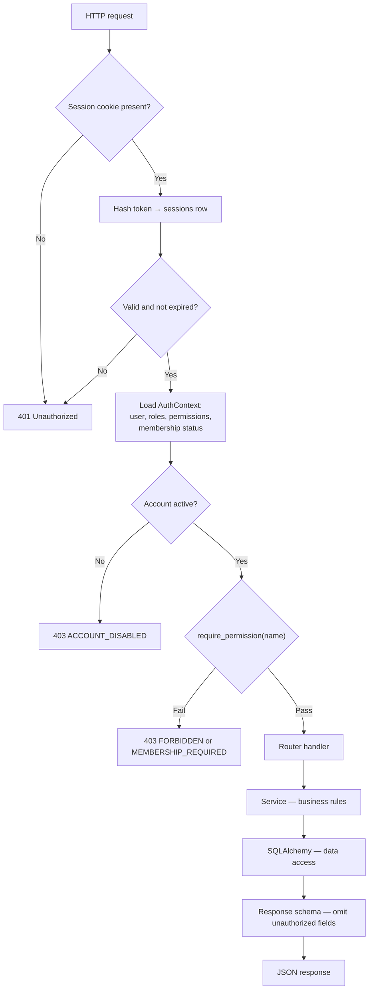
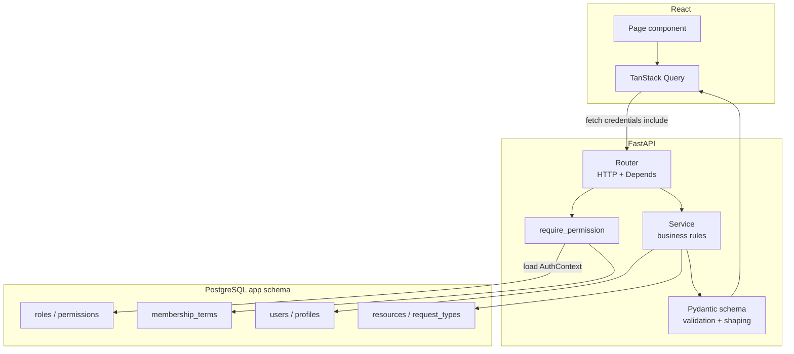

# API Architecture

This document defines **how the React frontend communicates with FastAPI**, how requests flow through authentication and authorization, and what endpoints exist in MVP.

**Prerequisites:** Read [`01-system-architecture.md`](01-system-architecture.md) (trust boundaries), [`04-database-schema.md`](04-database-schema.md) (tables), and [`05-authorization-architecture.md`](05-authorization-architecture.md) (permissions and gates).

**Phase 0 reference:** §0.11 (conceptual API architecture), §0.7.17 (security requirements)

---

## What is an API in this project?

An **API** (Application Programming Interface) is the set of HTTP endpoints the React frontend calls to read or change portal data.

In our architecture, the API is the **only allowed path** from the browser to stored data:

```
React  ──HTTPS JSON──▶  FastAPI (/api/v1)  ──SQL──▶  PostgreSQL
```

The browser **never** talks to Supabase or PostgreSQL directly. There is no Supabase client, no anon key, no service key in the frontend. If React needs member data, resources, or membership status, it sends an HTTP request to FastAPI and receives JSON back.

**Why this matters:** Every security rule — authentication, authorization, validation, audit logging — is enforced in one place (FastAPI). A member who edits JavaScript in the browser cannot bypass these rules because the browser has no database access.

**Phase 0 ref:** §0.11.1, §0.7.17 — "Supabase/PostgreSQL access should not be exposed directly to arbitrary frontend operations."

---

## How the frontend communicates with FastAPI

### Transport

| Aspect | Decision |
|---|---|
| Protocol | HTTPS only (TLS in production) |
| Format | JSON request and response bodies |
| Base path | `/api/v1/` — versioned from day one (Phase 0 §0.11.2) |
| Session | HttpOnly cookie — sent automatically by the browser |

### The fetch contract

Every authenticated request from React must include credentials so the session cookie is sent:

```typescript
fetch(`${API_BASE}/api/v1/resources?scope=organizational`, {
  credentials: 'include',  // required — sends session cookie
  headers: { 'Content-Type': 'application/json' },
})
```

Without `credentials: 'include'`, the browser will not send the HttpOnly session cookie and every protected endpoint will return `401`.

### CORS

The API runs on a different subdomain from the frontend (`api.*` vs `portal.*`). The browser enforces Cross-Origin Resource Sharing rules. FastAPI must allow **only** the portal origin — not `*`.

Detailed CORS and CSRF configuration is in [`08-security-architecture.md`](08-security-architecture.md). Section 6 assumes: one allowed origin, credentials permitted.

### What the frontend does not do

- Send a Bearer token or API key
- Send `user_id`, role names, or permission lists as trusted identity
- Call Supabase REST endpoints
- Decide authorization — it only hides UI based on `/auth/me` for convenience

---

## The four-layer request pipeline

Every API request passes through four **conceptually separate** responsibilities. Future developers should know which layer owns which concern — mixing them creates bugs that are hard to find.



| Layer | Question | Owns | Does not own |
|---|---|---|---|
| **Authentication** | Who is making this request? | Session lookup, account status (`is_active`, locked, deleted) | Permission checks, field filtering |
| **Authorization** | Is this user allowed to perform this action? | `require_permission(...)`, membership gate, response shaping | Password verification, business rules |
| **Business logic** | What should happen if they are allowed? | Writable profile fields, import preview/conflict rules, audit triggers, status transition rules | HTTP status codes, SQL syntax |
| **Data access** | How do we read/write the required data? | SQLAlchemy queries, transactions, commits | Permission names, Pydantic validation |

### Where each layer lives (conceptual backend layout)

```
backend/
├── app/
│   ├── main.py              # FastAPI app, middleware, router registration
│   ├── routers/             # HTTP layer — paths, methods, Depends(...)
│   ├── schemas/             # Pydantic — request/response validation and shaping
│   ├── services/            # Business logic — rules, orchestration
│   ├── models/              # SQLAlchemy — database table mappings
│   ├── auth/                # Session, AuthContext, require_permission
│   └── db/                  # Engine, session factory
```

**Routers** declare endpoints and attach dependencies. They should be thin — call a service, return a schema.

**Schemas** (Pydantic) are **not** database models. Section 2 rejected SQLModel precisely because `MemberDirectoryRead` and `MemberAdminRead` must differ — response shaping is authorization expressed as types.

**Services** contain rules that would be wrong in a router (e.g. "only `contact_number` and `year_level` are member-editable") or wrong in a model (e.g. import conflict detection).

**Models** map to `app.*` tables. Queries live in services or dedicated repository functions — not scattered through routers.

**Sync endpoints:** All route handlers use plain `def`, not `async def` (Section 2). FastAPI runs them in a thread pool; blocking SQLAlchemy and Argon2 calls are safe.

---

## Authentication and authorization on every request

Section 5 defines the full authorization model. Section 6 shows how it attaches to HTTP.

### Single mechanism — no second auth system

| Mechanism | Used? |
|---|---|
| HttpOnly session cookie | **Yes** — only session transport |
| Opaque DB-backed token | **Yes** — hash stored in `sessions` |
| JWT / Bearer token | **No** — rejected Section 2 |
| API keys for SPA | **No** |
| Supabase Auth | **No** |
| RLS as API authorization | **No** — FastAPI is the sole enforcement point |

There is **one** authentication path and **one** authorization path. Endpoints do not implement alternate checks.

### Request flow (authenticated endpoint)



### Two styles of permission attachment

**1. Static permission** — one permission per endpoint, declared via `Depends`:

```
GET /api/v1/request-types
  → require_permission("view_request_directory")
  → member_access, required_membership = ANY
```

**2. Scope-after-load** — permission depends on data being mutated. A static `Depends` cannot know the scope until the target row is loaded:

```
PATCH /api/v1/resources/{id}
  → require authenticated session
  → load resource → join category → read scope
  → if ACADEMIC: require manage_academic_resources
  → if ORGANIZATIONAL: require manage_organizational_resources
  → else 403 FORBIDDEN
```

Same pattern for `POST /api/v1/resources` (scope comes from the category in the request body) and `PATCH /api/v1/request-types/{id}` (finance vs publicity admin permissions).

**Phase 0 ref:** §0.6.14 — Finance Admin must not edit academic resources.

### No `/admin` URL prefix

Member consumption and admin mutation use the **same resource paths** with different permissions:

| Action | Method | Path | Permission |
|---|---|---|---|
| Member lists resources | `GET` | `/api/v1/resources?scope=academic` | `view_academic_resources` |
| Admin creates resource | `POST` | `/api/v1/resources` | `manage_academic_resources` or `manage_organizational_resources` (scope-after-load) |
| Admin updates resource | `PATCH` | `/api/v1/resources/{id}` | scope-after-load |

Authorization is the **permission**, not the URL prefix. Phase 0 §0.11.7–8 uses this pattern; Section 6 confirms it explicitly.

---

## Request and response validation

### Pydantic schemas

Every request body and response is validated through **Pydantic models** in `schemas/`:

| Schema kind | Purpose | Example |
|---|---|---|
| `*Create` | POST body — required fields, types, URL format | `ResourceCreate` |
| `*Update` | PATCH body — optional fields, partial update | `ProfileUpdate` |
| `*Read` | Response — fields the caller may see | `MemberDirectoryRead` vs `MemberAdminRead` |
| `*List` | Paginated collection wrapper | `{ items: [...], meta: { total, offset, limit } }` |

Validation failures return `422 Unprocessable Entity` with field-level details — never `500`.

**Examples of validation rules:**

- URLs: `http` or `https` only (matches DB CHECK on `resources.url`)
- Email: UP email format via `EmailStr`
- Enums: membership status, resource scope, resource type — must match allowed values
- PATCH: reject empty body; at least one field required

### Response shaping is authorization

The schema chosen for the response depends on the caller's permissions:

| Endpoint | Caller | Schema | Fields |
|---|---|---|---|
| `GET /members` | Member | `MemberDirectoryRead` | name, program, year level, batch, division — **no** student number, contact |
| `GET /members` | Admin (`view_members_admin`) | `MemberAdminRead` | all profile fields |
| `GET /members/me` | Self | `MemberSelfRead` | own full profile including contact |

Same URL, different JSON shape — enforced server-side, not by React props alone.

---

## Error representation

One error envelope for the entire API (Phase 0 §0.11.15):

```json
{
  "error": {
    "code": "MEMBERSHIP_REQUIRED",
    "message": "Renew your membership to access the Academic Drive.",
    "details": {}
  }
}
```

| HTTP status | `error.code` | When |
|---|---|---|
| `400` | `BAD_REQUEST` | Malformed request (rare — Pydantic usually catches first) |
| `401` | `UNAUTHORIZED` | No valid session |
| `403` | `FORBIDDEN` | Authenticated but lacks permission |
| `403` | `MEMBERSHIP_REQUIRED` | Has permission; membership gate failed |
| `403` | `ACCOUNT_DISABLED` | Account inactive, locked, or deleted |
| `404` | `NOT_FOUND` | Resource does not exist (or caller may not know it exists) |
| `409` | `CONFLICT` | Duplicate email, import conflict, optimistic lock |
| `422` | `VALIDATION_ERROR` | Pydantic validation failed — `details` has field errors |
| `429` | `RATE_LIMITED` | Too many login/OTP attempts |
| `500` | `INTERNAL_ERROR` | Unexpected server error — generic message to client; details in server logs only |

**Security rule:** Error messages must not leak whether a resource exists if the caller lacks permission to know. For ID-based lookups, return `404` for both "not found" and "not allowed" when revealing existence would be an information leak. For list endpoints, omit unauthorized rows.

### Success responses

| Pattern | Shape |
|---|---|
| Single resource | The resource object directly (not wrapped) |
| Collection | `{ "items": [...], "meta": { "total": N, "offset": 0, "limit": 50 } }` |
| Action with no body | `204 No Content` or `{ "ok": true }` — pick one convention and stay consistent |
| Created | `201 Created` with resource body and `Location` header |

---

## Pagination and filtering

Collections use **offset/limit** pagination — sufficient at ~1,200 members:

| Parameter | Default | Max |
|---|---|---|
| `offset` | `0` | — |
| `limit` | `50` | `100` |

**Filtering conventions:**

| Endpoint | Query params | Notes |
|---|---|---|
| `GET /resources` | `scope=academic\|organizational`, optional `category_id`, `type` | **`scope` is the authority** (C9), not `category=academic` |
| `GET /members` | `division_id`, `committee_id`, `q` (name search) | Directory filters |
| `GET /notifications` | `is_read=true\|false` | |
| `GET /audit-logs` | `actor_id`, `action`, date range | Admin only |

Phase 0 §0.11.7 left filtering syntax open — Section 6 resolves `scope` vs `category` per C9.

---

## Session and authentication endpoints

Authentication **flow internals** are documented in [`07-authentication-architecture.md`](07-authentication-architecture.md). This section defines the **HTTP contract**.

| Method | Path | Auth required? | Purpose |
|---|---|---|---|
| `GET` | `/api/v1/health` | **No** | Liveness check for Render keep-warm and monitoring |
| `POST` | `/api/v1/auth/login` | No | Email + password → OTP sent **or** session if trusted device |
| `POST` | `/api/v1/auth/verify-code` | No | OTP (+ optional remember-device) → `Set-Cookie` session |
| `POST` | `/api/v1/auth/logout` | Yes | Delete session row, clear cookie |
| `POST` | `/api/v1/auth/forgot-password` | No | Send reset token email (enumeration-safe) |
| `POST` | `/api/v1/auth/reset-password` | No | Token + new password; revokes all sessions |
| `POST` | `/api/v1/auth/activate` | No | Activation token + password → activated account |
| `POST` | `/api/v1/auth/activate/resend` | No | Enumeration-safe activation resend |
| `GET` | `/api/v1/auth/me` | Yes | Session bootstrap for React |
| `POST` | `/api/v1/members/{id}/send-activation` | Admin | Admin-triggered activation email |
| `DELETE` | `/api/v1/auth/sessions` | Yes | Logout all own sessions (P1) |
| `DELETE` | `/api/v1/members/{id}/sessions` | Admin | Admin revoke member sessions |

### Deliberately omitted: `POST /auth/refresh`

Phase 0 §0.11.4 lists `POST /api/v1/auth/refresh`. **This endpoint is not implemented.**

Section 2 rejected JWTs in favour of opaque DB-backed sessions. There is no refresh token. Session lifetime is controlled by `sessions.expires_at`. Logout deletes the session row. "Refresh" is not a concept in this architecture — it was a JWT-era leftover.

### `GET /auth/me` — session bootstrap

Returns everything React needs to render navigation and UI gates **without** calling five other endpoints on load:

```json
{
  "user_id": "...",
  "email": "member@up.edu.ph",
  "full_name": "Juan Dela Cruz",
  "membership_status": "RENEWED",
  "roles": ["MEMBER"],
  "permissions": ["view_dashboard", "view_resources", "..."],
  "route_keys": ["dashboard", "resources", "academic_drive", "..."]
}
```

`permissions` and `route_keys` are **for UI convenience only**. Every other endpoint re-derives authorization from the session.

### Distinct "me" endpoints

Three endpoints serve different purposes — do not merge them:

| Endpoint | Purpose |
|---|---|
| `GET /auth/me` | Session bootstrap — permissions, status, route keys, display name |
| `GET /members/me` | Full own profile — all fields the member may see about themselves |
| `GET /membership/me` | Own membership term(s) — status, academic year, org assignments |

---

## MVP endpoint catalogue

Every protected endpoint lists its **permission** and notes audit requirements. Membership gate applies only to `member_access` permissions (see Section 5).

### Health

| Method | Path | Permission | Notes |
|---|---|---|---|
| `GET` | `/health` | — (public) | Returns `{ "status": "ok" }`. No DB check in MVP. |

### Auth

See Session and authentication endpoints table above. Full flow in [`07-authentication-architecture.md`](07-authentication-architecture.md).

### Members

Public API uses **`/members`** — Circuit language. The database table is `users` + `profiles`; the API does not expose that split.

| Method | Path | Permission | Gate | Notes |
|---|---|---|---|---|
| `GET` | `/members` | `view_member_directory` | ANY | Paginated directory; response shape varies by caller |
| `GET` | `/members/me` | `view_own_profile` | ANY | Full own profile |
| `PATCH` | `/members/me` | `edit_own_profile` | ANY | Only `contact_number`, `year_level` writable |
| `GET` | `/members/{member_id}` | `view_member_directory` or `view_members_admin` | ANY / admin | Single member; admin sees more fields |
| `PATCH` | `/members/{member_id}` | `manage_members` | admin | Admin edit profile; audit log |
| `POST` | `/members/import/preview` | `import_member_data` | admin | Upload CSV/sheet → preview counts, conflicts |
| `POST` | `/members/import/confirm` | `import_member_data` | admin | Execute import after preview; audit log |

**Phase 0 refs:** §0.11.5, FR-MEMBER-001, §0.7.18 (import preview/confirm)

### Membership

| Method | Path | Permission | Gate | Notes |
|---|---|---|---|---|
| `GET` | `/membership/me` | `view_own_profile` | ANY | Current term + assignments |
| `GET` | `/membership/{member_id}` | `view_members_admin` | admin | Any member's term history |
| `GET` | `/membership/{member_id}/history` | `view_members_admin` | admin | All terms for member |
| `PATCH` | `/membership/{member_id}/status` | `manage_membership_status` | admin | Body: `status`, `academic_year`, `reason`, **`confirm_full_name`**; audit log |

**Phase 0 refs:** §0.11.6, FR-MEMBERSHIP-001, §0.6.6 (confirmation)

### Divisions (read-only in MVP)

| Method | Path | Permission | Gate | Notes |
|---|---|---|---|---|
| `GET` | `/divisions` | `view_member_directory` | ANY | List divisions for directory filters |
| `GET` | `/divisions/{id}/committees` | `view_member_directory` | ANY | Committees under a division |

Organizational structure CRUD is seed-data + admin tooling in P1 if needed (N6).

### Academic years

| Method | Path | Permission | Gate | Notes |
|---|---|---|---|---|
| `GET` | `/academic-years/current` | `view_dashboard` | ANY | Returns current academic year row. Requires authenticated session from M1 onward. |

### Resources and categories

| Method | Path | Permission | Gate | Notes |
|---|---|---|---|---|
| `GET` | `/resources` | `view_resources` or `view_academic_resources` | ANY / RENEWED | Query `scope=academic` requires `view_academic_resources`; `scope=organizational` requires `view_resources` |
| `GET` | `/resources/{id}` | same as list | same | Single resource |
| `POST` | `/resources` | scope-after-load | admin | Create; audit log |
| `PATCH` | `/resources/{id}` | scope-after-load | admin | Update; audit log |
| `DELETE` | `/resources/{id}` | scope-after-load | admin | Soft-delete (`is_active=false`); audit log |
| `GET` | `/resource-categories` | `view_resources` or `view_academic_resources` | ANY / RENEWED | Filter by `scope` query param |
| `POST` | `/resource-categories` | `manage_resource_categories` | admin | Audit log |
| `PATCH` | `/resource-categories/{id}` | `manage_resource_categories` | admin | Audit log |

**Note on `GET /resources`:** When `scope=academic`, the endpoint checks `view_academic_resources` (RENEWED gate). A non-renewed member receives `403 MEMBERSHIP_REQUIRED` — not a generic forbidden.

**Phase 0 refs:** §0.11.7, FR-ACADEMIC-005

### Request types

| Method | Path | Permission | Gate | Notes |
|---|---|---|---|---|
| `GET` | `/request-types` | `view_request_directory` | ANY | MVP: directory of external form links |
| `GET` | `/request-types/{id}` | `view_request_directory` | ANY | Single entry |
| `POST` | `/request-types` | domain-after-load or `manage_all_request_types` | admin | Audit log |
| `PATCH` | `/request-types/{id}` | domain-after-load or `manage_all_request_types` | admin | Audit log |
| `DELETE` | `/request-types/{id}` | domain-after-load or `manage_all_request_types` | admin | Soft-delete; audit log |

Per-request-type membership gating deferred (N10).

**Phase 0 refs:** §0.11.8, §0.7.9

### Notifications

| Method | Path | Permission | Gate | Notes |
|---|---|---|---|---|
| `GET` | `/notifications` | `view_own_notifications` | ANY | Paginated; own notifications only |
| `PATCH` | `/notifications/{id}/read` | `view_own_notifications` | ANY | Mark one read |
| `PATCH` | `/notifications/read-all` | `view_own_notifications` | ANY | Mark all read |

Backend creates notification rows in response to events (membership status change, etc.) — not via a member-facing POST.

**Phase 0 refs:** §0.11.11, FR-NOTIF-001

### Roles and admin assignments

| Method | Path | Permission | Notes |
|---|---|---|---|
| `GET` | `/roles` | `manage_roles` | List assignable roles |
| `GET` | `/members/{member_id}/roles` | `manage_roles` | Roles held by member |
| `PUT` | `/members/{member_id}/roles` | `manage_roles` | Replace role set; audit log |

Renewals Admin does **not** have `manage_roles` — only Super Admin assigns admin roles.

### Audit logs

| Method | Path | Permission | Notes |
|---|---|---|---|
| `GET` | `/audit-logs` | `view_audit_logs` | Paginated; Super Admin only in MVP |

Scoped division audit views deferred to P1 (`view_audit_logs_scoped`).

**Phase 0 refs:** §0.11.14, FR-AUDIT-001

---

## Deferred endpoints (not MVP)

Listed for traceability to Phase 0 §0.11. Not implemented in initial release.

| Domain | Phase 0 paths | When | Why deferred |
|---|---|---|---|
| Native requests | `POST/GET/PATCH /requests` | P1 | C5 — MVP is redirect-only directory |
| Flagships | `/flagships`, `/flagship-iterations`, `/activities` | P1/P2 | Tier 3 tables; N12 per-project admin |
| Announcements | `/announcements` | P1 | Tier 2 |
| Navigation CRUD | `/navigation` | P1 | C7 — MVP uses code-defined routes + `/auth/me` route keys |
| Portal configuration | `/configuration` | P2 | Branding, etc. |
| Auth refresh | `POST /auth/refresh` | **Never** | No JWT — Section 2, ADR-023 |

When P1 endpoints are added, they follow the same four-layer pipeline and permission attachment rules defined here.

---

## OpenAPI documentation

FastAPI generates interactive API docs automatically (Phase 0 §0.11.16):

| Path | Purpose |
|---|---|
| `/api/docs` | Swagger UI |
| `/api/redoc` | ReDoc |

**Environment policy:**

| Environment | Docs enabled? |
|---|---|
| Local | **Yes** — primary developer reference |
| Dev (Supabase dev project) | **Yes** — integration testing |
| Production | **No** — reduces attack surface |

Production docs may be re-enabled behind Super Admin auth in a later iteration if needed. The canonical API reference for future WebDev members is this document and the GitHub architecture package — not production `/api/docs`.

---

## Mapping API to database and authorization



| API concept | Database table(s) | Authorization (Section 5) |
|---|---|---|
| `GET /members` | `profiles`, `membership_term_assignments`, `divisions` | `view_member_directory` — ANY |
| `GET /resources?scope=academic` | `resources` → `resource_categories.scope` | `view_academic_resources` — RENEWED |
| `PATCH /resources/{id}` | `resources`, `resource_categories` | scope-after-load admin permission |
| `PATCH /membership/{id}/status` | `membership_terms` | `manage_membership_status` + `confirm_full_name` |
| `GET /auth/me` | `users`, `user_roles`, `role_permissions`, `permissions`, `membership_terms` | Valid session only |

---

## Worked example: member opens Academic Drive

```
1. React: GET /api/v1/resources?scope=academic
           Cookie: session=<opaque token>

2. Authentication:
   Hash cookie → sessions row → user_id
   Load AuthContext

3. Authorization:
   require_permission("view_academic_resources")
   → user holds permission via MEMBER role ✓
   → kind = member_access, required_membership = RENEWED
   → membership_status = NOT_RENEWED ✗
   → 403 { "error": { "code": "MEMBERSHIP_REQUIRED", ... } }

4. React shows renewal prompt (not generic error)
```

If `membership_status = RENEWED`:

```
3. Authorization: passes
4. Business logic: service queries resources JOIN categories WHERE scope = 'ACADEMIC' AND is_active
5. Data access: SQLAlchemy returns rows
6. Response: ResourceRead[] wrapped in { items, meta }
```

---

## Worked example: Academic Admin edits a resource

```
1. React: PATCH /api/v1/resources/abc-123
           Body: { "url": "https://forms.google.com/..." }

2. Authentication: valid session ✓

3. Authorization (scope-after-load):
   Load resource abc-123 → category.scope = ACADEMIC
   Require manage_academic_resources ✓
   (membership gate skipped — admin_capability)

4. Business logic:
   Validate URL scheme
   Write audit_log row (actor, action, before/after)
   Update resource

5. Response: ResourceRead
```

Same URL path a member would use to read — different permission, different HTTP method.

---

## Design decisions and reasoning

### Same-resource REST, not `/admin` prefix

Phase 0 groups admin and member operations under the same resources. A separate `/admin` tree would duplicate routes, confuse OpenAPI consumers, and tempt frontend code to treat `/admin` as "secure by obscurity." Permission checks are the boundary — not URL structure.

### `/members` not `/users`

Phase 0 §0.11.3 lists both `auth` and `users` domains. The public API uses **`/members`** because Circuit officers and members think in terms of members, not authentication identities. The `users` / `profiles` split stays internal to the database and SQLAlchemy models.

### No refresh endpoint

JWT-based designs need refresh tokens because access tokens expire quickly. Opaque sessions expire on a longer horizon (`sessions.expires_at`) and are revoked by row deletion. Adding refresh would introduce a second token type with no benefit.

### Separate Pydantic schemas from SQLAlchemy models

A single model for DB + API would leak fields. `MemberDirectoryRead` deliberately excludes `student_number` and `contact_number`. The service layer chooses which schema to construct based on `AuthContext` — that is response shaping as authorization.

### Import as preview + confirm

Phase 0 §0.7.18 requires preview before import. Two endpoints (`/import/preview`, `/import/confirm`) make the two-step flow explicit and idempotent — confirm references the preview session or re-validates, never blindly trusts client counts.

---

## Related documents

| Topic | Document |
|---|---|
| Trust boundaries, request flow | `01-system-architecture.md` |
| Pydantic, sync SQLAlchemy | `02-technology-decisions.md` |
| Tables and columns | `04-database-schema.md` |
| Permissions and gates | `05-authorization-architecture.md` |
| Login, OTP, activation (C4) | [`07-authentication-architecture.md`](07-authentication-architecture.md) |
| CORS, CSRF, headers | [`08-security-architecture.md`](08-security-architecture.md) |
| Open items | `open-items.md` |

---

## Do not change without ADR

- Single session mechanism (cookie + DB session — no JWT, no refresh)
- Four-layer separation (router / service / model / schema)
- Permission on every protected endpoint — no "trusted internal" shortcuts
- Same-resource REST — no `/admin` URL namespace for authorization
- `scope` query param authority on resources (C9)
- Production OpenAPI disabled by default
- Error envelope shape
