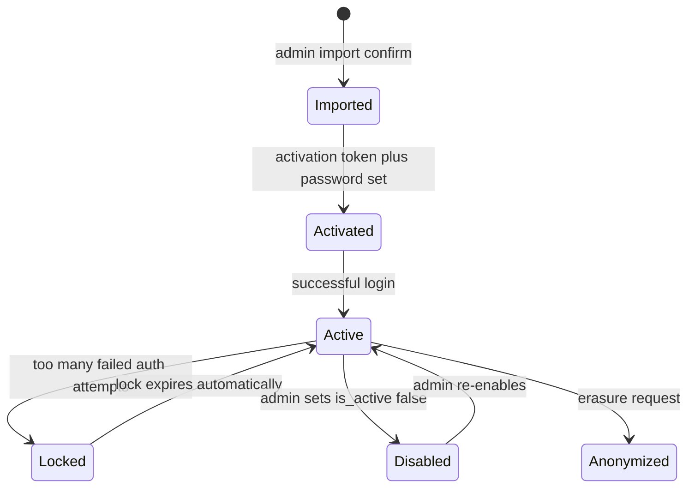
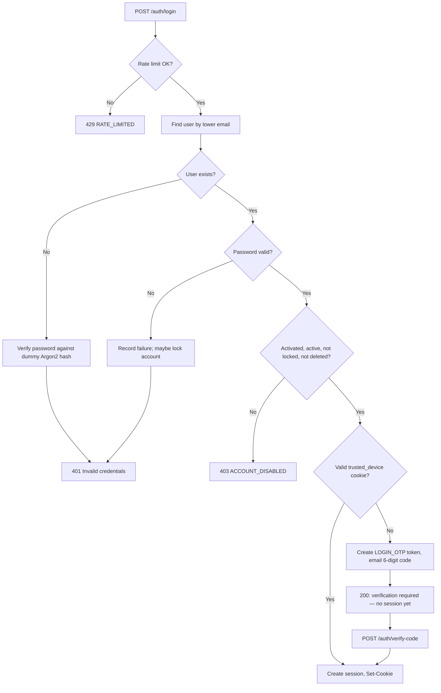
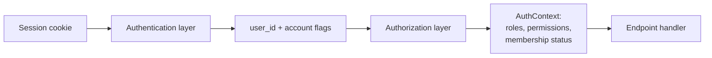

# Authentication Architecture

This document defines **how members prove their identity** to the UP Circuit Member Portal — login, activation, sessions, passwords, OTP, and account security.

**Security-critical:** Read this entire document before changing any authentication code. Mistakes here are expensive to recover from and may affect all ~1,200 members.

**Prerequisites:** [`01-system-architecture.md`](01-system-architecture.md) (trust boundaries), [`04-database-schema.md`](04-database-schema.md) (auth tables), [`05-authorization-architecture.md`](05-authorization-architecture.md) (what happens after login), [`06-api-architecture.md`](06-api-architecture.md) (HTTP endpoints).

**Phase 0 reference:** FR-AUTH-001 through FR-AUTH-005, §0.9.1–0.9.3, §0.7.17

---

## Authentication vs authorization

| | Authentication | Authorization |
|---|---|---|
| Question | **Who are you?** | **What may you do?** |
| Produces | A verified `user_id` and account flags | Allow or deny a specific action |
| Documented in | **This document (Section 7)** | [`05-authorization-architecture.md`](05-authorization-architecture.md) |
| Runs | At login and on every session lookup | After authentication, on every protected request |

Authentication **stops** once the session cookie resolves to a valid `user_id`. It does not load permissions, membership status, or roles into a trusted form for later reuse without re-querying. Authorization builds **AuthContext** from that `user_id` (Section 5).

---

## Threat model

Every mechanism in this document maps to a threat. Future developers should know **what breaks** if they remove or weaken a control.

| Threat | Example | Primary control |
|---|---|---|
| **Credential stuffing** | Attacker tries leaked passwords from other sites | Rate limiting; account lock after repeated failures |
| **Online password guessing** | Attacker brute-forces one account | Argon2id cost; lockout; rate limits per email/IP |
| **Database leak** | Attacker obtains a Postgres dump | Password hashes (Argon2id); token hashes only (SHA-256); no plaintext secrets stored |
| **Session theft (XSS)** | Malicious script reads session token | HttpOnly cookie — JavaScript cannot read it |
| **Session theft (network)** | Token intercepted on HTTP | Secure cookie — HTTPS only |
| **CSRF** | Malicious site triggers actions with victim's cookie | SameSite=Lax + Origin validation (Section 8) |
| **Account enumeration** | Attacker learns which emails are registered | Identical error responses; dummy hash on missing user |
| **OTP brute force** | Attacker guesses 6-digit code | Short expiry; attempt limit; hashed storage |
| **Stolen laptop / shared device** | Someone uses an unlocked browser | Session expiry; logout; admin session revocation |
| **Compromised password** | Member's password is known | OTP on untrusted devices; password reset revokes all sessions |
| **Insider / admin misuse** | Officer disables rival's account | Audit logs; `manage_members` permission gate |
| **Import typo (wrong email)** | Activation link sent to wrong inbox | Single-use token; 7-day expiry; admin can re-send; member contacts support if never received |

This is not a formal penetration test scope — it is the reasoning checklist for design decisions below.

---

## Design principles (non-negotiable)

These were decided in Sections 1–6 and **must not be reversed** without an ADR:

| Principle | Meaning |
|---|---|
| **No JWTs** | Opaque random tokens stored as hashes in PostgreSQL |
| **No refresh tokens** | Session lifetime managed by `sessions.expires_at` only |
| **No Bearer auth for the SPA** | Session cookie is the only client credential |
| **No Supabase Auth** | FastAPI owns the full auth stack |
| **No plaintext secrets in DB** | Passwords, OTPs, session tokens, activation tokens — hash only |
| **No second auth mechanism** | One session model for members and admins |

---

## No public self-registration

Phase 0 FR-AUTH-001 allows registration via UP email but **redirects to the existing Membership Division process** for MVP. The portal does **not** expose `POST /auth/register`.

**Accounts are created only by:**

1. **Admin import** — Membership Division sheet → preview → confirm (§0.7.18)
2. **Future:** automated sync when the external membership system exposes an API (§0.9.2 — mechanism TBD)

**Security benefit:** No attacker can create accounts, probe signup validation, or squat on email addresses. Every account traces to an import or admin action.

---

## Account lifecycle



### Database mapping

| State | `users` indicators | Can log in? |
|---|---|---|
| **Imported, not activated** | `password_hash IS NULL`, `activated_at IS NULL` | No — must activate first |
| **Activated** | `password_hash` set, `activated_at` set | Yes (if active, not locked) |
| **Locked** | `locked_until > now()` | No — until lock expires |
| **Disabled** | `is_active = false` | No — admin action required |
| **Deleted / anonymized** | `deleted_at` set, PII blanked | No |

**Membership status** (`PENDING`, `RENEWED`, `NOT_RENEWED`) is **not** an authentication state. A `NOT_RENEWED` member authenticates normally; authorization gates member-facing features (Section 5).

---

## Resolving C4 — imported member activation

### Problem

Phase 0 §0.9.3 imports ~1,200 members into `users` + `profiles` with **no password**. Without activation, nobody can log in at launch.

### Decision (approved)

**Activation via emailed single-use link.** Proving control of the UP/EEE inbox is sufficient trust. No second factor (student number, etc.) at activation.

**If the import sheet has a wrong email:** the real member never receives the link and contacts Renewals Admin / support. The wrong recipient could set a password on a mis-addressed account — operational risk mitigated by import preview (§0.7.18) and division-by-division rollout to limit blast radius.

### Activation token

Uses the same `auth_tokens` machinery as OTP and password reset:

| Property | Value | Reason |
|---|---|---|
| `purpose` | `ACTIVATION` | Distinct from login OTP |
| Format | Opaque URL token (`secrets.token_urlsafe(32)`) | Not a 6-digit guessable code |
| Storage | SHA-256 hash in `auth_tokens.token_hash` | DB leak does not reveal usable token |
| Expiry | **7 days** | Longer than OTP — staged rollout over several days |
| Single use | `used_at` set on success | Cannot reuse link |
| Attempt limit | N/A for link (possession = proof) | Unlike OTP, the token is high-entropy |

### Activation flow

```
Admin (or automated job after import)
  → POST /members/{id}/send-activation  (or bulk by division)
  → Create auth_tokens row (ACTIVATION)
  → Email link: https://portal.*/activate?token=...

Member clicks link
  → POST /api/v1/auth/activate
     Body: { "token": "...", "password": "..." }
  → Verify token hash, not expired, not used
  → Set users.password_hash (Argon2id)
  → Set users.activated_at = now()
  → Mark token used_at
  → Optionally auto-login (create session) — TBD in implementation; document either way

Member can now log in normally.
```

### Staged rollout (operational requirement)

Section 2 established: **1,204 activation emails exceed Brevo's 300/day free cap.** Onboarding must be **division by division** over several days. A bug in activation hits ~40 people, not 1,204.

### Self-service resend (enumeration-safe)

```
POST /api/v1/auth/activate/resend
Body: { "email": "member@up.edu.ph" }

Response (always identical, whether or not account exists):
  200 { "message": "If an account exists and is not yet activated, an email has been sent." }
```

Only sends if: user exists, `password_hash IS NULL`, not disabled. Rate limited per email/IP.

### Admin re-send

Renewals Admin with `manage_members` can trigger activation email for a specific member from the admin UI — same token machinery, audit logged.

**Phase 0 refs:** FR-MEMBERSHIP-007, §0.9.3, C4 (resolved)

---

## Login flow

Phase 0 FR-AUTH-003: **password, then email verification code, then authenticated.** Section 2 added: **OTP skipped on trusted devices** (FR-AUTH-003 relaxed — see Phase 0 deviations table).



### Step-by-step

1. **Rate limit** — check `auth_attempts` for email and IP (see Rate limiting below).
2. **Lookup user** — `lower(email)` match.
3. **Verify password** — Argon2id via `pwdlib`. If user missing, verify against a **precomputed dummy hash** so timing does not reveal existence (Enumeration protection).
4. **Account state** — reject if not activated, disabled, locked, or deleted. Use `403 ACCOUNT_DISABLED` with a generic message (do not distinguish "not activated" vs "disabled" to callers who failed password — they should not get this far without valid password).
5. **Trusted device check** — if valid `trusted_device` cookie, skip OTP → create session.
6. **OTP path** — generate 6-digit code, store hash in `auth_tokens` (`LOGIN_OTP`), email via Brevo, return `{ "verification_required": true }` — **no session cookie yet**.
7. **Verify OTP** — `POST /auth/verify-code` with email + code (+ optional `remember_device: true`). On success: create session, optionally create trusted device, clear OTP token.

**No session exists until OTP is verified or trusted device bypasses OTP.**

---

## Password hashing (Argon2id)

### Library and algorithm

**Decision:** `pwdlib[argon2]` with **Argon2id** (`PasswordHash.recommended()`).

| Why Argon2id | Why not bcrypt alone | Why not passlib |
|---|---|---|
| OWASP current recommendation | Weaker against GPU at equal cost | Unmaintained; broken Python 3.13+ |
| Memory-hard — costly for attackers | — | Replaced by pwdlib |

### Starting parameters (provisional — N1)

| Parameter | Starting value | Meaning |
|---|---|---|
| `m` (memory) | **19456** KiB (~19 MiB) | Memory cost per hash |
| `t` (time) | **2** | Iterations |
| `p` (parallelism) | **1** | Threads |

**Why not OWASP's headline 64 MiB?** Render Starter/Free instances have **512 MB RAM total**. Ten concurrent logins at 64 MiB each ≈ 640 MiB — the container OOMs. The connection between "we followed OWASP" and "login kills the server at 2am" is not obvious without this documentation.

**These values are not final until N1 benchmark passes on the actual Render instance.**

### N1 benchmark protocol (prove early)

Run **before** locking parameters for production:

| Step | Action |
|---|---|
| 1 | Deploy auth code to Render Starter (512 MB) with starting params |
| 2 | Simulate **10 concurrent** `POST /auth/login` requests (password verify only) |
| 3 | Measure **p95 hash latency** (target: ≤ 500 ms per hash at p95) |
| 4 | Measure **peak RSS** of the web process (must stay ≤ 400 MB with headroom) |
| 5 | If fail: **reduce `m` first**, then `t` — never increase without re-benchmark |
| 6 | Document final params in ADR-013 with evidence (latency graph, memory reading) |

**Acceptance criteria:**

- p95 password verify ≤ 500 ms under 10 concurrent logins
- Peak memory ≤ 80% of instance limit (409 MB on 512 MB)
- No OOM kills during 5-minute sustained login load test

**Status:** Open — prove early (`open-items.md` N1). Do not treat 19 MiB as permanently fixed.

### Password rules (MVP)

| Rule | Value |
|---|---|
| Minimum length | 12 characters |
| Maximum length | 128 characters (prevent DoS via huge passwords) |
| Complexity | No forced symbols (NIST-style — length over composition) |
| Breach check | Deferred — optional Have I Been Pwned API in P1 |

---

## OTP (login verification code)

### Generation

```python
code = secrets.randbelow(1_000_000)  # 000000–999999, zero-padded to 6 digits
```

**Why not TOTP/pyotp?** TOTP is for authenticator apps with shared secrets. Ours is a **one-shot emailed code** — simpler primitive, no app install, matches FR-AUTH-003.

### Storage and verification

| Property | Value |
|---|---|
| Table | `auth_tokens` |
| `purpose` | `LOGIN_OTP` |
| Stored | SHA-256 hash of code (or HMAC with server pepper if added — not required for 6-digit with expiry + rate limit) |
| Expiry | **10 minutes** |
| Single use | `used_at` set on success |
| Max attempts | **5** per token (`attempt_count`); then token invalidated |
| Comparison | `hmac.compare_digest()` — constant time |

**Note:** 6-digit codes are brute-forceable in theory (1M space). Mitigations: 10-minute window, 5 attempts, rate limits per email/IP, single active OTP per user (invalidate previous on new login).

### Email delivery

OTP sent **inline** during `POST /auth/login` — no background queue (Section 2 rejected Celery). Login response latency includes Brevo API call.

**Risk:** Slow email provider feels like broken login. See **N16** — prove early delivery latency and define timeout UX.

---

## Password reset

Uses `auth_tokens` with `purpose = PASSWORD_RESET`.

```
POST /auth/forgot-password  { "email": "..." }
  → Always 200 with generic message (enumeration-safe)
  → If user exists and activated: create token, email link

POST /auth/reset-password  { "token": "...", "password": "..." }
  → Verify token, set new password_hash
  → Mark token used
  → DELETE all sessions for user
  → DELETE / revoke all trusted_devices for user
  → Return success
```

**Why revoke everything on reset:** Password reset means suspected compromise. All existing sessions and trusted devices must die. This is a key advantage of DB-backed sessions over JWT.

Token expiry: **1 hour** (shorter than activation — active user context).

---

## Opaque database-backed sessions

### Token generation

```python
token = secrets.token_urlsafe(32)   # ~256 bits entropy
stored = sha256(token)              # hex or base64 in sessions.token_hash
```

Cookie value: the **plaintext token** (only in HttpOnly cookie — never in DB, never in logs).

### Session row

| Column | Purpose |
|---|---|
| `token_hash` | Lookup key |
| `user_id` | Owner |
| `expires_at` | When session becomes invalid |
| `last_used_at` | Sliding idle tracking (Section 4 schema) |
| `created_at` | Absolute lifetime cap |
| `ip_address`, `user_agent` | Audit / member "where am I logged in" (P1 UI optional) |

### Session lookup (every authenticated request)

1. Read cookie → hash token
2. `SELECT` from `sessions` WHERE `token_hash = ?` AND `expires_at > now()`
3. If found: optionally extend sliding window (throttled)
4. Load user → check `is_active`, `locked_until`, `deleted_at`
5. Pass `user_id` to authorization layer for AuthContext

**Permissions are NOT stored on the session row** (Section 5, ADR-022).

---

## Why SHA-256 for tokens but Argon2 for passwords

This is the most commonly misunderstood point in the design.

| Secret type | Entropy | Hash | Why |
|---|---|---|---|
| **Password** | Low (~20–40 bits effective) | **Argon2id** (slow, memory-hard) | Attacker with DB dump must brute-force each password — cost must be high |
| **Session / OTP / activation token** | High (~256 bits random) | **SHA-256** (fast) | Nothing to brute-force; slow hash adds latency on **every request** with no security gain |

If session tokens used Argon2, every API call would pay ~100–500 ms hashing — unacceptable. If passwords used SHA-256, a leaked hash table would crack passwords instantly.

**Rule:** Slow hash human-chosen secrets. Fast hash machine-generated secrets.

---

## Session expiry — sliding 7-day idle, 30-day absolute

**Decision (approved):**

| Rule | Value |
|---|---|
| **Idle timeout** | 7 days without activity |
| **Absolute maximum** | 30 days from `created_at` — forced re-login regardless of activity |

### Sliding extension (throttled)

On each authenticated request, **if** more than **15 minutes** since last extension:

```
new_expires_at = min(now + 7 days, created_at + 30 days)
UPDATE sessions SET expires_at = new_expires_at, last_used_at = now()
```

**Why throttle:** An active member clicking around should not trigger a DB write on every API call. 15-minute granularity is sufficient for idle detection.

### Cleanup

Expired sessions should be deleted by a periodic job (see N14). Until then, expired rows are harmless — lookup filters `expires_at > now()`.

---

## Logout and session invalidation

| Action | Mechanism |
|---|---|
| **Logout (current device)** | `POST /auth/logout` — delete this session row, clear cookie |
| **Logout all devices (member)** | Delete all `sessions` rows for `user_id` — P1 "Sign out everywhere" UI |
| **Admin revoke** | Renewals/Super Admin deletes sessions for a member — e.g. on compromise report |
| **Password reset** | Delete all sessions + trusted devices (automatic) |
| **Account disable** | Existing sessions fail on next request (`is_active` check) — no need to delete rows immediately, but admin may purge |

**Contrast with JWT:** `DELETE FROM sessions WHERE user_id = ?` instantly revokes. JWT requires blocklist or short expiry — why Section 2 rejected JWTs.

---

## Cookie attributes

Session cookie set on `POST /auth/verify-code` (and trusted-device login path):

| Attribute | Value | Threat addressed |
|---|---|---|
| **HttpOnly** | `true` | XSS cannot read token via `document.cookie` |
| **Secure** | `true` | Token not sent over plaintext HTTP |
| **SameSite** | `Lax` | CSRF on cross-site POST; allows top-level navigation |
| **Path** | `/` | Sent to all API paths on host |
| **Domain** | Host-only on `api.*` subdomain | Not shared with frontend origin JavaScript scope |
| **Max-Age / Expires** | Aligned with session policy | Browser discards when session would expire server-side |

**Custom domain required:** `portal.*` and `api.*` must share a registrable parent for same-site cookie behavior (Section 1). Until domain exists, local dev uses localhost with documented exceptions (Section 11).

**Trusted device cookie:** Separate cookie name, same security attributes, 30-day lifetime tied to `trusted_devices` row.

---

## Trusted devices ("Remember this device")

### Purpose

Section 2: OTP on every login exceeds free-tier email limits at ~1,200 members. Trusted devices reduce steady-state OTP volume by an order of magnitude.

### Mechanism

On successful OTP verification with `remember_device: true`:

1. Generate opaque token → hash → `trusted_devices` row
2. Set HttpOnly cookie (separate from session cookie)
3. Expiry: **30 days** (`trusted_devices.expires_at`)

On subsequent login: valid password + valid trusted device cookie → **skip OTP**, create session directly.

### Honest security tradeoff (ADR-029)

A trusted device **downgrades login to single-factor on that device:**

- Attacker with **stolen session cookie only** → cannot login (password still required)
- Attacker with **stolen password + stolen trusted device cookie** → skips OTP

This is a deliberate trade for usability and email quota. Mitigations:

- Member can revoke trusted devices (P1 account security page)
- Admin can revoke on behalf of member
- Password reset revokes all trusted devices
- 30-day expiry limits window

**Do not extend trusted device lifetime without revisiting email capacity and threat model.**

---

## Account locking vs disabling

| | **Lock** (`locked_until`) | **Disable** (`is_active = false`) |
|---|---|---|
| **Trigger** | Automatic — too many failed login/OTP attempts | Manual — admin action |
| **Duration** | Temporary — e.g. **15 minutes** after 5 failures in 15 minutes | Indefinite until admin re-enables |
| **Self-healing** | Yes — lock expires without admin | No |
| **Who resolves** | Time, or admin with `manage_members` | Admin only |

**Why locks must self-expire:** Circuit has no 24/7 helpdesk. An attacker who triggers lockout on a victim's account must not permanently deny access. Admin-only unlock would turn brute-force into denial-of-service.

**Suggested thresholds (tunable in implementation):**

| Event | Threshold | Action |
|---|---|---|
| Failed login (password) | 5 per email in 15 min | Lock 15 min |
| Failed OTP | 5 per token | Invalidate token |
| Failed login (IP) | 20 per IP in 15 min | Rate limit 429 |
| Activation resend | 3 per email per hour | Rate limit 429 |

---

## Rate limiting

**Decision:** PostgreSQL `auth_attempts` table — no Redis, no `slowapi` in-memory (Section 2).

| Why PostgreSQL | Why not in-memory |
|---|---|
| Survives Render restarts | Render free tier restarts wipe memory |
| FR-AUTH-005 requires durable attempt history | — |
| Same table serves rate limit + audit | — |

Each auth endpoint inserts a row: `email`, `ip_address`, `attempt_type` (`LOGIN`, `OTP`, `ACTIVATION`), `success`, `created_at`.

Rate check: count recent failures before processing. Retention: **90 days** (Section 4), then cleanup job (N14).

---

## Enumeration protection

Phase 0 FR-AUTH-005: *"We should not expose unnecessary information such as whether a particular email exists."*

| Endpoint | Behavior |
|---|---|
| `POST /auth/login` | Same `401` + message for wrong password **and** unknown email |
| Missing user timing | Verify password against **dummy Argon2 hash** to equalize latency |
| `POST /auth/forgot-password` | Always `200` + generic message |
| `POST /auth/activate/resend` | Always `200` + generic message |
| `POST /auth/login` (not activated) | After **valid password** only: may return specific "activate your account" — attacker needed password first |

**Why we do not fake the OTP step:** Some sites always show "enter code" even for bad emails. We use generic `401` instead — equally safe, clearer UX, because password failure already does not reveal existence.

---

## NOT_RENEWED members and authentication

**Authentication succeeds** for `PENDING`, `RENEWED`, and `NOT_RENEWED` membership statuses.

Phase 0 §0.6.3 explicitly requires non-renewed members to **log in** — the portal is where they learn to renew. Membership gates apply at **authorization** (Section 5), not login.

```
NOT_RENEWED member logs in successfully
  → AuthContext.membership_status = NOT_RENEWED
  → GET /resources?scope=academic → 403 MEMBERSHIP_REQUIRED
  → GET /auth/me → shows renewal route key
  → view_renewal_info works
```

---

## Authentication → AuthContext boundary



| Layer | Loads | Does not load |
|---|---|---|
| **Authentication** | `user_id`, `is_active`, `locked_until`, `deleted_at`, session validity | Permissions, roles, membership |
| **Authorization** | Roles, permissions (`kind`, `required_membership`), current `membership_terms.status` | Password hash, OTP state |

**Implementation:** `get_current_user()` dependency (authentication) → `require_permission(...)` dependency (authorization, builds full AuthContext).

**No permission caching on session:** Role revoked → next request fails. Membership lapses → next request reflects it.

---

## Authentication-related tables (summary)

| Table | Holds | Never holds |
|---|---|---|
| `users` | `password_hash` (Argon2), `activated_at`, lock/disable flags | Plaintext password |
| `sessions` | Session token **hash**, expiry, `last_used_at` | Plaintext session token |
| `auth_tokens` | OTP/activation/reset **hashes**, expiry, attempts | Plaintext codes/tokens |
| `auth_attempts` | Rate limit audit trail | — |
| `trusted_devices` | Device token **hash**, expiry | Plaintext device token |

---

## Authentication API endpoints (complete)

Extends [`06-api-architecture.md`](06-api-architecture.md) auth table:

| Method | Path | Auth? | Purpose |
|---|---|---|---|
| `GET` | `/health` | No | Liveness |
| `POST` | `/auth/login` | No | Password → OTP or session (trusted device) |
| `POST` | `/auth/verify-code` | No | OTP → session (+ optional trusted device) |
| `POST` | `/auth/logout` | Yes | End session |
| `POST` | `/auth/forgot-password` | No | Request reset email |
| `POST` | `/auth/reset-password` | No | Set new password, revoke sessions |
| `POST` | `/auth/activate` | No | Activation token + password → activated account |
| `POST` | `/auth/activate/resend` | No | Enumeration-safe resend |
| `GET` | `/auth/me` | Yes | Session bootstrap (includes AuthContext fields) |
| `POST` | `/members/{id}/send-activation` | Admin | Admin-triggered activation email |
| `DELETE` | `/auth/sessions` | Yes | Logout all own sessions (P1) |
| `DELETE` | `/members/{id}/sessions` | Admin | Admin revoke member sessions |

**Not implemented:** `POST /auth/refresh` (C11, ADR-023)

---

## What must not be changed casually

| Item | Risk if changed |
|---|---|
| Argon2 for passwords, SHA-256 for tokens | Wrong tool → instant crack or slow API |
| HttpOnly + Secure cookies | XSS or network theft |
| No JWT / refresh | Split brain sessions; un-revocable tokens |
| Enumeration-safe responses | Account discovery |
| Password reset revokes all sessions | Compromise persists after "reset" |
| OTP before session (untrusted device) | Single-factor login |
| Dummy hash on missing user | Timing enumeration |
| Self-expiring account locks | Permanent DoS on members |
| Permissions not on session row | Stale authorization |
| Trusted device as optional bypass only | Email quota vs security balance |

---

## Related documents

| Topic | Document |
|---|---|
| Authorization after login | `05-authorization-architecture.md` |
| HTTP conventions | `06-api-architecture.md` |
| Auth tables | `04-database-schema.md` |
| pwdlib, Brevo, no Redis | `02-technology-decisions.md` |
| CSRF, CORS detail | [`08-security-architecture.md`](08-security-architecture.md) |
| Local dev cookies | [`11-local-development-setup.md`](11-local-development-setup.md) |
| Cleanup jobs | **Resolved** — [`12-deployment-architecture.md`](12-deployment-architecture.md) |

---

## Open items touching authentication

| ID | Item | Status |
|---|---|---|
| N1 | Argon2 benchmark on Render | Open — prove early |
| N4 | Custom domain for cookies | Open — [`12-deployment-architecture.md`](12-deployment-architecture.md) |
| N14 | Scheduled cleanup job | **Resolved** — [`12-deployment-architecture.md`](12-deployment-architecture.md) |
| N15 | Account unlock support path | Open — organizational |
| N16 | OTP email delivery latency | Open — prove early |
| C4 | Activation flow | **Resolved** — this document |

---

*Section 7 complete. Security controls in [`08-security-architecture.md`](08-security-architecture.md).*
