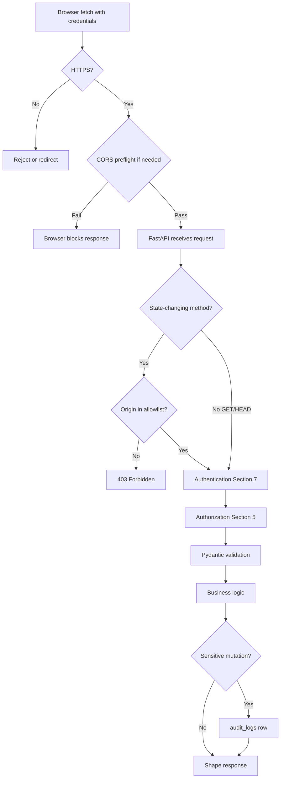

# Security Architecture

This document defines **how the UP Circuit Member Portal protects itself** beyond authentication and authorization — the threats, controls, and reasoning a future WebDev member needs to maintain the system safely.

**Security-critical:** Read [`07-authentication-architecture.md`](07-authentication-architecture.md) for login, sessions, and OTP. Read [`05-authorization-architecture.md`](05-authorization-architecture.md) for permissions. This document completes the picture.

**Phase 0 reference:** §0.7.17 (security requirements), §0.13.14 (security hardening checklist)

---

## What security architecture means here

Security is not a separate product bolted onto the portal. It is **how every request is handled**:

```
Browser (untrusted)
    → HTTPS
    → CORS (browser gate)
    → CSRF check (FastAPI)
    → Authentication (Section 7)
    → Authorization (Section 5)
    → Validation (Pydantic)
    → Business rules (services)
    → Audit (if sensitive)
    → Response (shaped, no leaks)
```

**One enforcement point:** FastAPI. We do not stack overlapping systems (RLS + app authz + WAF + CSRF tokens + JWT) that each need debugging in a different language.

**Defense-in-depth is allowed** when a second layer catches a *different* failure mode:

| Layer | Catches if… |
|---|---|
| Authorization in FastAPI | Application code has a bug in permission check |
| HttpOnly cookie | XSS bug lets attacker run JavaScript — they still cannot read the session token |
| Pydantic validation | Malformed input reaches the handler |
| DB CHECK constraints | Application validation is bypassed |

We do **not** add controls because they are "industry standard." Every control below names a **threat**, explains **what it does**, **why we chose it**, and **what breaks if you remove it**.

---

## Threat model (beyond Section 7)

Section 7 covers credential stuffing, password guessing, database hash leaks, session theft, and account enumeration. This section covers the rest:

| Threat | Example | Primary control |
|---|---|---|
| **CSRF** | Evil site triggers `PATCH /members/me` using victim's cookie | SameSite=Lax + Origin allowlist |
| **CORS misconfiguration** | `Access-Control-Allow-Origin: *` with credentials → any site reads API | Exact origin allowlist |
| **XSS (stored)** | Malicious HTML in a resource title executes in another member's browser | React escaping; ban `dangerouslySetInnerHTML` |
| **Clickjacking** | Portal embedded in iframe; user clicks invisible button | `X-Frame-Options: DENY` |
| **Secret leak via git** | `DATABASE_URL` committed to GitHub | `.gitignore`, env vars only — see [`10-environment-management.md`](10-environment-management.md) |
| **Secret leak via logs** | OTP printed in application log | Log hygiene rules (below) |
| **Referer leak** | Activation `?token=` sent to third party in Referer header | POST body consumption + Referrer-Policy |
| **Verbose errors** | Stack trace reveals SQL/table names to attacker | Generic 500 envelope (Section 6) |
| **Open redirect** | `destination_url` points to phishing site | http(s) validation only; officer trust model |
| **SSRF** | Server fetches attacker-supplied URL | **N/A in MVP** — we store URLs, never fetch them |
| **Database credential exposure** | Academic Admin gets production DB password | C8 — infra access is WebDev-only, not portal roles |

---

## End-to-end request protection



**Key insight:** The browser enforces CORS *before* our code runs. CSRF and auth run *inside* FastAPI. A `curl` attacker skips CORS but still hits CSRF (no Origin), auth, and authz.

---

## CORS (Cross-Origin Resource Sharing)

### What it is

The browser blocks JavaScript on `portal.example.com` from reading responses from `api.example.com` **unless** the API explicitly allows that origin. This is a **browser** security feature — `curl` ignores CORS entirely.

### Our configuration

| Setting | Value | Why |
|---|---|---|
| `Access-Control-Allow-Origin` | **Exact origin** — not `*` | Wildcard + credentials = any site can make authenticated requests |
| `Access-Control-Allow-Credentials` | `true` | Session cookies must be sent cross-subdomain |
| `Access-Control-Allow-Methods` | `GET, POST, PATCH, PUT, DELETE, OPTIONS` | MVP methods only |
| `Access-Control-Allow-Headers` | `Content-Type` (+ any custom headers we add) | Minimal |
| `Access-Control-Max-Age` | `86400` (24h) | Reduce preflight traffic |

### Allowed origins (by environment)

| Environment | Origin | Status |
|---|---|---|
| Local | `http://localhost:5173` (Vite default) | Active |
| Dev (laptop → Supabase #1) | `http://localhost:5173` | Active — see Section 10 |
| Production | `https://portal.{domain}` | **Blocked on N4** — domain not purchased |

**FastAPI config:** `CORSMiddleware` with a list of allowed origins — never computed from the request's `Origin` header dynamically (that would allow any origin).

### Threat addressed

**Session theft via malicious site:** If CORS allowed `*` with credentials, any website could call `/api/v1/auth/me` and read the member's permissions and profile while the victim is logged in.

### What breaks if changed

Setting `allow_origins=["*"]` with `allow_credentials=True` is **invalid per spec** — browsers reject it. Some frameworks silently drop credentials, breaking login. Dynamically echoing the request Origin enables any attacker domain.

**Prove early (N17):** Once `portal.*` and `api.*` exist, verify preflight and credentialed requests in a real browser — not just `curl`. Checklist in [`13-testing-strategy.md`](13-testing-strategy.md).

---

## CSRF (Cross-Site Request Forgery)

### What it is

A victim is logged into the portal. They visit `evil.com`. Evil's page contains:

```html
<form action="https://api.upcircuit.org/api/v1/members/me" method="POST">
  <input name="contact_number" value="attacker-controlled">
</form>
<script>document.forms[0].submit()</script>
```

The browser **automatically sends the session cookie**. Without CSRF protection, the API might apply the change.

### Why cookie sessions require CSRF defense

Bearer tokens in JavaScript memory are not sent automatically — CSRF is less critical. **HttpOnly cookies are sent automatically** — which is why we use them (XSS protection) and must add CSRF protection.

### Our two-layer defense

| Layer | Mechanism | What it blocks |
|---|---|---|
| **1 — SameSite=Lax** | Cookie not sent on cross-site POST from third-party iframe | Most classic CSRF form POSTs |
| **2 — Origin allowlist** | FastAPI middleware rejects POST/PATCH/PUT/DELETE if `Origin` (or `Referer`) is not in the portal origin list | Same-site subdomain attacks; Lax bypasses |

**We do not use CSRF token libraries** (double-submit cookie, synchronizer token). Reasons:

- Our SPA uses `fetch` with JSON — every request includes an `Origin` header the browser sets honestly
- Same-site subdomain topology (`portal.*` + `api.*`) keeps cookies first-party
- Token libraries add a second cookie, frontend wiring, and token rotation — maintenance cost with no benefit over Origin validation for this architecture

### Implementation rule

```python
# Pseudocode — mutating methods only
if request.method in ("POST", "PATCH", "PUT", "DELETE"):
    origin = request.headers.get("origin") or derive_from_referer(request.headers.get("referer"))
    if origin not in ALLOWED_ORIGINS:
        raise HTTPException(403, detail={"error": {"code": "FORBIDDEN", "message": "..."}})
```

**Critical failure mode:** Middleware that **allows missing Origin** "for compatibility" silently disables CSRF protection. `curl` and some proxies omit Origin — that is fine (attackers use browsers, not curl, for CSRF). **Missing Origin on browser-initiated mutating requests should be rejected.**

### GET must be side-effect free

SameSite=Lax **does** send cookies on top-level cross-site GET (e.g. victim clicks a link). Therefore:

- `GET` endpoints must **never** mutate state
- No "delete via GET" patterns — ever

### Threat addressed

Unauthorized state changes using a victim's active session without their knowledge.

---

## XSS (Cross-Site Scripting)

### What it is

Attacker injects JavaScript that runs in another user's browser. With XSS + non-HttpOnly tokens, session theft is trivial. With HttpOnly cookies, XSS can still perform actions **as** the user (CSRF from inside the origin).

### Our controls

| Control | Detail |
|---|---|
| **React default escaping** | `{resource.title}` in JSX is text, not HTML |
| **Ban `dangerouslySetInnerHTML`** | Unless an ADR documents a specific need — none in MVP |
| **Stored content is data** | Resource titles, notification bodies, request descriptions are plain text — never rendered as HTML |
| **HttpOnly cookies** | Defense if XSS slips through — attacker cannot exfiltrate session token via `document.cookie` |
| **CSP (see Headers)** | Restricts inline script even if injection occurs |

### Officer-entered URLs

Resources and request types store external URLs (Google Forms, Drive links). These are **links** (`<a href="...">`), not embedded content. We do not iframe or fetch them server-side.

### Threat addressed

Script injection via member-visible stored fields.

---

## Activation and reset tokens in URLs

Section 7 sends activation links like `https://portal.*/activate?token=...`. Tokens in URLs can leak via:

| Leak vector | Mitigation |
|---|---|
| **Referer header** | User clicks external link on activate page → Referer may include `?token=` | `Referrer-Policy: strict-origin-when-cross-origin` on frontend; consume token via **POST body** on submit, not logged GET |
| **Browser history** | Token visible in history | Short expiry (7 days activation; 1 hour reset); single-use |
| **Server/proxy logs** | Query string logged | **Never log query strings** on activate/reset routes |
| **Shoulder surfing** | User shares screen | Operational — out of scope |

**Landing page pattern:**

1. React route `/activate` reads token from URL **once** into component state
2. User sets password → `POST /auth/activate` with token in **JSON body**
3. URL can be cleared with `history.replaceState` after read

---

## HTTP security headers

Applied by FastAPI middleware (few lines — no `helmet` npm package, no extra Python dependency).

| Header | Value | Threat | Notes |
|---|---|---|---|
| `X-Content-Type-Options` | `nosniff` | MIME sniffing attacks | Browsers respect declared Content-Type |
| `X-Frame-Options` | `DENY` | Clickjacking | Prevents iframe embedding of API responses |
| `Referrer-Policy` | `strict-origin-when-cross-origin` | Referer token leak | Stricter on frontend (Vercel headers) |
| `Permissions-Policy` | `camera=(), microphone=(), geolocation=()` | Unneeded API abuse | Portal uses none of these |
| `Strict-Transport-Security` | `max-age=31536000; includeSubDomains` | SSL stripping | **Only after N4 custom domain + HTTPS verified** |
| `Content-Security-Policy` | See below | XSS mitigation | Honest MVP policy |

### Content-Security-Policy (CSP)

**Goal:** Restrict where scripts and connections may load from.

**MVP honest default:**

```
default-src 'self';
connect-src 'self' https://api.{domain};
frame-ancestors 'none';
```

Vite production builds typically emit hashed JS files (`'self'` suffices for scripts). If the build **requires** `'unsafe-inline'` for style or script in MVP:

- Document that in **N18** as a known gap
- Do **not** ship a fake strict CSP that breaks the app and gets disabled
- Plan nonce-based CSP for P1

**Frontend CSP** is set via Vercel headers config — see [`12-deployment-architecture.md`](12-deployment-architecture.md). **API CSP** is set on FastAPI responses (mostly `frame-ancestors` for any HTML error pages).

---

## HTTPS and transport security

| Layer | Responsibility |
|---|---|
| Vercel | TLS termination for frontend static assets |
| Render | TLS termination for FastAPI |
| Browser | Refuses mixed content (HTTPS page calling HTTP API) |

**Local development exception:** [`11-local-development-setup.md`](11-local-development-setup.md) — `http://localhost` without TLS. Cookies use `Secure=false` locally only — never in production.

**HSTS (N4):** Enable only when the custom domain is live and HTTPS is confirmed end-to-end. Premature HSTS breaks local/staging testing against production domains.

---

## Secrets management

Full variable catalog is **[`10-environment-management.md`](10-environment-management.md)**. Security principles here:

| Rule | Detail |
|---|---|
| **Never in git** | `.env` in `.gitignore`; pre-commit secret scan **recommended** (not mandatory) — see [`09-git-github-strategy.md`](09-git-github-strategy.md) |
| **Never in architecture docs** | Document variable *names* and *purpose*, never values |
| **Never in frontend bundle** | No `VITE_DATABASE_URL` — browser must not hold DB credentials |
| **Rotate on leak** | New Render/Vercel env var + redeploy; invalidate sessions if DB password leaked |
| **Least privilege** | `circuit_app` role: DML only on `app` schema (Section 3) |

### Phase 0 leftovers — not used

| Phase 0 §0.12.8 variable | Status |
|---|---|
| `JWT_SECRET` | **Not used** — opaque DB sessions (Section 2, 7) |
| `SUPABASE_KEY` / anon key | **Not used** — no Supabase client in app |
| `SUPABASE_URL` (REST) | **Not used** — direct PostgreSQL via `DATABASE_URL` only |

### Who holds secrets

| Actor | Has access to |
|---|---|
| **WebDev** | GitHub, Render, Vercel, Supabase dashboard, `DATABASE_URL` |
| **Portal admin (officer)** | Portal UI only — **never** DB credentials (C8) |
| **Member** | Own session cookie — nothing else |

---

## Input validation and safe output

| Layer | Mechanism | Example |
|---|---|---|
| **Request body** | Pydantic schemas | Reject unknown fields; type coercion with limits |
| **URLs in resources** | Pydantic + DB CHECK | `http://` or `https://` only — no `javascript:` |
| **Response** | Separate read schemas | Admin vs directory field sets (Section 5) |
| **Errors** | Envelope (Section 6) | `422` with field errors; `500` generic — no stack trace |

**We do not fetch member-supplied URLs server-side** — no SSRF surface in MVP. If a future feature previews links, that requires a new ADR with URL allowlisting.

---

## Audit logging

### Purpose

Phase 0 §0.6.16: officers ask *"Who changed this?"* Audit logs answer that for sensitive mutations. This is **accountability**, not real-time intrusion detection — we are not building a SIEM.

### Events that must write `audit_logs`

| Action code | Trigger | `entity_type` |
|---|---|---|
| `UPDATE_MEMBERSHIP_STATUS` | `PATCH /membership/{id}/status` | `membership_term` |
| `IMPORT_MEMBERS_CONFIRM` | `POST /members/import/confirm` | `import_batch` |
| `UPDATE_MEMBER_PROFILE` | Admin `PATCH /members/{id}` | `profile` |
| `DISABLE_USER` / `ENABLE_USER` | Admin sets `is_active` | `user` |
| `ASSIGN_ROLES` | `PUT /members/{id}/roles` | `user_role` |
| `CREATE_RESOURCE` / `UPDATE_RESOURCE` / `DELETE_RESOURCE` | Resource CRUD | `resource` |
| `CREATE_REQUEST_TYPE` / `UPDATE_REQUEST_TYPE` / `DELETE_REQUEST_TYPE` | Request type CRUD | `request_type` |
| `CREATE_CATEGORY` / `UPDATE_CATEGORY` | Category CRUD | `resource_category` |

### Privacy rules (from Section 4)

| Data | Logged? |
|---|---|
| Status, URL, display order, boolean flags | Full before/after in JSONB |
| Contact number, student number, full name | `{"changed": ["field_name"]}` only — **no values** |

**Retention:** 24 months, then scheduled delete (N14).

### What audit logs are not

- Not a substitute for authorization — every action is permission-checked **before** audit write
- Not exposed to ordinary members — `view_audit_logs` is Super Admin only in MVP
- Not immutable against DB admin — WebDev with Supabase access can delete rows; organizational trust model

---

## Application log hygiene

Render and local stdout/stderr are **not** secure storage. Treat logs as potentially visible to anyone with Render dashboard access.

| Never log | Why |
|---|---|
| Passwords (plaintext or hash) | Credential leak |
| OTP codes | Bypass second factor |
| Session tokens, activation tokens, reset tokens | Session hijack |
| Full `Cookie` header | Session hijack |
| Request bodies on `/auth/*` | May contain passwords |
| Query strings on `/activate`, `/reset` | Contains tokens |

| Acceptable to log | Why |
|---|---|
| Request path + method | Debugging |
| `user_id` (UUID) after auth | Tracing |
| Error type (not stack) in production | Ops |
| Email on failed login in `auth_attempts` **table** | FR-AUTH-005 — intentional, 90-day retention, not stdout |

**Production:** Log level INFO for request summary; ERROR for failures without stack traces to external systems. Full stack traces only in dev/local.

---

## Error response security

Recap from Section 6 — repeated here because verbose errors are a common leak:

| Status | Client sees | Server logs |
|---|---|---|
| `401` | "Invalid credentials" | Email attempted (in `auth_attempts`, not necessarily stdout) |
| `403` | Generic or `MEMBERSHIP_REQUIRED` | user_id + denied permission |
| `404` | "Not found" | Same for forbidden vs missing when existence leak matters |
| `422` | Field validation errors | Safe — no internal paths |
| `500` | "An unexpected error occurred" | Full stack trace **server-side only** |

---

## PII and member data protection

Recap — details in Sections 4 and 5:

| Control | Detail |
|---|---|
| Directory response shaping | No student number, no contact in member directory JSON |
| `emergency_contact` omitted | N5 — not stored |
| Audit log field rules | Sensitive fields: change notification only |
| Erasure | Anonymize, do not hard-delete audit-linked rows (Section 4) |

**Organizational (N2):** Circuit leadership must sign off on stored PII before production import — architecture cannot replace consent/policy.

---

## Mapping Phase 0 §0.7.17 requirements

| §0.7.17 requirement | Where implemented |
|---|---|
| Authenticate users securely | Section 7 |
| Hash passwords | Section 7 — Argon2id |
| Secure sessions/tokens | Section 7 — opaque DB sessions, HttpOnly cookies |
| Validate API input | Section 6 — Pydantic; this doc |
| Enforce authorization on backend | Section 5 |
| Protect administrative endpoints | Section 5 — permissions on every route |
| Protect sensitive member information | Sections 4, 5, 8 — shaping + audit rules |
| Avoid exposing unnecessary PII | Sections 4, 5 |
| Rate-limit authentication attempts | Section 7 — PostgreSQL |
| Securely manage secrets | Section 8 (principles); [`10-environment-management.md`](10-environment-management.md) (catalog) |
| Maintain audit logs | Section 8 — event list; Section 4 — schema |
| FastAPI owns business rules | Sections 1, 6 — no direct DB from browser |

---

## Explicitly rejected controls

| Control | Why rejected for this project |
|---|---|
| **CAPTCHA** | Friction for ~1,200 known members; rate limits + lockout sufficient at this scale |
| **WAF / Cloudflare in front** | Cost, complexity, student-maintained; Vercel/Render provide baseline DDoS |
| **Redis / rate-limit SaaS** | PostgreSQL `auth_attempts` survives restarts; no second datastore |
| **CSRF token library** | Origin validation sufficient for SPA + same-site cookies (ADR-030) |
| **RLS as authorization** | Data API disabled; FastAPI is sole enforcement (Section 3 reversal) |
| **JWT / Bearer for SPA** | Revocation, complexity — Section 2 |
| **Public `/api/docs` in production** | Attack surface — Section 6 |
| **Server-side URL fetching** | SSRF risk — we store links, do not fetch |
| **File upload scanning** | No file uploads in MVP |
| **Web Application Firewall rules** | No budget/maintainer for tuning false positives |
| **`helmet` / security middleware package** | Few headers = few lines of FastAPI middleware; one less dependency |

---

## Prove-early and deferred items

| ID | Item | Status |
|---|---|---|
| **N4** | Custom domain — blocks production CORS origin + HSTS | Open — documented in [`12-deployment-architecture.md`](12-deployment-architecture.md); purchase deferred |
| **N17** | Verify CORS preflight + security headers on real `portal.*`/`api.*` after DNS | Open — prove early; checklist in [`13-testing-strategy.md`](13-testing-strategy.md) |
| **N18** | Strict CSP without `'unsafe-inline'` — may be P1 if Vite build requires inline | Open — watch at first prod build |
| **N2** | Leadership PII sign-off | Open — organizational |
| **N14** | Cleanup job for expired sessions/tokens/logs | **Resolved** — [`12-deployment-architecture.md`](12-deployment-architecture.md) |

---

## What must not be changed casually

| Control | Risk if weakened |
|---|---|
| CORS exact-origin allowlist (no `*`, no dynamic echo) | Any site reads authenticated API responses |
| Origin check on mutating requests (no "allow missing Origin") | CSRF via browser |
| GET endpoints remain side-effect free | CSRF via link |
| HttpOnly + Secure cookies in production | Session theft |
| No secrets in git or logs | Credential leak |
| Generic 500 messages to clients | Information disclosure |
| Audit on sensitive mutations | No accountability |
| No server-side fetch of user URLs | SSRF (if added later without ADR) |
| Production OpenAPI disabled | Endpoint enumeration |

---

## Related documents

| Topic | Document |
|---|---|
| Authentication | `07-authentication-architecture.md` |
| Authorization | `05-authorization-architecture.md` |
| API errors | `06-api-architecture.md` |
| Database roles, no RLS | `03-supabase-architecture.md` |
| Audit schema | `04-database-schema.md` |
| Secret catalog | `10-environment-management.md` |
| Deployment, DNS, HSTS | [`12-deployment-architecture.md`](12-deployment-architecture.md) |
| Automated security tests, prove-early checklist | [`13-testing-strategy.md`](13-testing-strategy.md) |
| Git workflow, `.gitignore`, secret scanning | `09-git-github-strategy.md` |

---

*Section 8 complete. Section 9 documents Git/GitHub strategy.*
