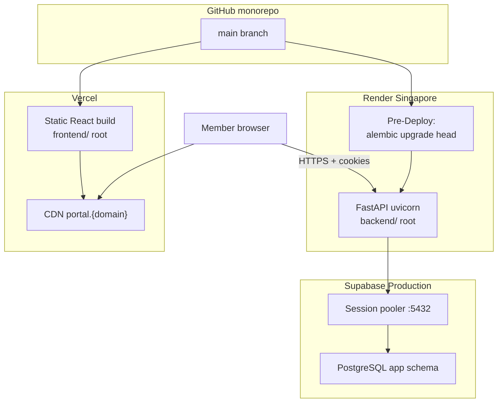
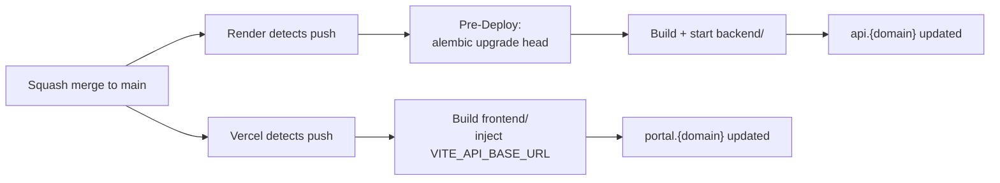
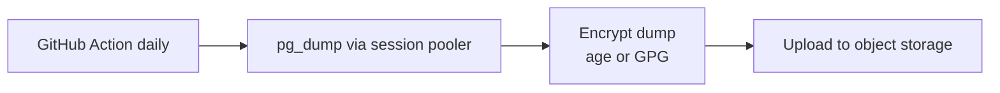

# Deployment Architecture

This document explains **how the UP Circuit Member Portal reaches production** — what happens when code merges to `main`, how Vercel, Render, Supabase, DNS, and scheduled jobs fit together, and what to configure before members use the portal.

**Prerequisites:** Read [`09-git-github-strategy.md`](09-git-github-strategy.md) (PR workflow), [`10-environment-management.md`](10-environment-management.md) (env catalog), and [`03-supabase-architecture.md`](03-supabase-architecture.md) (database roles, pooler, backups).

**Phase 0 reference:** §0.12.6 (hosting), §0.13.15 (deployment stage)

---

## What is deployment?

**Deployment** is the process of making a specific git commit on `main` run as the live portal that members and officers use.

| What deployment is | What deployment is not |
|---|---|
| Vercel builds and serves the React frontend | Officers changing a Google Form URL (admin UI — no deploy) |
| Render builds and runs FastAPI | Editing member data in Supabase dashboard |
| Alembic applies pending migrations to Production DB | Running migrations manually without a migration file |
| DNS points `portal.*` and `api.*` at the right hosts | Committing secrets to git |

Every production deploy traces to **one squash-merged commit on `main`** (Section 9).

---

## Production topology

| Component | Host | Root directory | Region |
|---|---|---|---|
| **Frontend** | Vercel | `frontend/` | Edge CDN (build in Singapore-adjacent if configurable) |
| **Backend** | Render | `backend/` | **Singapore** (`ap-southeast-1`) — Section 3 |
| **Database** | Supabase project #2 (Production) | — | **Singapore** |

**One production Render web service.** There is no second warm Render for staging (ADR-008, cost). Dev integration uses laptop → Supabase #1 (Section 10), not a hosted Dev API.

**Build method:** Render Python buildpack and Vercel's native build — **not Docker** (Section 2).

---

## From merge to live

When a PR squash-merges into `main`:

### Vercel (frontend)

| Setting | Value |
|---|---|
| **Root directory** | `frontend/` |
| **Build command** | `npm run build` (when implemented) |
| **Output** | `dist/` (Vite default) |
| **Deploy trigger** | Push to `main` |
| **Preview deploys** | Per PR — static UI only (ADR-038) |

**Critical:** `VITE_API_BASE_URL` is injected at **build time** in the Vercel dashboard. Changing the API URL requires a **frontend rebuild**, not just a backend env change.

### Render (backend)

| Setting | Value |
|---|---|
| **Root directory** | `backend/` |
| **Runtime** | Python (buildpack) |
| **Start command** | `uvicorn app.main:app --host 0.0.0.0 --port $PORT` (exact path at implementation) |
| **Pre-Deploy Command** | `alembic upgrade head` |
| **Deploy trigger** | Push to `main` |
| **Region** | Singapore |

**Pre-Deploy runs before the new version serves traffic.** It uses `MIGRATOR_DATABASE_URL` (`circuit_migrator` role). If migration fails, **the deploy fails** — old code keeps running.

### What does not deploy from git

| Item | Where it lives |
|---|---|
| Environment variable **values** | Render / Vercel dashboards |
| Database **member data** | Supabase Production |
| Backup **files** | S3-compatible object storage (below) |
| DNS records | Domain registrar / DNS provider |

---

## GitHub as control plane (ADR-040)

GitHub holds source code and branch protection. **Deploys use Vercel and Render git integrations** — not GitHub Actions as a CD pipeline.

| GitHub responsibility | Platform responsibility |
|---|---|
| Code on `main` | Vercel builds frontend |
| Branch protection (Section 9) | Render builds backend |
| `.github/workflows/` for **ops** | Supabase hosts Postgres |
| Secrets for backup/maintenance Actions | TLS termination on each platform |

### `.github/workflows/` in MVP (ops only)

| Workflow | Schedule | Purpose |
|---|---|---|
| **backup-database** | Daily (e.g. 03:00 UTC) | `pg_dump` → encrypt → upload to object storage |
| **maintenance-cleanup** | Daily (e.g. 04:00 UTC) | Call authenticated cleanup endpoint |
| **dev-keepalive** (optional) | Weekly | `SELECT 1` against Dev Supabase to prevent 7-day pause |

**Lint, test, and typecheck CI** are documented in [`13-testing-strategy.md`](13-testing-strategy.md) — not defined here.

### Repository creation (implementation step)

Deferred from Section 9 — performed during first deployment bring-up:

1. Create GitHub organization / repository (`upcircuit-portal`)
2. Push monorepo
3. Configure branch protection on `main` (Section 9)
4. Connect Vercel and Render to the repo
5. Add WebDev collaborators; **no officer access** (C8)

---

## DNS and custom domain (N4)

Architecture assumes a **custom domain** with two subdomains sharing one registrable parent (Section 1):

| Subdomain | Points to | Purpose |
|---|---|---|
| `portal.{domain}` | Vercel | React frontend |
| `api.{domain}` | Render | FastAPI backend |

**Exact domain is not purchased yet (N4).** Do not invent a registrable name in configuration. Use placeholder `{domain}` in docs and env templates.

### Required DNS records (when N4 is resolved)

| Record | Type | Target |
|---|---|---|
| `portal.{domain}` | CNAME or A/ALIAS | Vercel-provided target |
| `api.{domain}` | CNAME | Render-provided target |

TLS certificates are issued automatically by Vercel and Render once DNS validates.

### Before custom domain (bring-up only)

Vercel and Render provide default hostnames (e.g. `*.vercel.app`, `*.onrender.com`). These work for **initial smoke tests** but:

- Cookie same-site topology differs from production design
- CORS `FRONTEND_ORIGIN` will not match production
- **Member login go-live requires N4** — custom domain before production auth rollout

### HSTS and security headers

| Control | When |
|---|---|
| **HSTS** | After N4 + confirmed HTTPS end-to-end (Section 8) |
| **Frontend CSP** | Vercel headers config (`vercel.json` or dashboard) — Section 8 |
| **API security headers** | FastAPI middleware — Section 8 |
| **CORS `FRONTEND_ORIGIN`** | Set to `https://portal.{domain}` in Render when N4 live |

**Prove early (N17):** After DNS live, verify credentialed cross-subdomain requests in a real browser.

---

## Environment wiring (Production)

Map the Section 10 catalog to platform dashboards. **Never commit values.**

### Render (backend) — Production

| Variable | Production value |
|---|---|
| `APP_ENV` | `production` |
| `DATABASE_URL` | Supabase Production, `circuit_app`, session pooler :5432 |
| `MIGRATOR_DATABASE_URL` | Same host, `circuit_migrator` |
| `FRONTEND_ORIGIN` | `https://portal.{domain}` (after N4) |
| `BREVO_API_KEY` | From Brevo dashboard |
| `EMAIL_FROM` | Verified sender (N20) |
| `MAINTENANCE_TOKEN` | Random secret for cleanup endpoint — infrastructure only |

### Vercel (frontend) — Production

| Variable | Production value |
|---|---|
| `VITE_API_BASE_URL` | `https://api.{domain}` |

Rebuild frontend after changing `VITE_API_BASE_URL`.

### Dev / deployed testing

If a hosted Dev frontend exists later, it gets its own Vercel project or env profile with Dev Supabase URLs. **Not required for MVP** — laptop → Dev DB suffices (Section 10).

---

## Migrations on deploy

Section 3 rules apply unchanged:

| Rule | Detail |
|---|---|
| **Pre-Deploy command** | `alembic upgrade head` |
| **Role** | `circuit_migrator` via `MIGRATOR_DATABASE_URL` |
| **Connection** | Session pooler port 5432 |
| **Failure** | Failed migration aborts deploy |
| **Expand-then-contract** | Migrations backward-compatible with running code |
| **Destructive DDL** | Manual — backup first, run deliberately |

**Never** alter Production tables by hand without a migration file in git.

---

## Render: keep-warm vs Starter

### The cold-start problem

Render **free tier** spins down after **15 minutes** of no traffic. Next request: **30–90 second** Python cold start. First login of the day feels broken.

### Options

| Tier | Cost | Spin-down | Keep-warm needed? |
|---|---|---|---|
| **Free** | $0 | After 15 min idle | **Yes** — external HTTP ping |
| **Starter** | ~$7/mo | None | **No** |

**Recommendation (Section 2):** Budget **Render Starter before member rollout.** A minute-long login delay damages adoption more than $7/month.

### Keep-warm on free tier (pre-launch / dev Render only)

| Setting | Value |
|---|---|
| **Target** | `GET https://api.{domain}/api/v1/health` (or Render default URL pre-N4) |
| **Interval** | Every 10 minutes |
| **Provider** | External uptime monitor (UptimeRobot, cron-job.org, etc.) |
| **Why external** | GitHub Actions every 10 min wastes minutes; external is simpler |

### Health endpoint rules (Section 6)

| Rule | Detail |
|---|---|
| **Public** | No authentication required |
| **No DB check in MVP** | Returns `{ "status": "ok" }` without querying Postgres |
| **Why no DB in health** | Render liveness would fail during brief Supabase blips; backup Action already touches DB daily |

---

## Supabase: 7-day inactivity pause

Free Supabase projects **pause after 7 days without connections**.

| Environment | Mitigation |
|---|---|
| **Production** | Daily backup GitHub Action connects to DB; member traffic once live |
| **Dev** | Optional weekly GitHub Action `SELECT 1` |

Dev pause is an annoyance, not a data-loss risk. Production must never rely on manual dashboard restore during member season.

---

## Backups (ADR-041)

Supabase free tier has **no automated backups**. We own backup responsibility.

### Pipeline

| Step | Detail |
|---|---|
| **Source** | Production Supabase via session pooler :5432 |
| **Tool** | `pg_dump` (custom format or plain SQL) |
| **Encrypt** | **Before upload** — dumps contain PII |
| **Destination** | **S3-compatible object storage** |
| **Recommended product** | **Cloudflare R2** — S3 API, cheap egress, fits Circuit budget |
| **Secrets** | DB URL, R2 credentials, encryption key in **GitHub Actions secrets only** |
| **Retention** | **14 daily dumps** minimum — survive a bad week before noticing corruption |
| **Never** | Git, GitHub Actions artifacts as store of record, Google Drive |

### Prove restore (N3 — still open)

A backup never restored is a hypothesis. **Before importing real member data:**

1. Run backup Action against Production (or Dev with copy)
2. Download and decrypt dump
3. Restore into Dev Supabase project
4. Verify row counts and spot-check tables

N3 remains **prove-early** until this drill succeeds via session pooler.

### Alternative destinations (acceptable)

Any S3-compatible store with access-controlled credentials: AWS S3, Backblaze B2, etc. R2 is the documented first choice for cost and simplicity.

---

## Scheduled cleanup (N14 — resolved)

Expired rows accumulate without periodic deletion:

| Table | What to delete |
|---|---|
| `sessions` | Rows where `expires_at < now()` |
| `auth_tokens` | Expired or used activation/OTP tokens |
| `auth_attempts` | Rows older than **90 days** (Section 4 retention) |
| `notifications` | Rows older than **12 months** (Section 4 retention) |

Section 2 rejected Celery. Render free tier has no cron.

### Decision: GitHub Action + authenticated maintenance endpoint

| Component | Detail |
|---|---|
| **Schedule** | Daily GitHub Action (e.g. 04:00 UTC) |
| **Mechanism** | `POST /api/v1/internal/maintenance/cleanup` (exact path at implementation) |
| **Auth** | `MAINTENANCE_TOKEN` header — shared secret in Render env + GitHub Actions secret |
| **Not portal RBAC** | Infrastructure token only (C8) — officers never call this |
| **Recommended extra** | Opportunistic cleanup on write (e.g. delete expired sessions during login) |

**Rejected for MVP:** Celery, Redis queue, Render cron job (until paid tier and justified).

---

## Email DNS (N20)

Before production OTP go-live, configure DNS for the sending domain:

| Record | Purpose |
|---|---|
| **SPF** | Authorize Brevo to send on behalf of domain |
| **DKIM** | Cryptographic signature for deliverability |
| **DMARC** | Policy for failed authentication |

Exact values come from Brevo dashboard when `EMAIL_FROM` domain is chosen (N20). Section 12 documents **that these must exist**, not the record values.

---

## Observability (minimal)

| Signal | Source |
|---|---|
| **Request logs** | Render dashboard |
| **Build logs** | Vercel / Render dashboards |
| **Uptime** | External ping on `/api/v1/health` |
| **Errors** | Render logs; generic 500 to clients (Section 6) |

**Not in MVP:** APM (Datadog, Sentry paid tiers), custom metrics dashboards, PagerDuty.

**Log hygiene (Section 8):** Never log passwords, OTP codes, session tokens, or `MAINTENANCE_TOKEN`.

---

## Rollback

### Application rollback

1. **Revert the merge commit on `main`** (Section 9 — never force-push)
2. Vercel and Render auto-deploy the reverted commit
3. Previous frontend + backend version serves again

### Schema rollback

**Do not rely on `alembic downgrade` in production without a written plan.**

Expand-then-contract migrations keep **reverted code compatible** with current schema:

- Add nullable column → deploy code → later drop old column
- Reverting code before drop is safe if new column unused

Destructive DDL (DROP COLUMN, DROP TABLE) requires backup + deliberate manual execution.

---

## Who has access

| Dashboard | Who | Officers? |
|---|---|---|
| **GitHub** | WebDev | **No** (C8) |
| **Vercel** | WebDev | **No** |
| **Render** | WebDev | **No** |
| **Supabase** | WebDev | **No** |
| **Cloudflare R2** (backups) | WebDev | **No** |
| **Brevo** | WebDev | **No** |
| **Domain registrar / DNS** | WebDev or org leadership | **No** |
| **Portal admin UI** | Officers | **Yes** — content only |

**N19 (succession):** Transfer org ownership for GitHub, Vercel, Render, Supabase, R2/Cloudflare, Brevo, and domain when founding WebDev graduates.

---

## Practice classification

### Required rules

| Rule |
|---|
| Deploy Production **only from `main`** after merged PR |
| Vercel root `frontend/`; Render root `backend/` |
| Alembic Pre-Deploy on every Render deploy |
| Production `APP_ENV=production` |
| Encrypted daily `pg_dump` to S3-compatible storage (not git) |
| Daily maintenance cleanup via GitHub Action + `MAINTENANCE_TOKEN` |
| Custom domain (N4) before member auth go-live |
| Render Starter before member rollout (or accept cold starts knowingly) |
| Singapore region for Render + Supabase |
| Officers do not receive infrastructure dashboard access (C8) |

### Recommended practices

| Practice |
|---|
| Cloudflare R2 as first backup destination |
| 14-day backup retention |
| External keep-warm ping on Render free tier pre-Starter |
| Weekly Dev Supabase keep-alive Action |
| Restore drill (N3) before real member import |
| Document exact domain in env vars when N4 resolves |

### Optional practices

| Practice |
|---|
| Separate Vercel project for PR previews (already default) |
| Render deploy notifications to WebDev email |
| Uptime monitor on frontend URL too |

### Explicitly rejected

| Practice | Why rejected |
|---|---|
| **Deploy Production from feature branches** | Bypasses PR review and protection |
| **GitHub Actions as CD pipeline** | Vercel/Render git integration is simpler (ADR-040) |
| **Second warm Render on free tier** | 750 instance-hours/month budget (ADR-008) |
| **Backups in git or Action artifacts** | PII leak risk; not durable store (ADR-041) |
| **Google Drive for database dumps** | Access control, encryption, automation friction |
| **DB check in `/health`** | False negatives during Supabase blips |
| **Celery / task queue for cleanup** | Section 2 — unnecessary dependency |
| **Docker-required deployment** | Section 2 — buildpacks sufficient |
| **Wildcard CORS for Vercel previews** | ADR-038 |

### Deferred to later sections

| Topic | Section |
|---|---|
| Documentation layout / commands extract | [`14-documentation-system.md`](14-documentation-system.md) |
| Implementation stage order | [`15-development-roadmap.md`](15-development-roadmap.md) |

---

## Production bring-up checklist

When implementing deployment (not during Phase 1 documentation):

1. **GitHub** — create org/repo; push monorepo; branch protection on `main`
2. **Supabase** — create Dev (#1) and Production (#2) projects; Singapore region
3. **Disable Data API** on both projects (Section 3)
4. **Create DB roles** — `circuit_app`, `circuit_migrator`; `app` schema
5. **Render** — create web service, `backend/` root, Pre-Deploy command, env vars
6. **Vercel** — create project, `frontend/` root, `VITE_API_BASE_URL`
7. **Connect both** to GitHub `main` branch
8. **First deploy** — verify health endpoint and frontend load
9. **N4** — purchase domain; DNS for `portal.*` and `api.*`
10. **Update env** — `FRONTEND_ORIGIN`, `VITE_API_BASE_URL`, enable HSTS after verify
11. **Brevo** — SPF/DKIM/DMARC for `EMAIL_FROM` (N20)
12. **GitHub Actions** — backup workflow + maintenance workflow; secrets configured
13. **N3** — restore drill from backup into Dev
14. **Upgrade Render** to Starter before member rollout
15. **N17** — browser CORS/cookie test on production domain

---

## Mapping Phase 0 §0.12.6 and §0.13.15

| Phase 0 item | Section 12 decision |
|---|---|
| §0.12.6 GitHub → Vercel + Render + Supabase | **Confirmed** — topology above |
| §0.12.6 Frontend on Vercel, backend on Render | **Confirmed** |
| §0.13.15 Local → production-like → Vercel → Render → Supabase → Domain | **Local (11) → merge to main → auto deploy**; domain N4 |
| §0.13.15 Monitoring | **Minimal** — health ping + platform logs |
| Phase 0 staging | **Deferred** — ADR-008 |

---

## Related documents

| Topic | Document |
|---|---|
| PR and merge workflow | `09-git-github-strategy.md` |
| Environment variables | `10-environment-management.md` |
| Database roles, pooler, migration rules | `03-supabase-architecture.md` |
| Local development | `11-local-development-setup.md` |
| CORS, HSTS, headers | `08-security-architecture.md` |
| Health endpoint | `06-api-architecture.md` |
| CI on PR | [`13-testing-strategy.md`](13-testing-strategy.md) |
| Documentation system | [`14-documentation-system.md`](14-documentation-system.md) |
| Development roadmap | [`15-development-roadmap.md`](15-development-roadmap.md) |

---

## Do not change without ADR

- Vercel + Render + Supabase three-host split
- Deploy Production from `main` only
- Alembic Pre-Deploy on Render
- Encrypted offsite backups (S3-compatible, not git)
- Maintenance cleanup via GitHub Action + infrastructure token
- GitHub Actions for ops (backup, maintenance) — **not as primary CD**
- GitHub Actions CI on PR documented in Section 13 (ADR-042) — separate from deploy
- No Docker-required deploy path
- `/health` without DB check in MVP

---

*Section 12 complete. Section 15 documents the development roadmap.*
