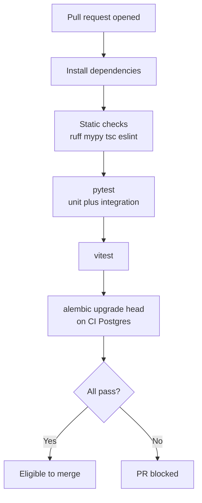
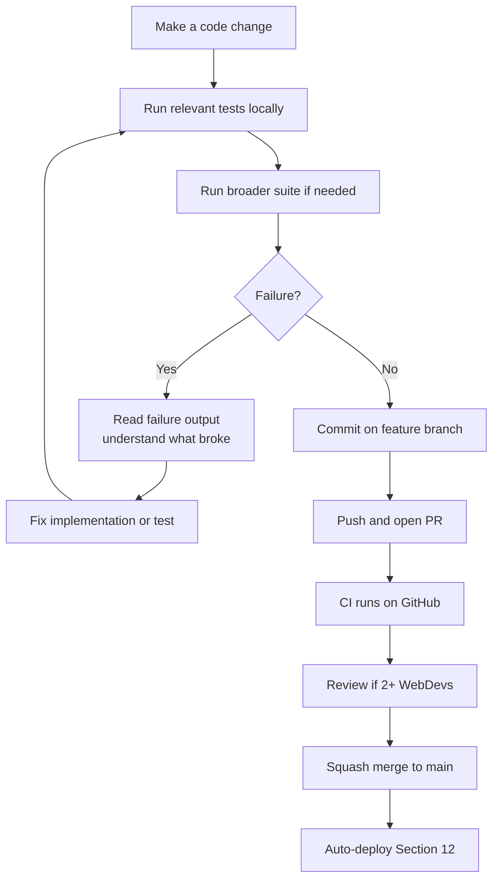

# Testing Strategy

This document explains **how the UP Circuit Member Portal is proven correct and safe** — what to test, at which layer, when tests run, and which failures block a merge or member rollout.

**Prerequisites:** Read [`09-git-github-strategy.md`](09-git-github-strategy.md) (PR workflow), [`11-local-development-setup.md`](11-local-development-setup.md) (local stack), [`08-security-architecture.md`](08-security-architecture.md) (security controls), and [`12-deployment-architecture.md`](12-deployment-architecture.md) (deploy and ops workflows).

**Phase 0 reference:** §0.13.13 (testing stage), §0.13.14 (security hardening), §0.6.17 (backend-authoritative security)

---

## What testing means here

**Testing is not "write as many tests as possible."**

Every test should answer two questions:

1. **What failure are we trying to catch?**
2. **At what layer can we catch it most cheaply?**

| Good test reasoning | Poor test reasoning |
|---|---|
| "An unauthenticated member must not reach this endpoint — prove it at the API layer." | "We need 100% coverage." |
| "Missing Origin on a POST must return 403 — this is the CSRF failure mode Section 8 names." | "Test that `check_auth()` was called once." |
| "A migration must apply on a clean database before deploy." | "Test that React escapes HTML" (React already does this by default). |

### The testing pyramid for this project

```
                 E2E / browser
                ───────────────
             API / integration
          ───────────────────────
              Unit tests
       ─────────────────────────────
       Static checks / type checks
```

**Bottom layers run on every PR.** Top layers run selectively — a small number of critical user journeys, not a duplicate of every API test.

This project does **not** need an enterprise testing stack. Each layer below must justify its maintenance cost for a **1–3 person WebDev team**.

---

## Testing philosophy

These principles apply to every test written during implementation.

### Test behavior, not implementation details

Prefer:

> "An unauthenticated member receives `401` from `GET /api/v1/members`."

Over:

> "The `require_permission` dependency was invoked exactly once."

Implementation details change during refactors. Behavior contracts (HTTP status, response shape, side effects) should remain stable.

### Test security boundaries explicitly

The browser is **untrusted**. React hiding a button is not security. Tests must prove that **backend enforcement cannot be bypassed** by manipulating requests — wrong role, forged Origin, missing session, direct `curl` to admin endpoints.

### Prefer deterministic tests

Avoid tests that depend on:

| Non-deterministic dependency | What to use instead |
|---|---|
| Real Brevo email delivery | Fake `EmailSender` that records sent messages in memory |
| Production or Dev Supabase | Dedicated test PostgreSQL (below) |
| External websites | Synthetic URLs in test data |
| Wall-clock timing for rate limits | Injectable clock or bounded fixtures |
| Random external services | None — keep tests self-contained |

### Tests must be cheap enough to run frequently

A WebDev should make a change, run the relevant tests locally in seconds to minutes, and know whether something broke **before** opening a PR.

### Do not re-test what the framework already guarantees

React escapes text in JSX by default. Pydantic rejects invalid types. Do not write hundreds of tests purely to increase coverage numbers unless they catch a **project-specific** risk.

---

## Testing layers

| Layer | What it tests | Example in this project | Runs when |
|---|---|---|---|
| **Static / type checks** | Code structure, types, lint rules | `ruff`, `mypy`, `tsc`, ESLint | Every PR (CI) |
| **Unit** | Small isolated logic | Permission helper, session expiry math, URL validation | Every PR (CI) |
| **API / integration** | FastAPI + real PostgreSQL | Login flow, authz matrix, CRUD, error envelopes | Every PR (CI) |
| **Security** | Security boundaries | CSRF Origin rejection, CORS allowlist, cookie attributes | Every PR (CI) |
| **Migration / schema** | Alembic applies cleanly | Clean DB → `alembic upgrade head` | PR (CI) + local before merge |
| **Frontend behavior** | React routing, UI states, safe rendering | Auth redirect, form validation, stored text display | PR (CI) — recommended |
| **E2E / browser** | Full user journey in real browser | Login → dashboard → representative action | **Deferred** — selective later |
| **Manual / prove-early** | Real deployment infrastructure | Production CORS preflight, HSTS, restore drill | Before member rollout |

Not every layer needs a large suite. **API/integration + security tests on the backend are the primary automated proof** for MVP.

---

## Backend unit testing

### Stack (already decided — Section 2)

| Tool | Purpose |
|---|---|
| **pytest** | Test runner |
| **pytest-cov** | Coverage reporting (diagnostic only — no 100% gate) |
| **ruff** | Lint |
| **mypy** | Static type checking |

No additional testing framework is required. pytest is the smallest reasonable choice for Python and integrates with FastAPI's TestClient (via existing `httpx`).

### Good unit test targets

Pure logic that is easy to get wrong and cheap to test in isolation:

| Area | Example failure caught |
|---|---|
| Permission resolution | Membership gate applied even when admin role is present (C3) |
| Session expiry calculation | Sliding idle vs 30-day absolute cap (Section 7) |
| Rate-limit window math | OTP attempt counter resets at correct boundary |
| URL validation helpers | `javascript:` scheme rejected before DB write |
| Notification eligibility rules | Wrong membership status filtered |
| Role/membership rule helpers | `PENDING` fails `RENEWED` gate |

`require_permission()` is designed to be unit-testable in isolation (Section 5) — test the four-step allow rule with constructed `AuthContext` objects.

### When **not** to unit-test

| Situation | Better approach |
|---|---|
| FastAPI route wiring + DB side effects | API/integration test with TestClient |
| "Does login work end-to-end?" | Integration test through auth endpoints |
| PostgreSQL CHECK constraints | Integration test that hits the real DB |
| CORS/CSRF middleware behavior | Integration test with crafted HTTP headers |

**Rule of thumb:** if the test needs to mock SQLAlchemy, the session, and three middleware layers, it probably belongs in the integration suite.

---

## API and integration testing

This is the **major automated layer** because FastAPI is the authoritative enforcement point (Phase 0 §0.6.17).

### How integration tests run

| Component | Approach |
|---|---|
| HTTP client | FastAPI `TestClient` (Starlette/httpx) |
| Database | Real PostgreSQL — dedicated test database (ADR-043) |
| Email | Fake `EmailSender` — capture OTP codes from memory, never call Brevo |
| Sessions | Create via login flow or test fixtures; assert cookie `Set-Cookie` headers |

**Do not mock PostgreSQL so heavily that tests stop representing reality.** Constraints, transactions, and foreign keys matter.

### Authentication flows to cover

| Scenario | Expected behavior |
|---|---|
| Valid login + OTP | Session cookie set; `GET /auth/me` succeeds |
| Invalid OTP | Rejected; no session created |
| Expired OTP | Rejected |
| OTP attempt limit exceeded | `429 RATE_LIMITED` |
| Session created | Row in `sessions`; cookie HttpOnly |
| Session expired (idle or absolute) | `401`; cookie cleared or ignored |
| Logout | Session row deleted; subsequent requests `401` |
| Account disabled / locked | Consistent denial; no enumeration leak |

Use the **same error shapes** whether the account exists or not (Section 7 enumeration safety).

### Authorization flows to cover

Use **parameterized tests** where possible instead of duplicating every endpoint:

| Caller | Action | Expected |
|---|---|---|
| Ordinary member | Allowed member operation | `2xx` |
| Ordinary member | Forbidden admin operation | `403 FORBIDDEN` |
| Admin | Allowed admin operation in their domain | `2xx` |
| Admin | Operation outside their domain | `403 FORBIDDEN` |
| Non-renewed member | `RENEWED`-gated resource | `403 MEMBERSHIP_REQUIRED` |
| Non-renewed admin | Admin manage operation | `2xx` (admin capability) |
| Non-renewed admin | Member consumption of `RENEWED` resource | `403 MEMBERSHIP_REQUIRED` (C3) |
| Unauthenticated | Protected endpoint | `401` |

**Critical Phase 0 check (§0.13.14):** construct the API request manually — a normal member accessing an admin endpoint must fail even if they tamper with frontend JavaScript.

Include Section 5's mitigation test: **`SUPER_ADMIN` holds every `admin_capability` permission** in the seed data.

### Validation flows to cover

Malformed input must return the documented **`422 VALIDATION_ERROR`** envelope (Section 6) — never `500`:

| Input problem | Example |
|---|---|
| Invalid enum value | Unknown membership status in body |
| Missing required field | Create resource without `category_id` |
| Invalid URL scheme | `javascript:alert(1)` in resource URL |
| Oversized input | Field exceeds documented limit |
| Empty PATCH body | Rejected |

### Database behavior to cover

| Scenario | Why it matters |
|---|---|
| Unique constraint violation | Returns `409 CONFLICT`, not `500` |
| Foreign key integrity | Orphan rows rejected |
| Transaction rollback on error | Partial writes do not persist |
| Response shaping | Directory endpoint omits restricted fields for ordinary members |

---

## Security testing

Security tests are **not optional** for MVP. They map directly to controls in [`08-security-architecture.md`](08-security-architecture.md).

### CSRF (ADR-030)

| Test | Proves |
|---|---|
| Mutating request with **correct Origin** | Accepted (when auth/authz also pass) |
| Mutating request with **untrusted Origin** | `403` — cross-origin attack blocked |
| Mutating request with **missing Origin** | `403` — **not** treated as safe |
| `GET` endpoint | No state change even with valid session cookie |

**Critical failure mode (Section 8):** middleware that allows missing Origin "for compatibility" silently disables CSRF protection. This must have an explicit regression test.

`curl` omitting Origin is fine for manual debugging — attackers use browsers. The test simulates what a browser sends.

### CORS (ADR-031)

| Test | Proves |
|---|---|
| Preflight from approved origin | Succeeds with correct headers |
| Request from unapproved origin | Browser would block; API must not echo dynamic Origin |
| Credentials mode | `Access-Control-Allow-Credentials: true` only with exact origin |
| Wildcard `*` | Never used with credentialed requests |
| Vercel preview origin | **Not** in allowlist (ADR-038) |

CORS is primarily a **browser** gate. Integration tests assert response headers; full preflight behavior is also verified manually on production (N17).

### Authentication cookies

Inspect **`Set-Cookie` response headers** — not JavaScript (HttpOnly cookies are invisible to JS):

| Attribute | Local (`APP_ENV=local`) | Production |
|---|---|---|
| `HttpOnly` | Yes | Yes |
| `SameSite` | `Lax` | `Lax` |
| `Secure` | `false` (documented exception) | `true` |

Test logout invalidates the session server-side and clears or expires the cookie.

### Authorization bypass attempts

Every protected admin endpoint needs at least one test proving insufficient privileges are rejected. Frontend permission lists must never be the only enforcement.

### XSS (stored)

Use representative malicious strings in fields such as resource titles, descriptions, and notification bodies:

```
<script>alert('xss')</script>

```

| Layer | Assertion |
|---|---|
| API | Data stored as provided (escaped on output, not mangled on input unless policy says otherwise) |
| Frontend tests | Rendered as **text**, not executable HTML |

**Architectural rule:** `dangerouslySetInnerHTML` requires an ADR. Default is forbidden.

### Security headers (production)

Verify required headers from Section 8 on API responses:

| Header | Value |
|---|---|
| `X-Content-Type-Options` | `nosniff` |
| `X-Frame-Options` | `DENY` |
| `Referrer-Policy` | `strict-origin-when-cross-origin` |
| `Permissions-Policy` | `camera=(), microphone=(), geolocation=()` |
| `Strict-Transport-Security` | Present **only after** N4 custom domain + HTTPS verified |
| `Content-Security-Policy` | Honest MVP policy (N18 may relax if Vite requires inline) |

Do **not** create tests for controls Section 8 explicitly rejected (e.g. CSRF token libraries, `helmet` npm package).

### Secret leakage

Tests or CI log review should confirm:

- OTP codes, session tokens, activation tokens, and passwords never appear in application logs
- Test fixtures use synthetic credentials only

---

## Frontend testing

Keep frontend tests **proportionate**. The backend owns security; the frontend owns user experience and safe rendering.

### Stack (already decided — Section 2)

| Tool | Purpose |
|---|---|
| **Vitest** | Test runner (Vite-native) |
| **@testing-library/react** | Render components; query as a user would |
| **TypeScript + ESLint** | Static checks in CI |

### Good frontend test targets

| Area | Example failure caught |
|---|---|
| Routing | Unauthenticated user redirected to login |
| Auth UI states | Dashboard hidden when session absent |
| Form validation | Client-side hints before submit (server still authoritative) |
| API error handling | `MEMBERSHIP_REQUIRED` shows renewal prompt |
| Admin workflows | Representative create/edit flow renders success/error |
| Stored text safety | Malicious title renders as visible text, not HTML |

### What not to test

| Skip | Why |
|---|---|
| Every CSS pixel / layout detail | High churn, low security value |
| React's built-in escaping mechanism | Framework guarantee |
| Duplicating every API authz case | Backend integration tests already cover this |

---

## Database and migration testing

### Why migrations deserve tests

A broken migration can leave production running against an incompatible schema — or fail deploy mid-rollout (Section 12 Pre-Deploy).

### Minimum migration test path

```
Clean PostgreSQL database
        ↓
alembic upgrade head
        ↓
Application integration tests pass
```

### What migration tests catch

| Failure | Symptom |
|---|---|
| Migration cannot apply to clean DB | Deploy fails on fresh environment |
| Broken migration sequence | Alembic revision graph error |
| Schema mismatch with application code | ORM errors in integration tests |
| Wrong privilege assumptions | `circuit_app` cannot access new tables |
| Accidental destructive DDL | Data loss in environments that had data |

### Expand-then-contract (Section 3)

Safe production schema changes:

1. **Expand** — add nullable column or new table; deploy code that writes both old and new
2. **Migrate data** — backfill
3. **Contract** — remove old column in a later migration after code no longer reads it

**Do not rely on `alembic downgrade` as the normal production rollback mechanism.** Code revert on `main` should remain compatible with the current schema. Downgrade is for development mistakes only, with a plan.

### Connection to deployment

If Pre-Deploy migration fails, **the deploy fails** and the previous version keeps running (Section 12). Migration tests in CI are merge blockers (ADR-042).

---

## Test database strategy (ADR-043)

Tests must use **real PostgreSQL** — not SQLite, not Production, not Dev Supabase.

### Why not SQLite?

PostgreSQL-specific behavior matters in this project:

- `app` schema and role grants (`circuit_app`, `circuit_migrator`)
- CHECK constraints, enums, and transaction semantics
- Session pooler behavior is production-only, but SQL dialect must match

SQLite would hide grant bugs and schema differences.

### Local test database

| Setting | Value |
|---|---|
| Database name | `upcircuit_test` (separate from `upcircuit_local`) |
| Host | Same local PostgreSQL instance as Section 11 |
| Roles | Same `circuit_app` / `circuit_migrator` pattern |
| `APP_ENV` | **`local`** — do not add a fourth `APP_ENV=test` value |

Tests override `DATABASE_URL` via pytest configuration or a test-specific env file — not by changing the runtime environment model (Section 10).

### CI test database

GitHub Actions runs a **PostgreSQL service container** alongside the test job. No Docker required on developer laptops; CI uses the platform's container support.

No extra GitHub secrets are needed for the test database — connection string is constructed from the service container hostname.

### Isolation strategy

| Technique | Use |
|---|---|
| Session-scoped database engine | One engine per test session |
| Function-scoped transaction rollback | Most tests — fast, isolated |
| Explicit commit + truncate | Tests that must verify commit behavior or cross-connection visibility |

Each test starts from a known state. Tests must not depend on execution order.

### Explicitly rejected

| Approach | Why rejected |
|---|---|
| SQLite | Hides PostgreSQL-specific behavior |
| Production Supabase | PII risk; never |
| Dev Supabase as test target | Shared mutable state; breaks determinism |
| Testcontainers / Docker on laptop | Section 2 — no Docker-required dev path |
| `APP_ENV=test` | Section 10 — three environments only |

---

## Test data rules

All test data must be:

| Rule | Detail |
|---|---|
| **Synthetic** | Invented emails, names, student numbers |
| **No real member PII** | Never import production exports |
| **Reproducible** | Fixtures or factories create the same baseline every run |
| **Role coverage** | Distinct identities for membership and admin scenarios |

Example identities (illustrative only — **do not invent official Circuit division names while N6 is open**):

| Identity | Purpose |
|---|---|
| `test_member@up.edu.ph` | Renewed ordinary member |
| `test_admin@up.edu.ph` | Admin with one domain role |
| `test_super@up.edu.ph` | Super Admin |
| `test_inactive@up.edu.ph` | `is_active = false` |
| `test_not_renewed@up.edu.ph` | `NOT_RENEWED` membership status |
| `test_other_division_admin@up.edu.ph` | Admin lacking permission for target resource |

Seed data for integration tests lives in test fixtures — not in committed SQL dumps of real members.

---

## E2E testing

End-to-end tests exercise the **real browser** against a running frontend and backend. They catch wiring failures unit and API tests miss (wrong API URL, broken routing, cookie domain issues).

### MVP stance: deferred

| Reason | Detail |
|---|---|
| Cost | Browser automation is slower and flakier |
| Overlap | API tests already prove auth, authz, and mutations |
| Team size | 1–3 WebDevs cannot maintain a huge E2E suite |

**Do not add Playwright or Cypress during initial implementation** unless a specific gap cannot be closed at the API layer.

### When E2E is justified (post-MVP)

A **small** suite — roughly 3–5 journeys — for example:

```
Open portal → authenticate → reach dashboard → perform representative action → verify result
```

If E2E is adopted later, **Playwright** is the recommended candidate (modern, good debugging). Adding it requires an ADR — new dependency, browser binaries, CI job complexity.

E2E must **not** duplicate every API test. One happy-path journey per critical feature area is enough.

---

## CI strategy (ADR-042)

Section 9 requires PRs; branch protection will require **status checks to pass** once CI exists. Section 12 defines **ops** workflows (backup, maintenance). Section 13 defines **quality** workflows.

**ADR-040 is unchanged for deploy:** Vercel and Render deploy from `main` via git integration — **not** GitHub Actions as CD.

GitHub Actions serves **two purposes**:

| Purpose | Examples | Section |
|---|---|---|
| **CI — merge gate** | Lint, typecheck, pytest, vitest, migration check | 13 |
| **Ops — scheduled jobs** | Backup, maintenance cleanup, Dev keep-alive | 12 |

Both live under `.github/workflows/`.

### Eventual PR pipeline (documented — not implemented in Phase 1)



### Required CI checks (merge blockers)

| Check | Failure means |
|---|---|
| `ruff` + `mypy` | Type or style errors; possible bugs |
| `tsc` + ESLint | Frontend type or lint errors |
| pytest (unit + API/integration + security) | Broken behavior or security regression |
| Alembic upgrade on clean CI Postgres | Migration broken — would fail Pre-Deploy |

### Recommended checks (not MVP blockers unless team promotes them)

| Check | Value |
|---|---|
| Vitest frontend suite | UI regressions |
| pytest-cov report | Diagnostic — **no coverage threshold** |
| Secret scan (e.g. gitleaks) | Already recommended in Section 8 |

### Deferred CI jobs

| Job | Why deferred |
|---|---|
| E2E (Playwright) | Maintenance cost; API tests sufficient for MVP |
| Mutation testing | Overkill for team size |
| Paid external scanners | Cost; manual prove-early covers deployment-specific checks |
| Performance/load testing | N1 benchmark is a separate prove-early activity |

### Enabling branch protection checks

When CI workflows are implemented:

1. Add required status check names to GitHub branch protection (Section 9)
2. PRs cannot merge until checks pass
3. Solo WebDev: self-merge **after** green CI — same as Section 9 today

**Phase 1 documentation does not create workflow YAML files.**

---

## Local developer testing loop

Connect to [`11-local-development-setup.md`](11-local-development-setup.md):



### What to run when

| Change type | Minimum local proof |
|---|---|
| Permission logic | Unit tests for helper + one integration case |
| New API endpoint | Integration tests for auth, authz, validation |
| Migration | `alembic upgrade head` on test DB + integration suite |
| Frontend route / form | Vitest for that component |
| Security middleware | Dedicated security test module |

### Understand failures — do not blindly rerun

When a test fails, the developer should answer:

1. What behavior was the test proving?
2. Did the implementation break, or is the test wrong?
3. Is this a regression or a test that was too brittle?

**Asking AI to "make the test green" without understanding the failure is not the intended workflow** (see below).

---

## Manual security verification / prove-early checks

Some properties depend on **real deployment infrastructure** and cannot be fully simulated locally.

| Check | Open item | When |
|---|---|---|
| Production CORS preflight (`portal.*` → `api.*`) | **N17** | After N4 DNS live |
| Production security headers (incl. HSTS when enabled) | **N17** | After N4 |
| HTTPS end-to-end | **N4** | Custom domain live |
| Cookie attributes on production domain | **N17**, **N4** | Real browser DevTools |
| Activation token Referer behavior | Section 8 | Real browser navigation |
| Vercel → Render connectivity | Bring-up checklist | First production deploy |
| Render → Supabase connectivity | Bring-up checklist | First production deploy |
| Backup creation | **N3** | First backup Action run |
| Restore drill | **N3** | Before member rollout |
| Email sender / SPF/DKIM/DMARC | **N20** | Before OTP to real members |

These remain **open** until infrastructure exists. Section 13 documents them; completing them does not close the open item until the check is actually performed and recorded.

---

## Security architecture test matrix

Compact mapping of threats to automated or manual proof:

| Threat / control | Test |
|---|---|
| **CSRF** | Cross-origin mutation rejected; missing Origin on mutation rejected |
| **CORS** | Unapproved origin not allowlisted; no `*` with credentials |
| **XSS** | Stored malicious strings render as text, not executable HTML |
| **Clickjacking** | `X-Frame-Options: DENY` on API responses |
| **Secret leakage** | Logs and CI output contain no credentials or tokens |
| **Activation token leak** | Query token not logged; Referrer-Policy verified manually (N17) |
| **Authz bypass** | Backend rejects insufficient role on protected mutations |
| **Invalid input** | `422 VALIDATION_ERROR`, not `500` |
| **SSRF** | Application **never fetches** stored URLs — assert no HTTP client call to member-supplied URLs |
| **Verbose errors** | Production `500` returns generic `INTERNAL_ERROR` envelope only |

**SSRF note:** URLs are stored for links; the server does not fetch them (Section 8). Do not add URL-fetching functionality merely to test SSRF — test that fetching does not exist.

---

## Error testing

Connect to [`06-api-architecture.md`](06-api-architecture.md):

| Scenario | Expected |
|---|---|
| Validation failure | `422` with `VALIDATION_ERROR` and field `details` |
| Authentication failure | `401` — no unnecessary account existence leak |
| Authorization failure | `403 FORBIDDEN` or `403 MEMBERSHIP_REQUIRED` consistently |
| Rate limit | `429 RATE_LIMITED` |
| Unexpected exception | `500 INTERNAL_ERROR` — generic message to client |
| Stack traces | **Never** in HTTP response body |

Clients must not receive internal exception details, SQL fragments, or table names.

---

## Coverage

**Coverage is a diagnostic signal, not proof of correctness.**

| Do | Do not |
|---|---|
| Use pytest-cov to find untested auth paths | Require 100% coverage |
| Prioritize auth, authz, membership, mutations, security | Add meaningless tests for coverage numbers |
| Review coverage after major features | Block merge on arbitrary percentage |

High-value areas for coverage attention:

- Authentication and session lifecycle
- Authorization matrix (parameterized)
- Membership gates (C3)
- Database mutations and constraints
- CSRF, CORS, cookie behavior
- Error envelope consistency

A **small number of meaningful tests** beats hundreds of trivial ones.

---

## Required / recommended / optional / rejected / deferred

### Required (MVP)

| Practice |
|---|
| Static checks (`ruff`, `mypy`, `tsc`, ESLint) on PR |
| Backend unit tests for security-critical helpers |
| Backend API/integration tests for auth, authz, validation |
| CSRF and CORS regression tests |
| Migration apply test on clean PostgreSQL |
| Synthetic test data only |
| Real PostgreSQL test database (ADR-043) |
| CI merge blockers for the above (ADR-042) |
| Manual prove-early checklist before member rollout (N3, N4, N17, N20) |

### Recommended

| Practice |
|---|
| Frontend Vitest tests for routing, auth UI, safe rendering |
| Small parameterized authz matrix |
| pytest-cov report (no threshold) |
| Opportunistic cleanup tests if maintenance endpoint added (Section 12) |
| Pre-commit secret scan |

### Optional (justify maintenance cost first)

| Practice |
|---|
| Additional browser E2E coverage beyond MVP deferral |
| Mutation testing |
| Property-based testing (hypothesis) |
| Load testing beyond N1 benchmark |

### Explicitly rejected

| Practice | Why rejected |
|---|---|
| **100% coverage requirement** | False confidence; wastes solo-dev time |
| **Huge E2E suite** | Brittle; duplicates API layer |
| **Testing framework proliferation** | pytest + vitest already chosen (Section 2) |
| **Testing against Production** | PII and irreversible risk |
| **Real member data in tests** | Privacy violation |
| **SQLite for backend tests** | Hides PostgreSQL behavior (ADR-043) |
| **Testing React internals** | Implementation detail churn |
| **Manual testing as only security validation** | Must have automated CSRF/CORS/authz tests |
| **Adding a tool because it is industry standard** | Section 2 minimal dependencies |
| **`APP_ENV=test`** | Three environments only (Section 10) |
| **GitHub Actions as CD** | ADR-040 — deploy stays Vercel/Render |

### Deferred to later sections

| Topic | Section |
|---|---|
| Extracting test commands to maintenance doc | [`maintenance/commands.md`](../../maintenance/commands.md) — index |
| Development roadmap | [`15-development-roadmap.md`](15-development-roadmap.md) |
| Implementation stage order (when to write first tests) | [`15-development-roadmap.md`](15-development-roadmap.md) |
| E2E framework adoption | Future ADR if Playwright added |

---

## Failure ownership

Lightweight process for a 1–3 person team:

| Failure context | Owner | Action |
|---|---|---|
| **Local test failure** | Developer who made the change | Investigate, fix, rerun — understand before committing |
| **PR CI failure** | PR author | PR cannot merge until fixed or test is corrected with justification in PR description |
| **Flaky CI** | Whoever merges last | Stabilize or quarantine — flakiness is treated as a bug |
| **Production prove-early failure** | WebDev lead | Block member rollout until resolved |
| **Post-merge production incident** | WebDev on call | Revert on `main` (Section 9); fix forward with tests that would have caught it |

Do not create approval committees or mandatory test plans for every one-line fix.

---

## Testing and AI usage

This project treats testing as a **learning mechanism** for the founding WebDev member. During implementation, **Mark writes application and test code and runs commands personally** to build engineering skills.

### Good uses of AI

| Use | Example |
|---|---|
| Explain what a test should verify | "What should CSRF test prove given Section 8?" |
| Suggest edge cases to evaluate | "What authz cases am I missing for double division?" |
| Explain a test failure | "Why did this integration test get 403 instead of 401?" |
| Review a test the developer wrote | "Is this testing behavior or implementation?" |
| Teach mocking vs integration | "Should I mock EmailSender or use the fake implementation?" |
| Debug failing tests | Walk through traceback and HTTP response |

### Not the intended workflow

| Anti-pattern | Why |
|---|---|
| "Generate the entire test suite and accept it" | No learning; tests may not match architecture |
| "Make the test green" without reading the failure | Masks real bugs |
| AI runs all tests on developer's behalf | Developer must know how to run and interpret locally |

**Goal:** the WebDev can read a failing test, understand what it proves, modify the implementation, and run the test themselves.

---

## Newcomer testing checklist

When you join as a WebDev member:

1. **Read** this document and Section 8 security controls.
2. **Understand** the testing pyramid — know which layer catches which failures.
3. **Create** local `upcircuit_test` database (separate from `upcircuit_local`).
4. **Run** backend tests locally once package files exist.
5. **Run** frontend checks (`vitest`, `tsc`, ESLint) once configured.
6. **Learn** how the test database is created and reset (transaction rollback pattern).
7. **Add a test** whenever you add security-sensitive behavior — before opening the PR.
8. **Run relevant tests** locally before every PR — not only CI.
9. **Read CI failures** — do not blindly re-run until green.
10. **Never** point tests at Production or Dev Supabase.
11. **Never** use real member PII in fixtures.
12. **Understand why a test exists** before deleting or weakening it.
13. **Use AI to learn**, not to outsource understanding.

---

## Mapping Phase 0 §0.13.13 and §0.13.14

| Phase 0 item | Section 13 decision |
|---|---|
| §0.13.13 Unit, integration, API, frontend, E2E, manual | **Confirmed** — layers above; E2E deferred for MVP |
| §0.13.13 Prioritize backend API, auth, authz, DB tests | **Confirmed** — API/integration is primary automated layer |
| §0.13.14 Security hardening before production | **Automated CSRF/CORS/authz tests in CI** + manual prove-early (N17) |
| §0.13.14 "Can normal member access admin endpoint?" | **Parameterized authz integration tests** — must be `403`/`401` |
| §0.13.14 Rate limiting, validation, CORS, secrets | Covered in security and API test sections |
| Phase 0 testing "not left until the end" | Tests written alongside features ([`15-development-roadmap.md`](15-development-roadmap.md)) |

---

## Related documents

| Topic | Document |
|---|---|
| PR workflow and branch protection | `09-git-github-strategy.md` |
| Environment variables (`APP_ENV`, no `test`) | `10-environment-management.md` |
| Local stack and Postgres setup | `11-local-development-setup.md` |
| Deploy, Pre-Deploy migrations, ops Actions | `12-deployment-architecture.md` |
| Security controls and threat model | `08-security-architecture.md` |
| Authorization matrix and SUPER_ADMIN test | `05-authorization-architecture.md` |
| Error envelopes | `06-api-architecture.md` |
| Auth flows to test | `07-authentication-architecture.md` |
| pytest / vitest stack | `02-technology-decisions.md` |
| Alembic and expand-then-contract | `03-supabase-architecture.md` |
| Development roadmap | [`15-development-roadmap.md`](15-development-roadmap.md) |
| Documentation system | [`14-documentation-system.md`](14-documentation-system.md) |

---

## Do not change without ADR

- Primary backend test framework (pytest)
- Primary frontend test runner (Vitest)
- Test database strategy — real PostgreSQL, not SQLite (ADR-043)
- CI checks that block merge (ADR-042)
- Making E2E mandatory for MVP
- Adding Playwright or external testing SaaS
- Testing against Production or shared Dev Supabase
- Adding `APP_ENV=test`
- Replacing automated security tests with manual-only verification
- GitHub Actions as CD pipeline (deploy stays Vercel/Render — ADR-040)

---

*Section 13 complete. Section 15 documents the development roadmap.*
