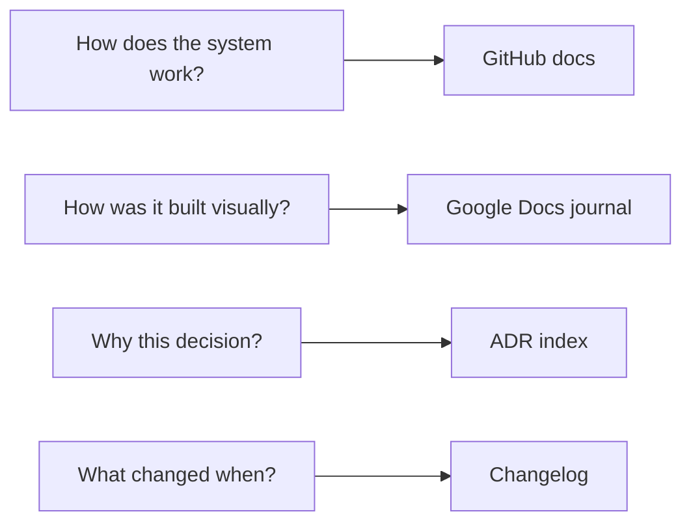

# Documentation System

This document explains **how documentation for the UP Circuit Member Portal is organized, maintained, and discovered** — what belongs in GitHub, what belongs in Google Docs, and how a future WebDev member or officer finds answers without relying on chat history.

**Prerequisites:** Read [`09-git-github-strategy.md`](09-git-github-strategy.md) (what lives in git), [`00-phase-1-overview.md`](00-phase-1-overview.md) (Phase 1 document sequence), and [`docs/README.md`](../../README.md) (documentation index).

**Phase 0 reference:** §0.14 (documentation architecture), §0.13.16 (documentation maintained throughout the project)

---

## What documentation means here

**Documentation is not "write everything in one place."**

Every document should answer three questions:

1. **Who is the reader?** (WebDev, officer, future maintainer)
2. **What question does it answer?**
3. **Where does it live so it stays true when the system changes?**

| Good documentation reasoning | Poor documentation reasoning |
|---|---|
| "A newcomer needs to know how login works — point them to Section 7." | "Copy all of Section 7 into a wiki page." |
| "This session changed migrations — update Section 3 and the changelog." | "The Google Doc is enough; GitHub can wait." |
| "Officers need screenshots of the admin UI — that goes in the journal, not git." | "Commit 200MB of PNGs to the repo." |

### Four questions, four homes



---

## Two documentation layers (ADR-045)

Phase 0 §0.14.1 and §0.14.14 define two complementary layers. **Neither replaces the other.**

| Layer | Where | Audience | Purpose |
|---|---|---|---|
| **Technical docs** | GitHub (`docs/`) | WebDev members, future maintainers | Source of truth for architecture, schema, API, env, deploy, tests |
| **Development journal** | Google Docs (not in git) | WebDev + officers (read access) | Visual story: screenshots, terminals, session notes, onboarding narrative |

### GitHub — "How does the system work?"

- Versioned alongside code
- Updated when behavior or architecture changes
- Required for every PR that changes a contract (API, schema, permissions, deploy)
- Officers do **not** need GitHub access (C8) — they use the portal admin UI and may read the journal

### Google Docs — "How did we build this system?"

- Historical and visual — screenshots of local/dev UI, terminal output, IDE structure
- Explains *sessions* and *progress*, not the authoritative API reference
- WebDev owns the Doc; include in N19 succession handoff
- **Never** paste secrets, `.env` values, production member PII, or real OTP codes

**Do not create the Google Doc during Phase 1 documentation.** Section 14 defines the rules; implementation of the Doc happens when coding begins.

---

## GitHub documentation layout (ADR-044)

Phase 0 §0.14.2 proposed a numbered folder tree (`docs/00-project-genesis/`, `01-requirements/`, … `12-maintenance/`). **That tree is not the live structure for this project.**

### Why we keep the current layout

| Reason | Detail |
|---|---|
| **Phase 1 already complete** | Sections 00–14 live in `docs/architecture/phase-1/` with cross-links |
| **No duplicate homes** | One authoritative file per topic — not "architecture in two folders" |
| **Team size** | 1–3 WebDevs cannot maintain two parallel doc maps |
| **Link stability** | Migrating would break every pointer in Sections 1–13 |

### Live structure

```
upcircuit-portal/
├── README.md                          ← Repo entry point (thin)
├── docs/
│   ├── README.md                      ← Documentation index
│   ├── glossary.md                    ← Term definitions
│   ├── PHASE0.md                      ← Requirements baseline
│   ├── CHANGELOG.md                   ← Chronological project log
│   ├── maintenance/
│   │   └── commands.md                ← Command index (links to owning sections)
│   └── architecture/
│       └── phase-1/
│           ├── 00-phase-1-overview.md
│           ├── 01-system-architecture.md … 14-documentation-system.md
│           ├── open-items.md
│           └── decisions/
│               └── README.md          ← ADR index (ADR-001–048)
│
├── project/                           ← Stakeholder summary (ADR-048)
│   ├── overview.md
│   └── scope.md
│
├── getting-started/                   ← Tutorials and how-tos (ADR-048)
│   ├── local-setup.md
│   └── add-a-feature.md
│
├── operations/
│   └── handover.md                    ← Succession checklist
│
├── DOCUMENTATION-PLAN.md              ← Phase 2 migration record
```

**Rejected:** Creating empty `docs/00-project-genesis/` … `docs/12-maintenance/` folders as a second documentation tree.

### Mapping Phase 0 §0.14.2 topics to current files

| Phase 0 folder (conceptual) | Live location |
|---|---|
| Project genesis / requirements | [`PHASE0.md`](../../PHASE0.md) |
| Architecture | Sections 01–03, 07–09, 12 |
| Database | Sections 03–04 |
| API | Section 06 (+ local OpenAPI when implemented) |
| Frontend / backend (implementation detail) | Sections 01–02; code comments at implementation |
| Authentication / security | Sections 07–08 |
| Deployment | Section 12 |
| Testing | Section 13 |
| Integrations | Section 02 (Brevo), Section 12 (backups) |
| Maintenance / commands | [`maintenance/commands.md`](../../maintenance/commands.md) + owning sections |
| Changelog | [`CHANGELOG.md`](../../CHANGELOG.md) |

---

## Root README (Phase 0 §0.14.3)

The repository root [`README.md`](../../../README.md) is a **thin entry point**:

| Must include | Must not include |
|---|---|
| What the portal is and why it exists | Secret values or `.env` contents |
| Stack summary (React, FastAPI, PostgreSQL, Vercel, Render) | Invented production domain names (N4) |
| Link to [`docs/README.md`](../../README.md) | Full architecture (that lives in Phase 1 docs) |
| Link to local setup (Section 11) | Member data or PII |

Detailed "how to run" stays in Section 11. The root README answers: *What is this repo? Where do I go next?*

---

## Where each documentation type lives

Phase 0 §0.14.4–0.14.7 asked for architecture, database, API, and environment documentation. **Phase 1 Sections 1–13 already provide these.** Section 14 does not duplicate them — it explains how to find and maintain them.

| Doc type | Authoritative file | Notes |
|---|---|---|
| **System architecture** | `01-system-architecture.md` | Diagrams, tiers, data flow |
| **Technology choices** | `02-technology-decisions.md` | Stack, dependencies, rejections |
| **Database infrastructure** | `03-supabase-architecture.md` | Roles, pooler, migrations, backups |
| **Database schema** | `04-database-schema.md` | Tables, relationships, constraints |
| **Authorization** | `05-authorization-architecture.md` | Permissions, gates, SUPER_ADMIN |
| **API endpoints** | `06-api-architecture.md` | Routes, errors, OpenAPI policy |
| **Authentication** | `07-authentication-architecture.md` | Login, OTP, sessions, activation |
| **Security** | `08-security-architecture.md` | CSRF, CORS, headers, threats |
| **Git workflow** | `09-git-github-strategy.md` | PRs, branches, `.gitignore` |
| **Environment variables** | `10-environment-management.md` | Full catalog — satisfies §0.14.7 |
| **Local commands** | `11-local-development-setup.md` | Install, `.env`, run stack |
| **Deployment** | `12-deployment-architecture.md` | Vercel, Render, DNS, backups |
| **Testing** | `13-testing-strategy.md` | Layers, CI, test DB |
| **Terminology** | [`glossary.md`](../../glossary.md) | Shared vocabulary |
| **Unresolved questions** | `open-items.md` | N-items, contradictions |
| **Decision index** | `decisions/README.md` | ADR-001–048 summaries |

### OpenAPI vs GitHub API docs

| Source | When to use |
|---|---|
| **Section 6** | Authoritative endpoint handbook — permissions, errors, shapes |
| **`/api/docs` (FastAPI)** | Local/dev exploration only — production OpenAPI disabled (Section 6) |

**Do not** generate a second OpenAPI export into `docs/` that can drift from Section 6 and the code.

---

## Command documentation (Phase 0 §0.14.8)

Commands are documented in **owning sections** (local → Section 11, deploy → Section 12, tests → Section 13, git → Section 9). [`docs/maintenance/commands.md`](../../maintenance/commands.md) is an **index** — a map to those sections, not a third full copy.

### Maintenance rule

When a command stabilizes during implementation:

1. Document it in the **owning section** (full context, prerequisites, pitfalls)
2. Add or update a **one-line link** in `commands.md`
3. Optionally mention it in a **journal entry** (screenshot of terminal)

**Do not** maintain three identical command blocks in three files.

---

## Changelog (Phase 0 §0.14.9)

[`docs/CHANGELOG.md`](../../CHANGELOG.md) records **what changed and when** — a reconstructable project history.

| Rule | Detail |
|---|---|
| **Format** | Chronological by date (newest first or oldest first — pick one and stay consistent) |
| **Scope** | Architecture milestones, major features, security fixes — not every typo |
| **No PII** | Never list member names, emails, or imported sheet contents |
| **Not SemVer** | No product version numbers until there is a released, versioned product |

Seed entries cover Phase 0 completion and Phase 1 documentation sections. Implementation entries are added as features land.

The changelog answers *"What happened on this date?"* The journal answers *"What did it look like while we built it?"*

---

## Architecture Decision Records (Phase 0 §0.14.10)

[`decisions/README.md`](decisions/README.md) is the **ADR index** — summaries and links to ADR-001 through ADR-048 and primary section documents.

### Individual ADR files

**Written:** ADR-001 through ADR-048 in [`decisions/`](decisions/). Each file summarizes the decision; full detail remains in the linked Phase 1 section.

Write a new numbered ADR when:

- A **significant new** architectural decision is made during implementation, **or**
- An existing decision is **reversed** — document immediately

Each file follows the format in `decisions/README.md`: Context, Decision, Alternatives, Consequences.

---

## Google Docs development journal (Phase 0 §0.14.11–13)

### Recommended structure

1. Project Genesis  
2. Problem Identification  
3. Requirements  
4. Architecture  
5. Project Setup  
6. Backend Development  
7. Database Development  
8. Frontend Development  
9. Authentication  
10. Core Features  
11. Admin Portal  
12. Flagship Projects  
13. Testing  
14. Deployment  
15. Production  
16. Maintenance  

Sections can merge or split as the project evolves. The structure is a guide, not a rigid contract.

### Entry template (every major session)

| Section | Content |
|---|---|
| **DATE** | Session date |
| **OBJECTIVE** | What were we trying to accomplish? |
| **CONTEXT** | Why now? |
| **CHANGES** | What changed? |
| **COMMANDS** | What was executed? (no secrets) |
| **FILES CREATED / MODIFIED** | Paths only |
| **DATABASE CHANGES** | Migrations, seed — not production dumps |
| **API CHANGES** | New/changed endpoints |
| **SCREENSHOTS** | Terminal, IDE, local/dev UI |
| **TESTING** | What was run; pass/fail |
| **PROBLEMS ENCOUNTERED** | What went wrong? |
| **SOLUTION** | How fixed |
| **DECISIONS** | Link to ADR or section if architectural |
| **NEXT STEPS** | What follows |

### What belongs in the journal

| Include | Exclude |
|---|---|
| Screenshots of local Vite page, admin UI in dev | Production member directory exports |
| Terminal showing `pytest` or `alembic` output | `.env` file screenshots with values |
| Explanation of directory structure for newcomers | Real OTP codes from Brevo |
| "Why we chose X" narrative for officers | GitHub tokens, API keys, database passwords |

### Access

| Actor | GitHub docs | Google Doc journal |
|---|---|---|
| **WebDev** | Read/write (via org) | Owner/editor |
| **Portal officers** | **No access** (C8) | Read access optional — leadership decision |
| **Members** | No | No |

---

## Maintaining documentation

Documentation is **not a one-time Phase 1 task**. It is updated throughout implementation (Phase 0 §0.13.16).

### When something changes

| Change type | Update |
|---|---|
| Bug fix, no contract change | Changelog entry optional; journal if visually interesting |
| New API endpoint or behavior | Section 6 + changelog; journal screenshot |
| Schema migration | Section 4 + changelog; journal if complex |
| New env variable | Section 10 catalog + `.env.example` |
| Architectural reversal | ADR + affected section + `open-items.md` |
| Deploy or ops procedure | Section 12 + `commands.md` index |

### Docs-only changes

Documentation fixes and improvements still go through the **PR workflow** (Section 9) — even solo WebDev. This keeps history reviewable and triggers CI when workflows exist.

### Keeping docs truthful

| Anti-pattern | Fix |
|---|---|
| Code diverged from Section 6 | Update code **or** update docs — not neither |
| Journal says X, GitHub says Y | GitHub wins for technical truth; fix journal narrative |
| Stale "Section N planned" footer | Update pointer when section completes |

---

## Newcomer documentation path

A future WebDev member months from now should follow:

1. **Root [`README.md`](../../../README.md)** — what is this repo?
2. **[`docs/README.md`](../../README.md)** — where is everything?
3. **[`PHASE0.md`](../../PHASE0.md)** or **[`00-phase-1-overview.md`](00-phase-1-overview.md)** — requirements vs architecture
4. **Relevant Phase 1 section** for the task at hand
5. **[`glossary.md`](../../glossary.md)** — unfamiliar terms
6. **[`maintenance/commands.md`](../../maintenance/commands.md)** — quick command lookup
7. **Google Doc journal** (if shared) — visual context of how the project was built

They should not need the original developer's chat history.

---

## Documentation and AI usage

The same learning principle as Section 13 applies to documentation: **Mark writes and curates docs; AI teaches and reviews.**

### Good uses of AI

| Use | Example |
|---|---|
| Explain what a section should cover | "What belongs in a changelog entry for auth?" |
| Review prose the developer wrote | "Is this Section 6 addition clear?" |
| Find stale cross-links | "Which files still say Section 14 planned?" |
| Suggest missing topics | "Should we document X in the journal or GitHub?" |
| Explain a Phase 0 requirement | "What does §0.14.8 expect for commands?" |

### Not the intended workflow

| Anti-pattern | Why |
|---|---|
| "Generate the entire Phase 1 handbook and commit it" | No learning; may not match decisions |
| "Write my Google Doc journal from this chat" | Journal needs real screenshots and session context |
| "Copy AI output into changelog without reading" | May include wrong dates, PII, or invented features |

**Goal:** the WebDev can maintain GitHub docs and journal entries themselves and know which layer each fact belongs in.

---

## Required / recommended / optional / rejected / deferred

### Required

| Practice |
|---|
| Two-layer split: GitHub technical + Google Docs visual (ADR-045) |
| Current `docs/architecture/phase-1/` layout (ADR-044) |
| Root README + `docs/README.md` index |
| `CHANGELOG.md` for dated project history |
| `maintenance/commands.md` as command index |
| ADR index in `decisions/README.md` |
| Secrets and PII never in git docs |
| Update owning section when contracts change |
| Docs changes via PR (Section 9) |
| Journal entry template for major implementation sessions |

### Recommended

| Practice |
|---|
| Changelog entry on every merged feature PR |
| Journal screenshot for first-time setup milestones |
| Link from journal decisions to ADR or section |
| Pre-commit or CI check for accidental secret patterns in docs |
| Officer read access to journal (not GitHub) |

### Optional

| Practice |
|---|
| Diagrams in journal (export from architecture sections) |
| Separate Google Doc per academic year |
| Auto-generated ERD PNG in `docs/` (only if kept in sync with Section 4) |

### Explicitly rejected

| Practice | Why rejected |
|---|---|
| **Phase 0 numbered folder tree as live layout** | Duplicate homes; link breakage (ADR-044) |
| **Wiki / Notion / Confluence as architecture source of truth** | Not versioned with code |
| **Google Doc journal committed to git** | Binaries, no diff review, wrong layer |
| **Screenshots of secrets or `.env`** | Credential leak |
| **Duplicating Sections 4–7 into new doc folders** | Already authoritative in Phase 1 |
| **Second OpenAPI spec file in docs/** | Drift from Section 6 and code |
| **Officers given GitHub for "documentation access"** | C8 — use journal read access instead |
| **100-page changelog of every commit** | Noise; git log exists |

### Deferred

| Topic | Section |
|---|---|
| Writing individual ADR markdown files | Phase 1 close or implementation sprint |
| Creating the Google Doc | Implementation start |
| Section 15 implementation order | [`15-development-roadmap.md`](15-development-roadmap.md) |

---

## Mapping Phase 0 §0.14

| Phase 0 item | Section 14 decision |
|---|---|
| §0.14.1 Two-layer system (GitHub + Google Docs) | **Confirmed** — ADR-045 |
| §0.14.2 GitHub folder tree | **Superseded** — keep `architecture/phase-1/` (ADR-044) |
| §0.14.3 Root README | **Created** — thin entry point |
| §0.14.4 Architecture documentation | **Sections 01–03, 07–09, 12** |
| §0.14.5 Database documentation | **Sections 03–04** |
| §0.14.6 API documentation | **Section 06** (+ local OpenAPI) |
| §0.14.7 Environment documentation | **Section 10** |
| §0.14.8 Command documentation | **`maintenance/commands.md` index** + owning sections |
| §0.14.9 Changelog | **`docs/CHANGELOG.md`** |
| §0.14.10 ADRs | **`decisions/README.md` index**; ADR-001–048 written |
| §0.14.11–13 Google Docs journal | **Rules documented**; Doc not created in Phase 1 |
| §0.14.14 Two layers distinction | **Confirmed** — table above |
| §0.13.16 Docs throughout project | **Maintenance rules** — not end-only |

---

## Related documents

| Topic | Document |
|---|---|
| What lives in git | `09-git-github-strategy.md` |
| Environment catalog | `10-environment-management.md` |
| Local setup commands | `11-local-development-setup.md` |
| Deploy commands | `12-deployment-architecture.md` |
| Test commands | `13-testing-strategy.md` |
| Command index | [`maintenance/commands.md`](../../maintenance/commands.md) |
| Documentation index | [`docs/README.md`](../../README.md) |
| Changelog | [`CHANGELOG.md`](../../CHANGELOG.md) |
| ADR index | `decisions/README.md` |
| Infrastructure succession (incl. journal) | `open-items.md` (N19) |
| Development roadmap | [`15-development-roadmap.md`](15-development-roadmap.md) |

---

## Do not change without ADR

- Two-layer documentation split (GitHub vs Google Docs)
- Current `docs/architecture/phase-1/` layout as live structure
- Secrets and PII never in git documentation
- Google Docs journal not stored in the repository
- Section 6 as authoritative API handbook (no duplicate spec tree)
- Officers do not receive GitHub access for documentation (C8)
- Changelog in `docs/CHANGELOG.md` (not only git commit messages)