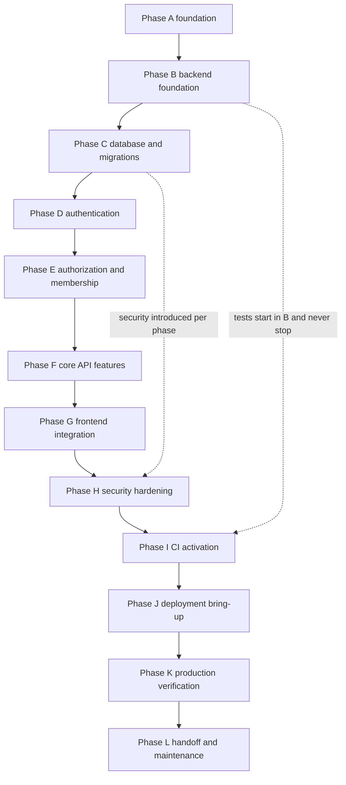

# Development Roadmap

This document turns Phase 1 architecture (Sections 1–14) into a **practical implementation sequence** — what to build, in what order, what to learn at each step, and when a step is done.

**This is the final Phase 1 planning document.** There is no Section 16. When this document is approved, Phase 1 architecture/planning is complete and implementation may begin.

**Prerequisites:** Read [`00-phase-1-overview.md`](00-phase-1-overview.md), then the sections referenced in each phase below.

**Phase 0 reference:** §0.13 (development roadmap), §0.13.16 (documentation throughout the project)

### Presentable local MVP sequence (implementation strategy)

Phases A–L below remain the **long-term production-safe roadmap**. They are not replaced.

For the first demonstrable local portal, implementation follows vertical product slices **M0–M5** (foundation → login/dashboard → resources → directory/account → admin membership → presentation hardening). M0 is the same Milestone 0 defined later in this document. Later phases (auth, CI, deploy) still happen; they are sequenced so a walkthrough exists before production bring-up.

`GET /api/v1/academic-years/current` is **public in M0** because authentication does not exist yet. Section 6's `view_dashboard` guard is added in M1.

---

## What the roadmap is

The roadmap is a **dependency order**, not a calendar. It does not assign dates. It answers:

| Question | Roadmap answer |
|---|---|
| What do I build first? | The piece with no unresolved dependencies |
| What must I understand before moving on? | The learning goal for each phase |
| What proves this phase works? | Tests + definition of done |
| What should I **not** build yet? | Explicit deferrals per phase |

**The biggest mistake to avoid:** building the dashboard or admin UI before the backend, database, and security foundations are understood and tested.

Phase 0 §0.13 lists 16 stages. This document **refines** that sequence using Sections 1–14 (see [Deviations from Phase 0 §0.13](#deviations-from-phase-0-013) below). Where they differ, **Sections 1–15 win**.

---

## Implementation philosophy

### Vertical slices over horizontal layers

Do **not** build the entire backend, then the entire frontend, then connect them.

Build the **smallest end-to-end path** through the stack:

```
Database table
    ↓
SQLAlchemy model
    ↓
Service / repository logic
    ↓
FastAPI endpoint
    ↓
pytest integration test
    ↓
React fetch + UI state
    ↓
Vitest test
```

Each slice teaches how a request travels from browser to database and back. You should understand the **whole path**, not only isolated technologies.

### Smallest useful piece

Every phase produces something that **works and can be tested** — not a large scaffold "for later." Milestone 0 (below) is deliberately tiny for this reason.

### Backend authority from the beginning

The browser is untrusted. Authorization, validation, and business rules live in FastAPI from the first protected endpoint — not added after the UI exists.

### No premature optimization or abstraction

- No Redis, Celery, task queues, or extra frameworks until a documented need appears (Section 2 rejections).
- No `EmailSender` abstraction before a second provider is plausible — but do introduce it before the first real Brevo send (Section 2).
- No E2E browser suite before API tests prove behavior (Section 13).

### Preserve Sections 1–14

This roadmap **implements** the architecture. It does not redesign auth, sessions, CORS, schema, or deployment. If implementation reveals a genuine conflict, stop, document in `open-items.md`, and get approval — do not silently change the design.

---

## Your implementation workflow (ADR-047)

This project is a **learning project** as well as a production project. During implementation:

```
Understand
    ↓
I write the code
    ↓
I run the command
    ↓
I observe the result
    ↓
I diagnose if something fails
    ↓
I ask AI when stuck
    ↓
I fix it myself
    ↓
I document what I learned
```

### What AI may do

| Use | Example |
|---|---|
| Explain concepts and architecture | "Why do we hash session tokens?" |
| Explain a command **before** you run it | "What does `alembic revision --autogenerate` do?" |
| Give hints or small examples when stuck | "Here's the shape of a FastAPI dependency — adapt it to your code" |
| Review code **you** wrote | "Does this permission check match Section 5?" |
| Explain errors and help diagnose | "Why did pytest get 403 instead of 401?" |
| Flag security or maintainability problems | "This endpoint has no auth guard" |
| Suggest tests you should write | "You should test missing Origin on POST" |
| Review documentation you wrote | "Is this changelog entry clear?" |

### What AI must not do

| Anti-pattern | Why |
|---|---|
| Generate the entire application for blind acceptance | No learning; you won't maintain what you don't understand |
| Run commands on your behalf when the goal is to learn them | You must know how to run pytest, alembic, npm yourself |
| Produce large code chunks without explanation | Hides the reasoning |
| Auto-create the full test suite | Section 13 — you write and run tests |
| Hide implementation behind abstractions you don't understand | Future you cannot debug it |

**You** author the code, run the commands, and write the primary documentation. AI is a teacher, reviewer, and debugger — not the implementer.

---

## Phase overview



| Phase | Name | One-line goal |
|---|---|---|
| **A** | Project foundation | Repo, tooling, docs habit, no app logic yet |
| **B** | Backend foundation | FastAPI boots, config, errors, `/health` |
| **C** | Database + migrations | Postgres roles, Alembic, Tier 1 schema |
| **D** | Authentication | Login, OTP, sessions, activation |
| **E** | Authorization + membership | Permissions, gates, response shaping |
| **F** | Core portal / API features | Member + admin MVP endpoints |
| **G** | Frontend integration | React shell, auth UI, features |
| **H** | Security hardening | Verification pass, not first introduction of security |
| **I** | CI activation | GitHub Actions merge gates live |
| **J** | Deployment bring-up | Vercel, Render, Supabase Production |
| **K** | Production verification | N3, N4, N17, N20 prove-early checks |
| **L** | Handoff + maintenance | Succession, ops runbooks, journal complete |

### Two important clarifications

**Testing (Phase I) is not when testing starts.** Tests begin in Phase B and accompany every phase. Phase I means: **wire CI so PRs cannot merge without the test suite** (ADR-042).

**Security (Phase H) is not when security starts.** Environment handling, DB roles, auth, CSRF, CORS, and authorization are introduced in earlier phases. Phase H is a **deliberate hardening and verification pass** before production members.

---

## Milestone 0 — your first vertical slice

Before Phase A is "done," aim to complete this **deliberately small** milestone. It is not a giant scaffold.

### Goal

Prove you understand the full toolchain with one read-only feature.

### What you personally implement

| Step | You build |
|---|---|
| 1 | Monorepo skeleton: `frontend/`, `backend/`, `docs/` (docs already exist) |
| 2 | Python venv in `backend/`; install runtime + dev deps from Section 2 |
| 3 | FastAPI app with `GET /api/v1/health` → `{ "status": "ok" }` (no DB check) |
| 4 | `pydantic-settings` loading `APP_ENV`, `DATABASE_URL` — fail loud if missing |
| 5 | Local Postgres: `upcircuit_local` + roles `circuit_app`, `circuit_migrator` |
| 6 | One Alembic migration: `academic_years` table only |
| 7 | `GET /api/v1/academic-years/current` — returns row where `is_current = true` |
| 8 | Seed one academic year row manually or via migration |
| 9 | Vite + React: one page that fetches current year and displays it |
| 10 | One pytest integration test for `/health` and `/academic-years/current` |
| 11 | One Vitest test for the React component rendering the year |
| 12 | `.env.example` files; `.env` gitignored |

### What you should learn

- How the monorepo is laid out
- How FastAPI starts and serves a route
- How Alembic applies a migration
- How SQLAlchemy reads a row
- How React calls the API with `fetch`
- How pytest uses a test database (`upcircuit_test`, ADR-043)
- How env vars reach backend vs frontend (`VITE_API_BASE_URL` only on frontend)

### Explicit non-goals (do not build yet)

- Authentication, sessions, cookies
- Authorization, roles, permissions
- Admin UI
- Deploy to Vercel/Render
- Supabase Dev/Production projects
- More than one or two tables

When Milestone 0 passes locally, you have earned Phase A/B overlap completion.

---

## Per-phase guide

Each phase uses the same template. **You** implement; **you** run tests; **you** update docs.

---

### Phase A — Project foundation

| Field | Detail |
|---|---|
| **Goal** | Repository and workflow exist; you can open a PR |
| **What I should learn** | Git branching, monorepo layout, what never goes in git |
| **What I personally implement** | GitHub org/repo; branch protection intent; root `.gitignore`; root `README.md`; `backend/.env.example`, `frontend/.env.example`; initial `requirements.txt` / `package.json` skeletons |
| **What to test** | Nothing automated yet — verify clone + venv + `npm install` succeed |
| **Definition of done** | Repo exists; Milestone 0 plan understood; first PR merged (can be docs-only + skeleton) |
| **Depends on** | Sections 9, 10, 11, 14 |
| **Docs to update** | `CHANGELOG.md`; Google Doc journal (screenshots of repo setup); `maintenance/commands.md` if new stable commands |
| **Do NOT build yet** | Business features, Supabase projects, CI workflows, production secrets |

---

### Phase B — Backend foundation

| Field | Detail |
|---|---|
| **Goal** | FastAPI application structure boots reliably |
| **What I should learn** | App factory pattern, middleware order, error envelope (Section 6), logging hygiene (no secrets) |
| **What I personally implement** | `app/main.py`, router mounting `/api/v1`, settings module, global exception handler → error envelope, `/health`, structured logging, CORS middleware stub (origins from config), CSRF middleware stub for mutating methods |
| **What to test** | pytest: `/health` returns 200; unknown route returns 404 envelope; validation error returns 422 envelope |
| **Definition of done** | `uvicorn` runs; tests pass on `upcircuit_test`; Milestone 0 backend portion complete |
| **Depends on** | Sections 2, 6, 8, 11, 13 |
| **Docs to update** | Section 11 commands if changed; journal entry with terminal screenshot |
| **Do NOT build yet** | Full schema, auth, member features, email sending |

**Security introduced:** fail-loud config; no secrets in logs; error envelope (no stack traces to client).

---

### Phase C — Database + migrations

| Field | Detail |
|---|---|
| **Goal** | Tier 1 schema exists locally; roles enforce least privilege |
| **What I should learn** | Alembic workflow, `app` schema, `circuit_app` vs `circuit_migrator`, expand-then-contract |
| **What I personally implement** | Alembic env; migrations in Section 4 order (21 tables); seed migration for roles, permissions, role_permissions (not division names — N6); SQLAlchemy models for each table |
| **What to test** | Clean DB → `alembic upgrade head` succeeds; integration test inserts/reads via `circuit_app`; migrator role can DDL, app role cannot |
| **Definition of done** | Full Tier 1 schema on local + test DB; prove-early #5 from Section 3 checklist passed |
| **Depends on** | Sections 3, 4, 10, 13 |
| **Docs to update** | `CHANGELOG.md`; journal with `\d app.*` or table list screenshot |
| **Do NOT build yet** | Production Supabase, member import, auth flows, frontend beyond Milestone 0 |

**Security introduced:** least-privilege DB roles; no superuser for app runtime (Section 11).

---

### Phase D — Authentication

| Field | Detail |
|---|---|
| **Goal** | Login, activation, and session lifecycle work end-to-end on the API |
| **What I should learn** | Opaque sessions, token hashing, OTP flow, enumeration safety, cookie attributes |
| **What I personally implement** | Follow this order — **do not skip ahead**; test each step before the next |

#### Authentication implementation order

| Step | Feature | Must pass before continuing |
|---|---|---|
| 1 | `auth_tokens` + activation: `POST /auth/activate`, `POST /auth/activate/resend` | Activation sets password; token single-use; expired rejected |
| 2 | Password hashing via `pwdlib[argon2]` (benchmark N1 before locking params) | Hash/verify tests |
| 3 | `POST /auth/login` — password verify, OTP issued (console `EmailSender` locally) | Invalid password enumeration-safe; OTP row created |
| 4 | `POST /auth/verify-code` — OTP verify, session created, `Set-Cookie` | Invalid/expired OTP; rate limit → 429 |
| 5 | Session middleware — load user from cookie hash | No cookie → 401 on protected routes |
| 6 | `GET /auth/me` — bootstrap payload | Returns identity, permissions list, membership status |
| 7 | `POST /auth/logout` — delete session, clear cookie | Subsequent requests 401 |
| 8 | Session expiry — sliding 7d idle, 30d absolute | Expired session rejected |
| 9 | `auth_attempts` rate limiting + account lock | Lockout tests |
| 10 | Trusted device cookie — skip OTP when valid | Revocation works |
| 11 | `POST /auth/forgot-password`, `POST /auth/reset-password` | Enumeration-safe; revokes sessions |
| 12 | CSRF: Origin allowlist on mutating routes; missing Origin → 403 | Section 8 failure mode test |
| 13 | CORS: exact origin allowlist with credentials | Preflight tests |

| Field | Detail |
|---|---|
| **What to test** | Full Section 7 + Section 13 auth tests; cookie `HttpOnly`, `SameSite=Lax`, `Secure` by env |
| **Definition of done** | All auth endpoints in Section 6 work; security tests green; no JWT anywhere |
| **Depends on** | Sections 6, 7, 8, 10, 13 |
| **Docs to update** | `CHANGELOG.md`; journal with login flow screenshots (console OTP, not real secrets) |
| **Do NOT build yet** | Frontend login page (Phase G), production Brevo, custom domain cookies (N4), member import at scale |

**Security introduced:** sessions, cookies, CSRF, CORS, rate limiting, enumeration-safe errors.

---

### Phase E — Authorization + membership

| Field | Detail |
|---|---|
| **Goal** | Every protected endpoint enforces Section 5 rules |
| **What I should learn** | Four-step allow rule, C3 asymmetry, response shaping, `MEMBERSHIP_REQUIRED` |
| **What I personally implement** | Follow this order |

#### Authorization implementation order

| Step | Feature | Must pass before continuing |
|---|---|---|
| 1 | Seed `SUPER_ADMIN` with every `admin_capability` permission | SUPER_ADMIN completeness test (Section 5) |
| 2 | `AuthContext` — load roles, permissions with `kind` + `required_membership`, current term status | Unit tests for context builder |
| 3 | `require_permission()` dependency — four steps | Parameterized authz matrix |
| 4 | Membership gate — `PENDING`/`NOT_RENEWED` fail `RENEWED` | `403 MEMBERSHIP_REQUIRED` |
| 5 | C3 rule — admin role does **not** satisfy membership gate | Non-renewed Academic Admin: manage yes, browse Drive no |
| 6 | Response shaping — directory vs admin field sets | Restricted fields omitted from JSON |
| 7 | Wrong-domain admin denied | Finance admin cannot manage academic resources |
| 8 | Unauthenticated → 401; unauthorized → 403 | Manual API tampering tests |

| Field | Detail |
|---|---|
| **What to test** | Section 13 authz tests; Phase 0 §0.13.14 check: "member cannot hit admin endpoint" |
| **Definition of done** | All Section 6 endpoints have correct guards; matrix tests green |
| **Depends on** | Sections 5, 6, 13 |
| **Docs to update** | `CHANGELOG.md`; journal if non-obvious bug found |
| **Do NOT build yet** | Frontend permission hiding (Phase G), flagship admin scoping (N12, P1) |

**Security introduced:** backend-authoritative authorization; no RLS; no frontend-only security.

---

### Phase F — Core portal / API features

| Field | Detail |
|---|---|
| **Goal** | MVP member and admin capabilities exist on the API |
| **What I should learn** | Vertical slices, transactions, audit logs, Pydantic validation |
| **What I personally implement** | One vertical slice at a time, in this order |

#### Feature implementation order (API)

| Order | Feature area | Key endpoints (Section 6) |
|---|---|---|
| 1 | Own profile + membership | `GET/PATCH /members/me`, `GET /membership/me` |
| 2 | Member directory | `GET /members`, filters |
| 3 | Resource categories + resources | CRUD with scope-after-load |
| 4 | Academic Drive | `scope=academic`; `RENEWED` gate |
| 5 | Request directory | `GET /request-types` (MVP: external URLs only) |
| 6 | Notifications | `GET /notifications`, mark read |
| 7 | Admin member management | `PATCH /members/{id}`, membership status |
| 8 | Admin configuration | navigation (P1 if not in MVP), categories, request types |
| 9 | Member import | preview + confirm (N13 mechanism) |
| 10 | Audit logs | sensitive mutations write `audit_logs` |

**Deferred within Phase F or later:** flagship projects (Tier 3), request history (C5, P1), native request workflows (P1), Tier 2 tables.

| Field | Detail |
|---|---|
| **What to test** | Integration test per slice; validation → 422; audit row on admin mutations |
| **Definition of done** | Section 6 MVP endpoints implemented and tested |
| **Depends on** | Sections 4, 5, 6, 8, 13 |
| **Docs to update** | `CHANGELOG.md` per feature; Section 6 only if contract changed |
| **Do NOT build yet** | Full React UI, production deploy, E2E suite |

**Security introduced:** Pydantic validation; URL scheme checks; SSRF N/A (never fetch stored URLs); audit logging.

---

### Phase G — Frontend integration

| Field | Detail |
|---|---|
| **Goal** | React portal consumes the API; officers can use admin UI locally |
| **What I should learn** | Route keys, TanStack Query, auth state, credentialed `fetch`, safe text rendering |
| **What I personally implement** | Follow this order |

#### Frontend implementation order

| Step | Area |
|---|---|
| 1 | Application shell — layout, header, sidebar placeholders |
| 2 | Routing + route key registry (Section 1, C7) |
| 3 | API client — `fetch` with credentials, base URL from `VITE_API_BASE_URL` only |
| 4 | Auth state — load `/auth/me`, handle 401 → login redirect |
| 5 | Login + OTP + activation pages |
| 6 | Loading and error states — including `MEMBERSHIP_REQUIRED` renewal prompt |
| 7 | Member features — profile, directory, resources, academic drive, requests |
| 8 | Admin features — member management, resource/request admin |
| 9 | Vitest tests for routing, auth states, safe rendering of stored text |

| Field | Detail |
|---|---|
| **What to test** | Vitest (Section 13); manual local credentialed flows; no PR preview login (ADR-038) |
| **Definition of done** | MVP pages work against local API; XSS strings render as text |
| **Depends on** | Sections 1, 2, 6, 7, 10, 11, 13 |
| **Docs to update** | Journal with UI screenshots; `CHANGELOG.md` |
| **Do NOT build yet** | Production deploy, custom domain, E2E Playwright |

**Security introduced:** React default escaping (do not use `dangerouslySetInnerHTML`); UI hides controls but backend remains authoritative.

---

### Phase H — Security hardening

| Field | Detail |
|---|---|
| **Goal** | Deliberate verification pass before production |
| **What I should learn** | Threat model from Section 8; what each control catches |
| **What I personally implement** | Review checklist: CSRF, CORS, cookies, headers, authz gaps, log hygiene, OpenAPI off in production config |
| **What to test** | Full Section 13 security module; fix any gaps found |
| **Definition of done** | Security matrix in Section 13 all green locally; no known authz bypass |
| **Depends on** | Section 8, 13 |
| **Docs to update** | `open-items.md` if N18 CSP gap found; journal |
| **Do NOT build yet** | Production-only checks (N17) — those are Phase K |

This phase is **verification**, not first introduction of security.

---

### Phase I — CI activation

| Field | Detail |
|---|---|
| **Goal** | PRs cannot merge with failing tests |
| **What I should learn** | GitHub Actions, Postgres service container, branch protection |
| **What I personally implement** | CI workflow: ruff, mypy, tsc, eslint, pytest, vitest, alembic upgrade (ADR-042); enable required checks on `main` |
| **What to test** | Intentionally break a test — confirm PR blocked |
| **Definition of done** | Green CI required for merge; ops workflows (Section 12) separate from CI |
| **Depends on** | Sections 9, 12, 13 |
| **Docs to update** | `CHANGELOG.md`; Section 9 branch protection note |
| **Do NOT build yet** | E2E CI job, paid scanners |

---

### Phase J — Deployment bring-up

| Field | Detail |
|---|---|
| **Goal** | Merge to `main` deploys to Vercel + Render + Supabase Production |
| **What I should learn** | Env wiring, Pre-Deploy migrations, platform dashboards |
| **What I personally implement** | Section 12 bring-up checklist (you execute each step yourself) |
| **What to test** | `/health` on Render; frontend loads; migration applied; no secrets in logs |
| **Definition of done** | Auto-deploy works; Dev Supabase for shared testing optional |
| **Depends on** | Sections 10, 11, 12 |
| **Docs to update** | `CHANGELOG.md`; journal with deploy screenshots |
| **Do NOT build yet** | Member rollout, custom domain (until N4), restore drill (until N3) |

---

### Phase K — Production verification

| Field | Detail |
|---|---|
| **Goal** | Prove-early items satisfied before real members |
| **What I should learn** | Production CORS, headers, backups, email deliverability |
| **What I personally implement** | Execute verify-only checklists — do not mark N-items closed until actually performed |

#### Production verification sequence

| Order | Task | Open item |
|---|---|---|
| 1 | Supabase Production: Data API off, roles, migrations | — |
| 2 | Env vars on Render/Vercel | N20 sender identity |
| 3 | DNS: `portal.*`, `api.*` | **N4** |
| 4 | SPF/DKIM/DMARC for `EMAIL_FROM` | **N20** |
| 5 | First backup Action run | — |
| 6 | Restore drill into Dev | **N3** |
| 7 | Browser CORS + cookie + header check | **N17** |
| 8 | Argon2 benchmark on Render Starter | **N1** |
| 9 | OTP delivery latency measurement | **N16** |
| 10 | Upgrade Render to Starter | Section 2 |
| 11 | Official seed data from leadership | **N6** |
| 12 | Staged division-by-division activation | Section 7 |

| Field | Detail |
|---|---|
| **Definition of done** | All prove-early items documented as passed; leadership sign-off on PII (N2) |
| **Depends on** | Sections 3, 7, 12, 13 |
| **Do NOT do** | Import production member data before N3 restore proven |

---

### Phase L — Handoff + maintenance

| Field | Detail |
|---|---|
| **Goal** | Next WebDev can operate the portal without you |
| **What I should learn** | Succession, ops rhythm, documentation debt |
| **What I personally implement** | N19 succession checklist; maintenance token cleanup workflow live; journal organized; optional individual ADR files from index |
| **What to test** | Backup + cleanup Actions run on schedule; another person can follow Section 11 setup |
| **Definition of done** | Handoff doc in journal; org ownership documented |
| **Depends on** | Sections 9, 12, 14, N19 |
| **Docs to update** | All stale pointers; `CHANGELOG.md`; ADR files if Phase 1 formally closed |

---

## Testing throughout implementation

Tests are **not** deferred to Phase I. You write and run them as you build.

| Phase | Test types you add |
|---|---|
| A | Manual smoke only |
| B | pytest: health, error envelope |
| C | migration apply; DB role grants; model CRUD |
| D | auth integration; CSRF/CORS; cookie headers; rate limits |
| E | parameterized authz; membership gate; response shaping |
| F | per-endpoint integration; validation 422; audit rows |
| G | Vitest: routing, auth UI, safe rendering |
| H | security regression full pass |
| I | CI runs all of the above on every PR |
| J–L | smoke tests on deployed env; manual prove-early (N17, N3) |

**Remember:** you write the tests. AI explains failures and reviews your tests — it does not replace writing them.

---

## Security throughout implementation

| Control | Introduced in phase | Section |
|---|---|---|
| Fail-loud env config | B | 10 |
| No secrets in logs | B | 8 |
| Error envelope (no stack leak) | B | 6 |
| DB least privilege (`circuit_app`) | C | 3 |
| Password hashing (Argon2) | D | 7 |
| Opaque session + token hash | D | 7 |
| HttpOnly / SameSite / Secure cookies | D | 7, 8 |
| CSRF Origin allowlist | D | 8 |
| CORS exact origins | D | 8 |
| Rate limiting / lockout | D | 7 |
| Enumeration-safe auth errors | D | 7 |
| Authorization four-step rule | E | 5 |
| Membership gate (C3) | E | 5 |
| Response shaping | E | 5, 6 |
| Pydantic validation | F | 6, 8 |
| URL scheme validation (no `javascript:`) | F | 8 |
| SSRF prevention (no URL fetch) | F | 8 |
| Audit logs on sensitive mutations | F | 8 |
| XSS-safe rendering | G | 8 |
| Production security headers / HSTS | K | 8, N4, N17 |
| Encrypted offsite backups | J | 12, N3 |

Phase H verifies the full set. Phase K verifies production behavior.

---

## Documentation throughout implementation

Follow Section 14. **You** write updates where practical.

| When | Update |
|---|---|
| Architecture/behavior change | Owning Phase 1 section |
| Any merged feature | `CHANGELOG.md` |
| Major dev session | Google Doc journal (screenshots) |
| Decision reversal | ADR file + `open-items.md` |
| New stable command | Owning section + `maintenance/commands.md` index |

**Proportionality:** a typo fix needs a PR, not necessarily a journal entry.

---

## Definition of done (per change)

Use this checklist for meaningful changes. Scale down for tiny fixes.

| Step | Question |
|---|---|
| **Implemented** | Does it match the architecture section? |
| **Tested** | Did I write/run the relevant tests myself? |
| **Security considered** | Auth, validation, CSRF, secrets, PII? |
| **Tests pass** | Local pytest + vitest green? |
| **Documentation updated** | Owning doc / changelog if behavior changed? |
| **Changelog updated** | Entry for user-visible or architectural change? |
| **Journal updated** | Screenshot narrative for major sessions? |
| **Reviewed** | Self-review or peer if 2+ WebDevs? |
| **PR opened** | Section 9 workflow? |
| **CI passes** | After Phase I — required? |
| **Squash merged** | One commit on `main`? |

---

## Checkpoints — questions you should answer yourself

Stop at each checkpoint. If you cannot answer without AI, revisit the phase.

### After Phase B (backend foundation)

- What port does local FastAPI use?
- What is the shape of a validation error response?
- Why does `/health` not check the database in MVP?

### After Phase C (database)

- What is the difference between `circuit_app` and `circuit_migrator`?
- Why is the schema named `app` instead of `public`?
- What happens if you run a migration without a migration file?

### After Phase D (authentication)

- Where is the session token stored — cookie or database?
- Why do we store a hash of the token, not the raw token?
- What happens if Origin is missing on a POST from a browser?
- Why is OTP skipped on a trusted device?

### After Phase E (authorization)

- Why can a non-renewed Academic Admin manage resources but not browse Academic Drive?
- What is the difference between `403 FORBIDDEN` and `403 MEMBERSHIP_REQUIRED`?
- Why are permissions not cached in the session row?

### After first full vertical slice (Phase F + G)

- Trace one `GET /resources` request from React to PostgreSQL and back.
- Where is membership status checked for Academic Drive?

### After Phase G (frontend)

- Why is `VITE_API_BASE_URL` the only frontend env var?
- Why cannot PR previews test login?

### After Phase H (security hardening)

- What CSRF failure mode does Section 8 warn about for missing Origin?
- Why do we not fetch member-supplied URLs server-side?

### After Phase I (CI)

- What fails a PR merge besides tests?
- How does CI get a PostgreSQL database without Docker on your laptop?

### After Phase J/K (deployment)

- What runs before Render serves new code?
- Where are backups stored and how do you restore (N3)?

---

## Deviations from Phase 0 §0.13

Documented intentionally (ADR-046):

| Phase 0 stage | Section 15 adjustment |
|---|---|
| Stage 5 — React foundation before full authz | **Frontend starts Phase G** after API auth + authz stable |
| Stage 6 — Frontend ↔ Backend as separate proof | **Merged into vertical slices** from Milestone 0 onward |
| Stage 13 — Testing | **Tests from Phase B**; Stage 13 ≈ Phase I CI activation |
| Stage 14 — Security hardening | **Security per phase**; Stage 14 ≈ Phase H verification |
| Stage 3 — `memberships` table name | Use **`membership_terms`** + assignments (Section 4) |
| Stages 10–11 — notifications, flagship early | **Sequence per Tier 1 MVP**; flagship Tier 3 deferred |
| Stage 12 — import before production hardening | **Import in Phase F**; production data only after Phase K checks |

Phase 0's vertical-slice intent ("each milestone should produce something that works") is **confirmed**.

---

## Open items carried into implementation

Do **not** invent resolutions. Track in [`open-items.md`](open-items.md).

| Item | Status | When to address |
|---|---|---|
| **N1** — Argon2 benchmark | Prove early | Phase D, before production auth lock-in |
| **N2** — leadership PII sign-off | Organizational | Before production import |
| **N3** — backup restore drill | Prove early | Phase K, before member data |
| **N4** — custom domain | Open | Phase K, before credentialed production cookies |
| **N6** — official division seed names | Open | Before production seed migration |
| **N7** — batch field format | Open | Before import tool |
| **N9** — renewal grace period | Org policy | Before launch |
| **N10** — per-request-type gating | P1 | If needed |
| **N11** — scoped permission revisit | Watch | If roles proliferate |
| **N12** — flagship admin scoping | P1 | Flagship work |
| **N13** — import preview mechanism | Implementation | Phase F import |
| **N15** — account unlock support path | Organizational | Before launch |
| **N16** — OTP delivery latency | Prove early | Phase K |
| **N17** — production CORS/headers | Prove early | Phase K |
| **N18** — strict CSP | Watch | First production frontend build |
| **N19** — infrastructure succession | Organizational | Phase L |
| **N20** — email sender identity | Organizational | Phase J/K |

---

## What we explicitly will NOT do

| Practice | Why |
|---|---|
| Giant initial code dump | Unlearnable; untestable |
| Build everything before testing | Section 13, ADR-042 |
| SQLite for backend tests | ADR-043 |
| Docker-required local workflow | Sections 2, 11 |
| Production DB on laptops | Sections 10, 11 |
| Frontend secrets in `VITE_*` | ADR-037 |
| Wildcard CORS | ADR-031, ADR-038 |
| Premature E2E suite | Section 13 |
| Unnecessary infrastructure | Section 2 |
| Silent architecture changes | ADR process |
| AI-generated app accepted without understanding | ADR-047 |
| AI running your learning commands for you | ADR-047 |
| JWT sessions | Section 2 |
| Supabase Auth or client in frontend | Sections 1–3 |
| Second warm Render on free tier | ADR-008 |

---

## Cleanup note

`docs/phase1.md` was an empty orphan transcript outside the Section 14 layout. It was removed in Milestone 0. This document and `docs/architecture/phase-1/` are the implementation guide.

---

## Phase 1 completion criteria

Phase 1 is **complete** when all of the following are true — **not** when the application is built.

| Criterion | Status |
|---|---|
| Sections 00–15 documented and approved | Section 15 is the last |
| Decisions recorded (ADR index ADR-001–047) | `decisions/README.md` |
| Open items registered with honest status | `open-items.md` |
| Dependencies between components understood | This roadmap |
| Testing strategy exists | Section 13 |
| Deployment strategy exists | Section 12 |
| Documentation workflow exists | Section 14 |
| Implementation order is clear | Phases A–L + Milestone 0 |
| A WebDev can begin without guessing | Milestone 0 is the front door |

**After approval of this document:** Phase 1 planning ends. **Implementation begins** at Phase A / Milestone 0. No further architecture sections are planned.

---

## Related documents

| Topic | Document |
|---|---|
| System design | Sections 01–08 |
| Git workflow | `09-git-github-strategy.md` |
| Environment variables | `10-environment-management.md` |
| Local setup | `11-local-development-setup.md` |
| Deployment | `12-deployment-architecture.md` |
| Testing | `13-testing-strategy.md` |
| Documentation | `14-documentation-system.md` |
| Schema + migration order | `04-database-schema.md` |
| API catalog | `06-api-architecture.md` |
| Open items | `open-items.md` |
| ADR index | `decisions/README.md` |
| Command index | [`maintenance/commands.md`](../../maintenance/commands.md) |

---

## Do not change without ADR

- Vertical-slice implementation order (ADR-046)
- Learning-first authorship model (ADR-047)
- Phase D auth design (Sections 2, 7)
- Phase E authorization model (Section 5)
- Test-alongside-build (ADR-042)
- Milestone 0 as first gate (not a big scaffold)
- Deferred features list (C5, flagship Tier 3, P1 tiers)